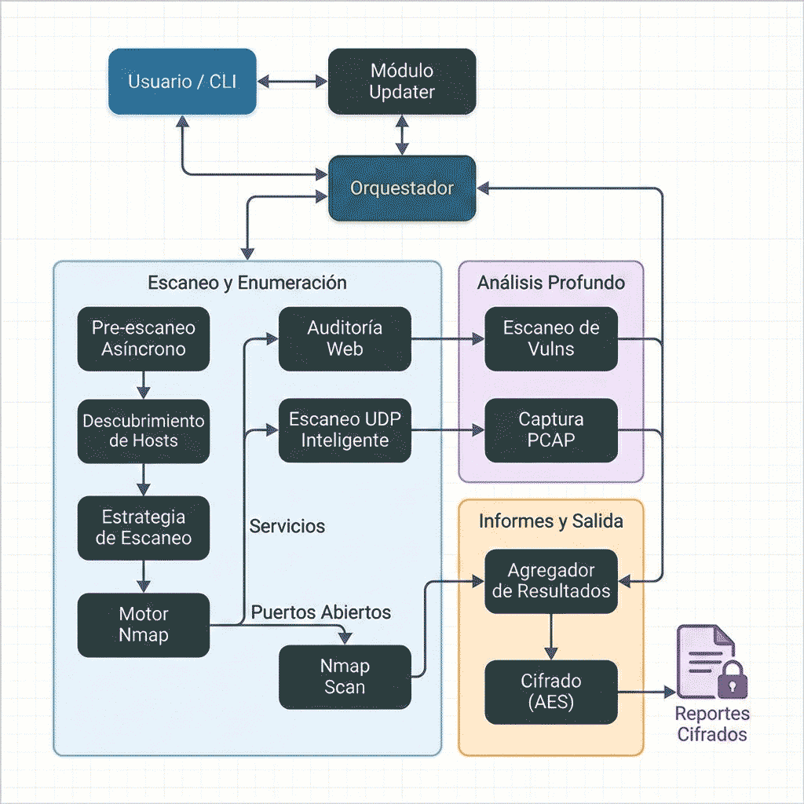

# RedAudit

[](../README.md)


[](https://github.com/dorinbadea/RedAudit/actions/workflows/tests.yml)


## ¿Qué es RedAudit?

RedAudit es un **framework de auditoría de red automatizada** para evaluaciones autorizadas. Coordina descubrimiento, resolución de identidad y comprobaciones de vulnerabilidades con escalado basado en evidencias, y consolida resultados en informes estructurados (JSON, TXT, HTML y exportaciones JSONL).

En lugar de ejecutar todas las herramientas contra todos los hosts, RedAudit escala solo cuando la identidad es débil o las señales son ambiguas, reduciendo ruido sin perder cobertura en entornos complejos.

Orquesta herramientas estándar (`nmap`, `nikto`, `nuclei` cuando está disponible) y aplica verificación **Smart-Check** para reducir falsos positivos antes de reportar.

**Casos de uso**: Hardening defensivo, acotación de pentests, seguimiento de cambios entre evaluaciones.

**Diferenciador clave**: Escalado por identidad (TCP → sondas UDP) combinado con **Smart-Check** (Content-Type, tamaño, magic bytes y señales de cabeceras/vendor) para reducir falsos positivos.

---

## Inicio Rápido

```bash
# Instalar
git clone https://github.com/dorinbadea/RedAudit.git
cd RedAudit && sudo bash redaudit_install.sh

# Ejecutar tu primer escaneo
sudo redaudit --target 192.168.1.0/24 --mode normal --yes
```

Para modo interactivo (asistente guiado), simplemente ejecuta:

```bash
sudo redaudit
```

---

## Capacidades Principales

### Escaneo y Descubrimiento

| Capacidad | Descripción |
| :--- | :--- |
| **Deep Scan Adaptativo** | Escalación en 3 fases (TCP → sonda UDP prioritaria → UDP top-ports) cuando la identidad es débil o ambigua |
| **HyperScan** | Barrido TCP asíncrono + sondas UDP de descubrimiento (incluye broadcast cuando procede) + ARP agresivo |
| **Descubrimiento de Topología** | Mapeo L2/L3 (ARP/VLAN/LLDP + gateway/rutas) para contexto de red |
| **Descubrimiento de Red** | Protocolos broadcast (DHCP/NetBIOS/mDNS/UPnP/ARP/FPING) para visibilidad L2 |
| **Verificación sin agente** | Sondas SMB/RDP/LDAP/SSH/HTTP para pistas de identidad |
| **Detección Interfaces VPN** | Clasifica endpoints VPN por heurísticas de MAC/IP de gateway, puertos VPN y patrones de hostname |
| **Modo Sigiloso** | Timing T1, 1 hilo, retardos 5s+ para entornos sensibles a IDS (`--stealth`) |

### Inteligencia y Correlación

| Capacidad | Descripción |
| :--- | :--- |
| **Correlación CVE** | NVD API 2.0 con matching CPE 2.3 y caché de 7 días |
| **Búsqueda de Exploits** | Consultas automáticas a ExploitDB (`searchsploit`) para servicios detectados |
| **Escaneo de Templates** | Templates Nuclei con comprobaciones best-effort de falsos positivos (cabeceras/vendor/título) |
| **Filtro Smart-Check** | Reducción de falsos positivos en 3 capas (Content-Type, tamaño, magic bytes) |
| **Detección de Fugas de Subred** | Identifica redes ocultas vía análisis de redirects/cabeceras HTTP |

### Reportes e Integración

| Capacidad | Descripción |
| :--- | :--- |
| **Salida Multi-Formato** | JSON, TXT, dashboard HTML y exportaciones JSONL para SIEM |
| **Playbooks de Remediación** | Guías Markdown auto-generadas por host/categoría |
| **Análisis Diferencial** | Compara reportes JSON para rastrear cambios en la red |
| **Exportaciones SIEM-Ready** | JSONL con scoring de riesgo y hash de observables para deduplicación |
| **Cifrado de Reportes** | AES-128-CBC (Fernet) con derivación PBKDF2-HMAC-SHA256 |

### Operaciones

| Capacidad | Descripción |
| :--- | :--- |
| **Defaults Persistentes** | Preferencias de usuario guardadas en `~/.redaudit/config.json` |
| **Webhooks Interactivos** | Alertas por webhook para hallazgos high/critical (asistente o CLI) |
| **Logging de Sesión** | Captura de salida terminal en doble formato (`.log` raw + `.txt` limpio) |
| **Escaneo con Timeout** | Escaneos de host con timeout duro; progreso con ETA límite |
| **Soporte IPv6 + Proxy** | Escaneo dual-stack completo con pivoting SOCKS5 |
| **Rate Limiting** | Retardo inter-host configurable con jitter ±30% para entornos sensibles a IDS |
| **Interfaz Bilingüe** | Localización completa Inglés/Español |
| **Auto-Actualización** | Actualizaciones atómicas staged con rollback automático en caso de fallo |

---

## Cómo Funciona

### Vista General de Arquitectura

RedAudit opera como una capa de orquestación, gestionando hilos de ejecución concurrentes para la interacción de red y el procesamiento de datos. Implementa una arquitectura multifase:

1. **HyperScan**: Descubrimiento async UDP/TCP.
2. **Deep Scan Adaptativo**: Enumeración dirigida basada en la identidad del host.
3. **Resolución de Entidad**: Consolidación de dispositivos multi-interfaz en activos únicos.
4. **Filtrado Inteligente**: Reducción de ruido via verificación consciente del contexto (`verify_vuln.py`).



### Lógica de Escaneo Adaptativo

RedAudit no aplica un perfil de escaneo fijo a todos los hosts. En su lugar, usa heurísticas en tiempo de ejecución para decidir la escalación, incluyendo probes HTTP breves de titulo/meta/encabezado en rutas de login comunes para hosts silenciosos:

```text
┌─────────────────────────────────────────────────────────────┐
│         FASE 1: Perfil Nmap según el modo de escaneo        │
│        rápido/normal/completo definen el scan base          │
└─────────────────────────┬───────────────────────────────────┘
                          │
                          ▼
              ┌───────────────────────┐
              │  Evaluación Identidad │
              │  • ¿MAC/vendor?       │
              │  • ¿Hostname/DNS?     │
              │  • ¿Versión servicio? │
              │  • ¿CPE/banner?       │
              │  • HTTP título/encab.?│
              │  • ¿Hints sin agente? │
              └───────────┬───────────┘
                          │
            ┌─────────────┴─────────────┐
            │                           │
            ▼                           ▼
    ┌───────────────┐          ┌────────────────┐
    │  SUFICIENTE   │          │ HOST AMBIGUO   │
    │  Detener scan │          │ Continuar...   │
    └───────────────┘          └───────┬────────┘
                                       │
                                       ▼
                    ┌──────────────────────────────────────┐
                    │  FASE 2a: UDP Prioritario            │
                    │  17 puertos comunes (DNS/DHCP/SNMP)  │
                    └──────────────────┬───────────────────┘
                                       │
                          ┌────────────┴────────────┐
                          │                         │
                          ▼                         ▼
                  ┌───────────────┐        ┌────────────────┐
                  │ Identidad OK  │        │ Aún ambiguo    │
                  │ Detener       │        │ (modo full)    │
                  └───────────────┘        └───────┬────────┘
                                                   │
                                                   ▼
                              ┌─────────────────────────────────┐
                              │     FASE 2b: UDP Extendido      │
                              │  --top-ports N (configurable)   │
                              └─────────────────────────────────┘
```

En modo **full/completo**, el perfil base ya es agresivo, por lo que el deep scan se activa menos y solo cuando la identidad
sigue siendo débil o hay señales sospechosas.

**Heurísticas de Disparo** (qué hace un host "ambiguo", sobre todo en rápido/normal):

- Pocos puertos abiertos (≤3) solo si la identidad está por debajo del umbral
- Servicios sospechosos (`unknown`, `tcpwrapped`)
- Falta de MAC/vendor/hostname
- Sin versión de servicio (identidad por debajo del umbral)
- Puertos filtrados o sin respuesta (fallback)
- Hosts silenciosos con vendor detectado pueden recibir un probe HTTP/HTTPS breve de titulo/meta/encabezado en puertos comunes

**Resultado**: Escaneos más rápidos que UDP siempre activo, manteniendo calidad de detección para IoT, servicios filtrados
y equipos legacy.

### Modelo de Concurrencia

RedAudit usa `ThreadPoolExecutor` de Python para escanear múltiples hosts simultáneamente.

| Parámetro | Defecto | Rango | Notas |
| :--- | :--- | :--- | :--- |
| `--threads` | 6 | 1-16 | Hilos comparten memoria, ejecutan nmap independientemente |
| `--rate-limit` | 0 | 0-∞ | Segundos entre hosts (jitter ±30% aplicado) |

**Guía**:

- **Hilos altos (10-16)**: Más rápido, pero más ruido de red. Riesgo de congestión.
- **Hilos bajos (1-4)**: Más lento, más sigiloso, más amable con redes legacy.
- **Rate limit >0**: Recomendado para entornos de producción para evitar triggers IDS.

---

## Instalación

RedAudit requiere un entorno basado en Debian (se recomienda Kali Linux). Se recomiendan privilegios `sudo` para funcionalidad completa (sockets raw, detección SO, tcpdump). Existe modo limitado sin root via `--allow-non-root`.

```bash
# 1. Clonar el repositorio
git clone https://github.com/dorinbadea/RedAudit.git
cd RedAudit

# 2. Ejecutar el instalador (gestiona dependencias y aliases)
sudo bash redaudit_install.sh
```

### Docker (Windows / macOS / Linux)

Funciona en cualquier plataforma con Docker Desktop. Ver **[Guía de Docker](../docs/DOCKER.es.md)** para configuración detallada.

```bash
docker pull ghcr.io/dorinbadea/redaudit:latest

# Wizard interactivo
docker run -it --rm -v $(pwd)/reports:/reports ghcr.io/dorinbadea/redaudit:latest

# Escaneo directo
docker run --rm -v $(pwd)/reports:/reports \
  ghcr.io/dorinbadea/redaudit:latest \
  --target 192.168.1.0/24 --mode normal --yes --output /reports
```

### Activar el Alias

Después de instalar, recarga la configuración de tu shell:

| Distribución | Shell por Defecto | Comando |
| :--- | :--- | :--- |
| **Kali Linux** (2020.3+) | Zsh | `source ~/.zshrc` |
| **Debian / Ubuntu / Parrot** | Bash | `source ~/.bashrc` |

**O simplemente abre una nueva ventana de terminal.**

### Verificación Post-Instalación

```bash
which redaudit            # Debería devolver: /usr/local/bin/redaudit
redaudit --version        # Debería mostrar la versión actual
bash redaudit_verify.sh   # Verificación completa de integridad
```

---

## Uso

### Modo Interactivo (Wizard)

Lanza sin argumentos para setup guiado:

```bash
sudo redaudit
```

El asistente te guía por la selección de objetivo y el perfil de auditoría. Ofrece 4 perfiles:

- **Express**: Descubrimiento rápido (solo hosts). Topología + descubrimiento de red activados; escaneo de vulnerabilidades desactivado.
- **Estándar**: Auditoría equilibrada (nmap `-F`/top 100 puertos + comprobaciones web). El preset de temporización se elige al inicio.
- **Exhaustivo**: Escaneo completo con más profundidad. UDP top-ports (500) se activa en hosts ambiguos; Red Team y verificación sin agente activadas. La correlación CVE solo se habilita si ya hay API key NVD configurada.
- **Custom**: Wizard completo de 8 pasos con navegación atrás para control granular.

La Fase 0 de enriquecimiento de bajo impacto es un prompt opt-in en todos los perfiles (por defecto desactivada).

El asistente cubre:

1. **Selección de objetivo**: Elige una subred local o introduce CIDR manual
2. **Preset de temporización**: Stealth (T1), Normal (T4) o Agresivo (T5) en Estándar/Exhaustivo
3. **Opciones**: Hilos, rate limiting, Fase 0 de bajo impacto, UDP/topología/descubrimiento, verificación sin agente (según perfil)
4. **Autorización**: Confirma que tienes permiso para escanear

### Modo No Interactivo / Automatización

```bash
# Descubrimiento rápido de hosts
sudo redaudit --target 192.168.1.0/24 --mode fast --yes

# Auditoría de seguridad estándar
sudo redaudit --target 192.168.1.0/24 --mode normal --yes

# Auditoría completa con cifrado
sudo redaudit --target 192.168.1.0/24 --mode full --encrypt --yes

# Escaneo sigiloso con rate limiting
sudo redaudit --target 10.0.0.0/24 --mode normal --rate-limit 2 --threads 4 --yes

# Descubrimiento de red con mapeo de topología
sudo redaudit --target 192.168.1.0/24 --net-discovery --topology --yes

# Análisis diferencial (comparar escaneos)
redaudit --diff ~/reports/lunes.json ~/reports/viernes.json
```

### Opciones CLI Principales

| Opción | Descripción |
| :--- | :--- |
| `-t, --target` | Red(es) objetivo en notación CIDR |
| `-m, --mode` | Modo de escaneo: `fast` / `normal` / `full` (defecto: normal) |
| `-j, --threads` | Hilos concurrentes (1-16, auto-detectado) |
| `--rate-limit` | Retardo entre hosts en segundos (jitter ±30%) |
| `-e, --encrypt` | Cifrar reportes con AES-128 |
| `-o, --output` | Directorio de salida |
| `--topology` | Activar descubrimiento de topología |
| `--net-discovery` | Descubrimiento L2/broadcast mejorado |
| `--cve-lookup` | Correlación CVE via NVD API |
| `--diff OLD NEW` | Análisis diferencial entre escaneos |
| `--html-report` | Generar dashboard HTML interactivo |
| `--stealth` | Activar timing paranoid para entornos sensibles a IDS |
| `-y, --yes` | Omitir confirmaciones (modo automatización) |

Consulta `redaudit --help` o [USAGE.md](../docs/USAGE.es.md) para la lista completa de opciones.

---

## Configuración

### Modos de Temporización

RedAudit aplica plantillas de temporización nmap según tu selección:

| Modo | Plantilla Nmap | Threads | Delay | Caso de Uso |
| :--- | :--- | :--- | :--- | :--- |
| **Stealth** | `-T1` | 1 (forzado por `--stealth`) | 5s+ | Redes sensibles a IDS |
| **Normal** | `-T4` | 6 (defecto; configurable) | 0s | Auditorías estándar (equilibrio velocidad/ruido) |
| **Agresivo** | `-T5` | 16 (preset del asistente; configurable) | 0s | Escaneos urgentes en redes confiables |

### Comportamiento de Escaneo

| Parámetro | Propósito | Recomendación |
| :--- | :--- | :--- |
| `--threads N` | Escaneo paralelo de hosts | 6 para equilibrado, 2-4 para sigilo |
| `--rate-limit N` | Retardo inter-host (segundos) | 1-5s para entornos de producción |
| `--udp-ports N` | Top UDP en modo full | 100 (defecto), rango 50-500 |
| `--stealth` | Modo paranoid | Usar en entornos sensibles a IDS/IPS |

### Salida y Cifrado

Los reportes se guardan bajo la carpeta Documentos del usuario invocante (p. ej., `~/Documents/RedAuditReports` o `~/Documentos/RedAuditReports`) con timestamps.

**Cifrado** (cuando se usa `-e, --encrypt`):

1. Se genera un salt aleatorio de 16 bytes
2. Tu contraseña deriva una clave de 32 bytes via PBKDF2-HMAC-SHA256 (480k iteraciones)
3. Los archivos se cifran usando Fernet (AES-128-CBC)
4. Un archivo `.salt` se guarda junto a los reportes cifrados

Cuando el cifrado está activo, se omiten artefactos en claro (HTML/JSONL/playbooks/manifest).

Si ejecutas `--encrypt` en modo no interactivo sin `--encrypt-password`, se genera y muestra una contraseña aleatoria una sola vez.

**Descifrado**:

```bash
python3 redaudit_decrypt.py /ruta/a/report.json.enc
```

### Persistencia

Guarda defaults para evitar repetir flags:

```bash
redaudit --target 192.168.1.0/24 --threads 8 --rate-limit 1 --save-defaults --yes
# Las ejecuciones futuras usarán estos ajustes automáticamente
```

Los defaults se almacenan en `~/.redaudit/config.json`.
Usa `--defaults {ask,use,ignore}` (o `--use-defaults`/`--ignore-defaults`) para controlar su aplicación en ejecuciones no interactivas.

---

## Referencia de Herramientas

RedAudit orquesta estas herramientas:

| Categoría | Herramientas | Propósito |
| :--- | :--- | :--- |
| **Escáner Core** | `nmap`, `python3-nmap` | Escaneo TCP/UDP, detección de servicios/versión, fingerprinting SO |
| **Reconocimiento Web** | `whatweb`, `curl`, `wget`, `nikto` | Cabeceras HTTP, tecnologías, vulnerabilidades |
| **Escáner Templates** | `nuclei` | Escáner de templates opcional (habilitar en asistente o con `--nuclei`) |
| **Inteligencia Exploits** | `searchsploit` | Búsqueda ExploitDB para servicios detectados |
| **Inteligencia CVE** | NVD API | Correlación CVE para versiones de servicios |
| **Análisis SSL/TLS** | `testssl.sh` | Escaneo profundo de vulnerabilidades SSL/TLS (requerido para checks TLS profundos; lo instala el instalador) |
| **Captura de Tráfico** | `tcpdump`, `tshark` | Captura de paquetes para análisis de protocolos |
| **DNS/Whois** | `dig`, `whois` | DNS inverso y consulta de propiedad |
| **Topología** | `arp-scan`, `ip route` | Descubrimiento L2, detección VLAN, mapeo gateway |
| **Descubrimiento Red** | `nbtscan`, `netdiscover`, `fping`, `avahi` | Descubrimiento broadcast/L2 |
| **Red Team Recon** | `snmpwalk`, `enum4linux`, `masscan`, `kerbrute` | Enumeración activa opcional (opt-in) |
| **Cifrado** | `python3-cryptography` | Cifrado AES-128 para reportes |

### Estructura del Proyecto

```text
redaudit/
├── core/                   # Funcionalidad principal
│   ├── auditor.py          # Orquestador principal
│   ├── wizard.py           # UI interactiva (WizardMixin)
│   ├── scanner/            # Lógica de escaneo Nmap + helpers IPv6
│   ├── network.py          # Detección de interfaces/red
│   ├── hyperscan.py        # Descubrimiento paralelo ultrarrápido
│   ├── net_discovery.py    # Descubrimiento L2/broadcast mejorado
│   ├── topology.py         # Descubrimiento de topología de red
│   ├── udp_probe.py        # Helpers de sondeo UDP
│   ├── agentless_verify.py # Verificación sin agente SMB/RDP/LDAP/SSH/HTTP
│   ├── nuclei.py           # Integración escáner templates Nuclei
│   ├── playbook_generator.py # Generador de playbooks remediación
│   ├── nvd.py              # Correlación CVE via NVD API
│   ├── osquery.py          # Helpers de verificación Osquery (opcional)
│   ├── entity_resolver.py  # Consolidación de activos / resolución de entidades
│   ├── evidence_parser.py  # Helpers de parsing de evidencias
│   ├── reporter.py         # Salida JSON/TXT/HTML/JSONL
│   ├── html_reporter.py    # Renderizado de reportes HTML
│   ├── jsonl_exporter.py   # Exportación JSONL para SIEM
│   ├── siem.py             # Integración SIEM (alineación ECS)
│   ├── diff.py             # Análisis diferencial
│   ├── crypto.py           # Cifrado/descifrado AES-128
│   ├── command_runner.py   # Ejecución segura comandos externos
│   ├── power.py            # Inhibición de reposo
│   ├── proxy.py            # Manejo de proxy
│   ├── scanner_versions.py # Detección de versiones de herramientas
│   ├── verify_vuln.py      # Filtro Smart-Check falsos positivos
│   └── updater.py          # Sistema de auto-actualización
├── templates/              # Templates reportes HTML
└── utils/                  # Utilidades (i18n, config, constantes)
```

---

## Referencia

### Terminología

| Término | Definición |
| :--- | :--- |
| **Deep Scan** | Escalación selectiva (fingerprinting TCP + UDP) cuando la identidad es débil o el host no responde |
| **HyperScan** | Módulo de descubrimiento async ultrarrápido (batch TCP, UDP IoT, ARP agresivo) |
| **Smart-Check** | Filtro de falsos positivos en 3 capas (Content-Type, tamaño, magic bytes) |
| **Entity Resolution** | Consolidación de dispositivos multi-interfaz en activos unificados |
| **ECS** | Elastic Common Schema (ECS) para compatibilidad SIEM |
| **Finding ID** | Hash SHA256 determinístico para correlación entre escaneos |
| **CPE** | Common Platform Enumeration v2.3 para matching NVD |
| **JSONL** | Formato JSON Lines para ingesta streaming SIEM |
| **Fernet** | Cifrado simétrico (AES-128-CBC + HMAC-SHA256) |
| **PBKDF2** | Derivación de clave basada en contraseña (480k iteraciones) |
| **Thread Pool** | Workers concurrentes para escaneo paralelo de hosts |
| **Rate Limiting** | Retardo inter-host con jitter ±30% para reducir probabilidad de alertas |
| **Heartbeat** | Hilo de fondo que avisa tras ~60s de silencio (umbral de fallo ~300s) |

### Solución de Problemas

Para solución de problemas completa, consulta: 📖 **[Guía Completa de Solución de Problemas](../docs/TROUBLESHOOTING.es.md)**

**Enlaces Rápidos**:

- [Problemas de Instalación](../docs/TROUBLESHOOTING.es.md#1-permission-denied--root-privileges-required)
- [Problemas de Escaneo](../docs/TROUBLESHOOTING.es.md#5-scan-appears-frozen--long-pauses)
- [Problemas de Network Discovery](../docs/TROUBLESHOOTING.es.md#12-net-discovery-missing-tools--tool_missing-v32)
- [Cifrado/Descifrado](../docs/TROUBLESHOOTING.es.md#8-decryption-failed-invalid-token)

### Logging

Los logs de depuración se almacenan en `~/.redaudit/logs/` (rotación: 5 archivos, 10MB cada uno).

---

## Changelog

Consulta [CHANGELOG_ES.md](CHANGELOG_ES.md) para el historial completo de versiones.

## Contribución

¡Agradecemos las contribuciones! Consulta [CONTRIBUTING_ES.md](CONTRIBUTING_ES.md) para más detalles.

## Licencia

RedAudit se distribuye bajo la **GNU General Public License v3.0 (GPLv3)**. Consulta [LICENSE](../LICENSE).

---

## Aviso Legal

**RedAudit** es una herramienta de seguridad únicamente para **auditorías autorizadas**. Escanear redes sin permiso es ilegal. Al usar esta herramienta, aceptas total responsabilidad por tus acciones y acuerdas usarla solo en sistemas de tu propiedad o para los que tengas autorización explícita.

---

[Documentación Completa](../docs/INDEX.md) | [Esquema de Reporte](../docs/REPORT_SCHEMA.es.md) | [Especificaciones de Seguridad](../docs/SECURITY.es.md)
