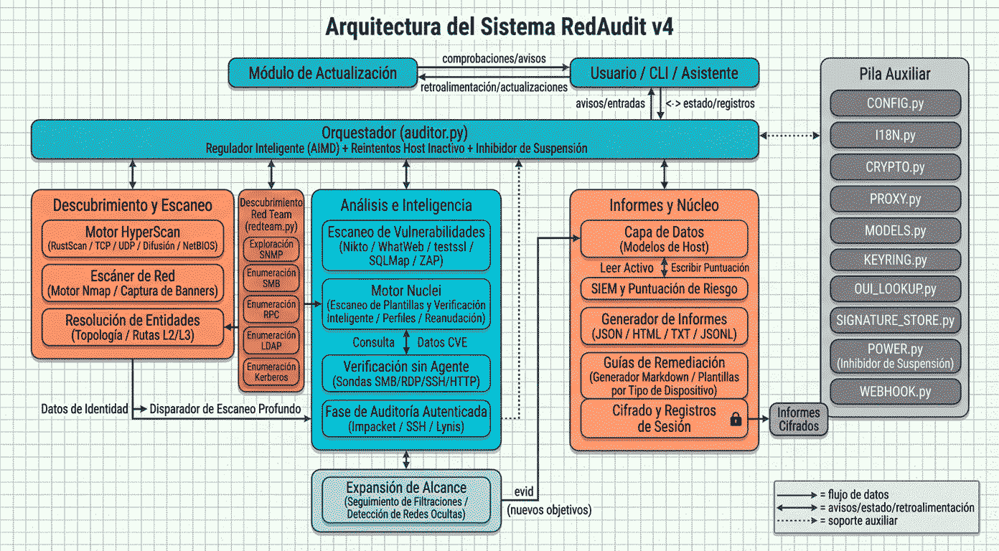

# RedAudit

[](../README.md)

[](https://github.com/dorinbadea/RedAudit/releases/latest)


[](https://github.com/dorinbadea/RedAudit/actions/workflows/tests.yml)


## ¿Qué es RedAudit?

RedAudit es un **framework de auditoría de red automatizado** para evaluaciones autorizadas. Coordina descubrimiento, resolución de identidad y comprobaciones de vulnerabilidades con escalado basado en evidencias, y consolida resultados en informes estructurados (JSON, TXT, HTML y exportaciones JSONL).

En lugar de ejecutar todas las herramientas contra todos los hosts, RedAudit escala solo cuando la identidad es débil o las señales son ambiguas, reduciendo ruido sin perder cobertura en entornos complejos. Las pistas HTTP (título/servidor) y el tipo de dispositivo ayudan a evitar deep scans innecesarios y escáneres web pesados en infraestructura.

Orquesta un toolchain completo (nmap, nikto, nuclei, whatweb, testssl.sh, sqlmap, rustscan y más) y aplica verificación **Smart-Check** para reducir falsos positivos antes de reportar.

**Casos de uso**: Hardening defensivo, acotación de pentests, seguimiento de cambios entre evaluaciones.

**Diferenciador clave**: Optimización de velocidad **HyperScan-first** que alimenta un motor de escalado por identidad (Deep TCP a sondas UDP), combinado con filtrado **Smart-Check** para reducir falsos positivos sin perder activos críticos.

---

## Cómo Funciona

### Vista General de Arquitectura

RedAudit opera como una capa de orquestación, gestionando hilos de ejecución concurrentes para la interacción de red y el procesamiento de datos. Implementa una arquitectura multifase:

> **Filosofía de Diseño**: *"Optimización por Defecto, Resiliencia por Excepción."*
> Una arquitectura diseñada para equilibrar velocidad y seguridad, evitando redundancia en casos claros y aplicando certeza absoluta (escaneo profundo) solo ante la ambigüedad. Este es el diseño óptimo para auditorías.

1. **HyperScan**: Descubrimiento async UDP/TCP con control de congestión **Smart-Throttle (AIMD)**.
2. **Deep Scan Adaptativo**: Enumeración dirigida basada en la identidad del host.
3. **Resolución de Entidad**: Consolidación basada en identidad de dispositivos multi-interfaz (heurística).
4. **Filtrado Inteligente**: Reducción de ruido vía verificación consciente del contexto.
5. **Selección de Nuclei**: Selección de objetivos basada en identidad con reintentos por excepción para evitar redundancia. Cambia automáticamente al perfil **rápido** en hosts con alta densidad web cuando la cobertura completa está desactivada para evitar timeouts largos.
6. **Resiliencia**: **Reintentos de Host Muerto** automáticos para abandonar hosts que no responden y evitar bloqueos.



### Lógica de Escaneo Adaptativo

RedAudit no aplica un perfil de escaneo fijo a todos los hosts. En su lugar, usa heurísticas en tiempo de ejecución para decidir el escalado, incluyendo sondas HTTP breves de título/metadatos/cabeceras en rutas de inicio de sesión habituales para hosts silenciosos:

```text
┌─────────────────────────────────────────────────────────────┐
│             FASE 0: HyperScan Discovery (Opcional)          │
│       (Opcional RustScan/Masscan en modo Red Team)          │
│              Alimenta puertos abiertos a Fase 1             │
└─────────────────────────────────────────────────────────────┘
                              │
                              ▼

┌─────────────────────────────────────────────────────────────┐
│      FASE 0b: Enriquecimiento de bajo impacto (optativo)    │
│        DNS/mDNS/SNMP + sonda HTTP/HTTPS breve para          │
│         hosts con fabricante y cero puertos abiertos        │
└─────────────────────────────────────────────────────────────┘
                              │
                              ▼

┌─────────────────────────────────────────────────────────────┐
│          FASE 1: Perfil Nmap según el modo de escaneo       │
│            rápido/normal/completo definen el scan base      │
└─────────────────────────────────────────────────────────────┘
                              │
                              ▼
              ┌────────────────────────────────┐
              │      Evaluacion de identidad   │
              │  • MAC/fabricante?             │
              │  • Hostname/DNS?               │
              │  • Version de servicio?        │
              │  • CPE/banner?                 │
              │  • HTTP titulo/encab.?         │
              │  • Hints sin agente?           │
              └────────────────┬───────────────┘
                              │
            ┌─────────────────┴─────────────────┐
            │                                   │
            ▼                                   ▼
    ┌──────────────────┐               ┌──────────────────┐
    │    SUFICIENTE    │               │   HOST AMBIGUO   │
    │   Detener scan   │               │   Trigger Deep   │
    └──────────────────┘               └────────┬─────────┘
                                                │
                                                ▼
                    ┌──────────────────────────────────────┐
                    │      DEEP PHASE 1: TCP Agresivo      │
                    │         nmap -p- -A --open           │
                    └──────────────────┬───────────────────┘
                                       │
                          ┌────────────┴────────────┐
                          │                         │
                          ▼                         ▼
                  ┌──────────────────┐      ┌──────────────────┐
                  │   Identidad OK   │      │  Sigue ambiguo   │
                  │       Stop       │      │   Continuar...   │
                  └──────────────────┘      └────────┬─────────┘
                                                     │
                                                     ▼
                                ┌──────────────────────────────────────┐
                                │     DEEP PHASE 2a: UDP Prioritario   │
                                │     17 puertos (DNS/DHCP/etc)        │
                                └──────────────────┬───────────────────┘
                                                   │
                                    ┌──────────────┴──────────────┐
                                    │                             │
                                    ▼                             ▼
                            ┌──────────────────┐         ┌──────────────────┐
                            │   Identidad OK   │         │  Sigue ambiguo   │
                            │       Stop       │         │   (modo full)    │
                            └──────────────────┘         └────────┬─────────┘
                                                                  │
                                                                  ▼
                                          ┌─────────────────────────────────┐
                                          │   DEEP PHASE 2b: UDP Extendido  │
                                          │   --top-ports N (hasta 500)     │
                                          └─────────────────────────────────┘
```

En modo **full/completo**, el perfil base ya es agresivo, por lo que el deep scan se activa menos y solo cuando la identidad
sigue siendo débil o hay señales sospechosas.

**Heurísticas de Disparo** (qué hace un host "ambiguo", sobre todo en rápido/normal):

- Pocos puertos abiertos (≤3) solo si la identidad está por debajo del umbral
- Servicios sospechosos (`unknown`, `tcpwrapped`)
- Falta de MAC/fabricante/nombre de host
- Sin versión de servicio cuando la evidencia de identidad sigue siendo débil (título/servidor/tipo)
- Puertos filtrados o sin respuesta (fallback)
- Hosts silenciosos con fabricante detectado pueden recibir una sonda HTTP/HTTPS breve de título/metadatos/cabeceras en puertos habituales para resolver identidad antes

**Resultado**: Escaneos más rápidos que UDP siempre activo, manteniendo calidad de detección para IoT, servicios filtrados
y equipos legacy.

### Modelo de Concurrencia

RedAudit usa `ThreadPoolExecutor` de Python para escanear múltiples hosts simultáneamente.

| Parámetro | Defecto | Rango | Notas |
| :--- | :--- | :--- | :--- |
| `--threads` | Autodetectado (respaldo: 6) | 1-100 | Hilos comparten memoria, ejecutan nmap independientemente |
| `--rate-limit` | 0 | 0-∞ | Segundos entre hosts (jitter ±30% aplicado) |

**Guía**:

- **Hilos altos (50-100)**: Más rápido, pero más ruido de red. Riesgo de congestión.
- **Hilos bajos (1-4)**: Más lento, más sigiloso, más amable con redes legacy.
- **Rate limit >0**: Recomendado para entornos de producción para evitar triggers IDS.

---

## Inicio Rápido

```bash
# Instalar
git clone https://github.com/dorinbadea/RedAudit.git
cd RedAudit && sudo bash redaudit_install.sh

# Ejecutar tu primer escaneo
sudo redaudit --target 192.168.1.0/24 --mode normal --yes
```

Para modo interactivo (asistente guiado), simplemente ejecuta:

```bash
sudo redaudit
```

> **¿Quieres probar RedAudit de forma segura?**
> Configura el Laboratorio Vulnerable usando Docker: **[Guía del Laboratorio](../docs/LAB_SETUP_ES.md)**

---

## Capacidades Principales

### Escaneo y Descubrimiento

| Capacidad | Descripción |
| :--- | :--- |
| **Deep Scan Paralelo** | Tareas de deep scan en paralelo dentro del pool de hosts (hasta 100 hilos) |
| **HyperScan** | Barrido TCP asíncrono + sondas UDP de descubrimiento (incluye broadcast cuando procede) + ARP agresivo |
| **Smart-Throttle** | Control de congestión adaptativo (AIMD) que previene la pérdida de paquetes ajustando dinámicamente los lotes de escaneo |
| **Descubrimiento de Topología** | Mapeo L2/L3 (ARP/VLAN/LLDP + gateway/rutas) para contexto de red |
| **Descubrimiento de Red** | Protocolos broadcast (DHCP/NetBIOS/mDNS/UPnP/ARP/FPING) para visibilidad L2 |
| **Seguridad Web App** | Integración de `sqlmap` (SQLi) y `OWASP ZAP` (DAST) para escaneo profundo de aplicaciones web, con gating de infraestructura |
| **Verificación sin agente** | Sondas SMB/RDP/LDAP/SSH/HTTP para pistas de identidad |
| **Detección Interfaces VPN** | Clasifica endpoints VPN por OUI del fabricante, puertos VPN (500/4500/1194/51820) y patrones de hostname |
| **Modo Sigiloso** | Timing T1, 1 hilo, retardos 5s+ para entornos sensibles a IDS (`--stealth`) |

### Inteligencia y Correlación

| Capacidad | Descripción |
| :--- | :--- |
| **Correlación CVE** | NVD API 2.0 con matching CPE 2.3 y caché de 7 días |
| **Búsqueda de Exploits** | Consultas automáticas a ExploitDB (`searchsploit`) para servicios detectados |
| **Escaneo de Plantillas** | Plantillas Nuclei con comprobaciones best-effort de falsos positivos (cabeceras/fabricante/título) y informe de timeout parcial |
| **Filtro Smart-Check** | Reducción de falsos positivos en 3 capas (Content-Type, tamaño, magic bytes) |
| **Indicios de Fuga de Red** | Señala múltiples subredes/VLANs anunciadas por DHCP como posibles redes ocultas |

### Informes e Integración

| Capacidad | Descripción |
| :--- | :--- |
| **Salida Multi-Formato** | JSON, TXT, dashboard HTML y exportaciones JSONL para SIEM |
| **Playbooks de Remediación** | Guías Markdown auto-generadas por host/categoría |
| **Análisis Diferencial** | Compara informes JSON para rastrear cambios en la red |
| **Exportaciones SIEM-Ready** | JSONL con scoring de riesgo y hash de observables para deduplicación |
| **Cifrado de Informes** | AES-128-CBC (Fernet) con derivación PBKDF2-HMAC-SHA256 |

### Operaciones

| Capacidad | Descripción |
| :--- | :--- |
| **Defaults Persistentes** | Preferencias de usuario guardadas en `~/.redaudit/config.json` |
| **Targeting basado en Generadores** | Procesador de targets en streaming para tamaño de red ilimitado (ej. /16 o /8) sin agotar la RAM |
| **Webhooks Interactivos** | Alertas por webhook para hallazgos high/critical (asistente o CLI) |
| **Logging de Sesión** | Captura de salida terminal en doble formato (`.log` raw + `.txt` limpio) |
| **Escaneo con Timeout** | Escaneos de host con timeout duro; progreso con ETA de límite superior |
| **Soporte IPv6 + Proxy** | Escaneo dual-stack con pivoting SOCKS5 vía proxychains4 (solo TCP connect) |
| **Rate Limiting** | Retardo inter-host configurable con jitter ±30% para entornos sensibles a IDS |
| **Interfaz Bilingüe** | Localización completa Inglés/Español |
| **Auto-Actualización** | Actualizaciones atómicas staged con rollback automático en caso de fallo |

### Mejoras Recientes

**Smart-Throttle:** Control de congestión adaptativo basado en AIMD que ajusta el tamaño de los lotes según las condiciones de la red.

**Targeting basado en Generadores:** Arquitectura en streaming para soportar redes grandes (por ejemplo, /16 o /8) sin agotar memoria.

**Escalado de Hilos:** `MAX_THREADS` aumentado de 16 a 100 (v4.6.29) para aprovechar hardware moderno.

**Risk Scoring Integrado:** Hallazgos de configuración (Nikto/Nuclei) integrados en la matriz de decisión con severidades Low/Medium/High.

Consulta [CHANGELOG](../CHANGELOG.md) para el historial completo.

---

## Instalación

RedAudit requiere un entorno basado en Debian (se recomienda Kali Linux). Se recomiendan privilegios `sudo` para funcionalidad completa (sockets raw, detección SO, tcpdump). Existe modo limitado sin root vía `--allow-non-root`.

```bash
# 1. Clonar el repositorio
git clone https://github.com/dorinbadea/RedAudit.git
cd RedAudit

# 2. Ejecutar el instalador (gestiona dependencias y aliases)
sudo bash redaudit_install.sh
```

Anclaje opcional del toolchain:

```bash
# Usa versiones latest para herramientas descargadas de GitHub (testssl, kerbrute)
REDAUDIT_TOOLCHAIN_MODE=latest sudo bash redaudit_install.sh

# O fija versiones específicas
TESTSSL_VERSION=v3.2 KERBRUTE_VERSION=v1.0.3 RUSTSCAN_VERSION=2.3.0 sudo bash redaudit_install.sh
```

### Docker (Windows / macOS / Linux)

Funciona en cualquier plataforma con Docker Desktop. Ver **[Guía de Docker](../docs/DOCKER.es.md)** para configuración detallada.

```bash
docker pull ghcr.io/dorinbadea/redaudit:latest

# Wizard interactivo
docker run -it --rm -v $(pwd)/reports:/reports ghcr.io/dorinbadea/redaudit:latest

# Escaneo directo
docker run --rm -v $(pwd)/reports:/reports \
  ghcr.io/dorinbadea/redaudit:latest \
  --target 192.168.1.0/24 --mode normal --yes --output /reports
```

### Activar el Alias

Después de instalar, recarga la configuración de tu shell:

| Distribución | Shell por Defecto | Comando |
| :--- | :--- | :--- |
| **Kali Linux** (2020.3+) | Zsh | `source ~/.zshrc` |
| **Debian / Ubuntu / Parrot** | Bash | `source ~/.bashrc` |

**O simplemente abre una nueva ventana de terminal.**

### Verificacion Post-Instalacion

```bash
which redaudit            # Deberia devolver: /usr/local/bin/redaudit
redaudit --version        # Deberia mostrar la version actual
bash redaudit_verify.sh   # Verificacion completa de integridad
```

### Actualizar RedAudit

RedAudit incluye **deteccion automatica de actualizaciones** al iniciar. La comprobacion es no bloqueante, cache-first y solo notifica cuando hay una version mas nueva.
Para desactivar la comprobacion al iniciar, usa `--skip-update-check`.

Cuando eliges actualizar (opcion de menu **Buscar actualizaciones**), RedAudit realiza una **actualizacion atomica escalonada** con rollback automatico en caso de fallo.

> **Nota para Ubuntu 24.04+ (Noble):** **No** uses `pip install` directamente. El instalador usa paquetes del sistema (`python3-*`) para evitar errores de `externally-managed-environment`.
>
> **Nota (repo git):** Si mantienes un checkout `~/RedAudit`, el updater refresca tags y hace fast‑forward de `main` cuando el repo esta limpio para evitar prompts desfasados. Si tienes cambios locales o estas en otra rama/tag, actualiza manualmente.

**Actualizacion manual (solo desarrolladores):**

```bash
cd ~/RedAudit
git pull origin main
sudo bash redaudit_install.sh -y
```

---

## Uso

### Modo Interactivo (Wizard)

Lanza sin argumentos para setup guiado:

```bash
sudo redaudit
```

El asistente te guía por la selección de objetivo y el perfil de auditoría. Ofrece 4 perfiles:

- **Express**: Descubrimiento rápido (solo hosts). Topología + descubrimiento de red activados; escaneo de vulnerabilidades desactivado.
- **Estándar**: Auditoría equilibrada (nmap `-F`/top 100 puertos + comprobaciones web). El preset de temporización se elige al inicio.
- **Exhaustivo**: Escaneo completo con más profundidad. UDP top-ports (500) se activa en hosts ambiguos; Red Team y verificación sin agente activadas. La correlación CVE solo se habilita si ya hay API key NVD configurada.
- **Custom**: Wizard completo de 9 pasos con navegación atrás para control granular.

La Fase 0 de enriquecimiento de bajo impacto es un prompt opt-in en todos los perfiles (por defecto desactivada).

El modo de escaneo (`fast`/`normal`/`full`) controla la cobertura y la profundidad; el preset de temporización (Sigiloso/Normal/Agresivo) controla la rapidez y el ruido. Para detalles completos, ver `docs/MANUAL.es.md`.

El asistente cubre:

1. **Selección de objetivo**: Elige una subred local o introduce objetivos CIDR/IP/rango
2. **Preset de temporización**: Stealth (T1), Normal (T4) o Agresivo (T5) en Estándar/Exhaustivo
3. **Opciones**: Hilos, rate limiting, Fase 0 de bajo impacto, UDP/topología/descubrimiento, verificación sin agente (según perfil)
4. **Autorización**: Confirma que tienes permiso para escanear

Desde el menu principal, **Reanudar Nuclei (pendiente)** incluye **Gestionar entradas de reanudacion** para borrar una o todas las entradas antiguas antes de continuar.

### Modo No Interactivo / Automatización

```bash
# Descubrimiento rápido de hosts
sudo redaudit --target 192.168.1.0/24 --mode fast --yes

# Auditoría de seguridad estándar
sudo redaudit --target 192.168.1.0/24 --mode normal --yes

# Auditoría completa con cifrado
sudo redaudit --target 192.168.1.0/24 --mode full --encrypt --yes

# Escaneo sigiloso con rate limiting
sudo redaudit --target 10.0.0.0/24 --mode normal --rate-limit 2 --threads 4 --yes

# Descubrimiento de red con mapeo de topología
sudo redaudit --target 192.168.1.0/24 --net-discovery --topology --yes

# Análisis diferencial (comparar escaneos)
redaudit --diff ~/reports/lunes.json ~/reports/viernes.json
```

### Opciones CLI Principales

| Opción | Descripción |
| :--- | :--- |
| `-t, --target` | Red(es) objetivo en notación CIDR |
| `-m, --mode` | Modo de escaneo: `fast` / `normal` / `full` (defecto: normal) |
| `-j, --threads` | Hilos concurrentes (1-100, autodetectado; respaldo: 6) |
| `--rate-limit` | Retardo entre hosts en segundos (jitter ±30%) |
| `-o, --output` | Directorio de salida |
| `-y, --yes` | Omitir confirmaciones (modo automatización) |
| `-e, --encrypt` | Cifrar informes con AES-128 |
| `--net-discovery` | Descubrimiento L2/broadcast mejorado |
| `--topology` | Activar descubrimiento de topología |
| `--nuclei` | Habilitar escaneo de plantillas Nuclei (solo modo full) |
| `--nuclei-max-runtime` | Tiempo maximo de Nuclei en minutos (0 = ilimitado; crea reanudacion) |
| `--nuclei-exclude` | Excluir objetivos de Nuclei (host, host:puerto, URL; repetible) |
| `--nuclei-resume` | Reanudar Nuclei pendiente desde carpeta o archivo de reanudacion |
| `--html-report` | Generar dashboard HTML interactivo |
| `--diff OLD NEW` | Análisis diferencial entre escaneos |

Ver `redaudit --help` o [USAGE.es.md](docs/USAGE.es.md) para la lista completa de opciones.

---

## Configuración

### Modos de Temporización

RedAudit aplica plantillas de temporización nmap según tu selección:

| Modo | Plantilla Nmap | Hilos | Retardo | Caso de Uso |
| :--- | :--- | :--- | :--- | :--- |
| **Stealth** | `-T1` | 1 (forzado por `--stealth`) | 5s+ | Redes sensibles a IDS |
| **Normal** | `-T4` | Autodetectado (configurable) | 0s | Auditorías estándar (equilibrio velocidad/ruido) |
| **Agresivo** | `-T5` | Autodetectado (límite 100; configurable) | 0s | Escaneos urgentes en redes confiables |

### Comportamiento de Escaneo

| Parámetro | Propósito | Recomendación |
| :--- | :--- | :--- |
| `--threads N` | Escaneo paralelo de hosts | Autodetectado por CPU; 2-4 para sigilo |
| `--rate-limit N` | Retardo inter-host (segundos) | 1-5s para entornos de producción |
| `--udp-ports N` | Top UDP en modo full | 100 (defecto), rango 50-500 |
| `--stealth` | Modo paranoid | Usar en entornos sensibles a IDS/IPS |

### Salida y Cifrado

Los informes se guardan bajo la carpeta Documentos del usuario invocante (p. ej., `~/Documents/RedAuditReports` o `~/Documentos/RedAuditReports`) con marcas de tiempo.

**Cifrado** (cuando se usa `-e, --encrypt`):

1. Se genera un salt aleatorio de 16 bytes
2. Tu contraseña deriva una clave de 32 bytes vía PBKDF2-HMAC-SHA256 (480k iteraciones)
3. Los archivos se cifran usando Fernet (AES-128-CBC)
4. Un archivo `.salt` se guarda junto a los informes cifrados

Cuando el cifrado está activo, se omiten artefactos en claro (HTML/JSONL/playbooks/manifest).

Si ejecutas `--encrypt` en modo no interactivo sin `--encrypt-password`, se genera y muestra una contraseña aleatoria una sola vez.

**Descifrado**:

```bash
python3 redaudit_decrypt.py /ruta/a/report.json.enc
```

### Persistencia

Guarda defaults para evitar repetir flags:

```bash
redaudit --target 192.168.1.0/24 --threads 8 --rate-limit 1 --save-defaults --yes
# Las ejecuciones futuras usarán estos ajustes automáticamente
```

Los defaults se almacenan en `~/.redaudit/config.json`.
Usa `--defaults {ask,use,ignore}` (o `--use-defaults`/`--ignore-defaults`) para controlar su aplicación en ejecuciones no interactivas.
Los defaults persistentes cubren modo de escaneo, hilos, rate limit, ajustes UDP, topología/descubrimiento de red, Red Team, verificación sin agente y Nuclei.
También persisten los controles de expansión de alcance (pack de política leak-follow, perfiles/denylist de allowlist y packs/presupuestos/timeouts de sondas IoT).

---

## Referencia de Herramientas

RedAudit orquesta estas herramientas:

| Categoría | Herramientas | Propósito |
| :--- | :--- | :--- |
| **Escáner Core** | `nmap`, `python3-nmap` | Escaneo TCP/UDP, detección de servicios/versión, fingerprinting SO |
| **Reconocimiento Web** | `whatweb`, `curl`, `wget`, `nikto` | Cabeceras HTTP, tecnologías, vulnerabilidades |
| **Seguridad App Web** | `sqlmap`, `zaproxy` | Escaneo de inyección SQL e integración OWASP ZAP DAST (v4.2+) |
| **Escáner de Plantillas** | `nuclei` | Escáner de plantillas opcional (habilitar en asistente o con `--nuclei`) |
| **Inteligencia Exploits** | `searchsploit` | Búsqueda ExploitDB para servicios detectados |
| **Inteligencia CVE** | NVD API | Correlación CVE para versiones de servicios |
| **Análisis SSL/TLS** | `testssl.sh` | Escaneo profundo de vulnerabilidades SSL/TLS (requerido para checks TLS profundos; lo instala el instalador) |
| **Captura de Tráfico** | `tcpdump`, `tshark` | Captura de paquetes para análisis de protocolos |
| **DNS/Whois** | `dig`, `whois` | DNS inverso y consulta de propiedad |
| **Topología** | `arp-scan`, `ip route` | Descubrimiento L2, detección VLAN, mapeo gateway |
| **Descubrimiento Red** | `nbtscan`, `netdiscover`, `fping`, `avahi` | Descubrimiento broadcast/L2 |
| **Red Team Recon** | `snmpwalk`, `enum4linux`, `rustscan`, `masscan`, `kerbrute` | Enumeración activa opcional (opt-in) |
| **Cifrado** | `python3-cryptography` | Cifrado AES-128 para informes |

### Estructura del Proyecto

```text
redaudit/
├── core/                   # Funcionalidad Core
│   ├── auditor.py          # Orquestador principal
│   ├── auditor_components.py # Helpers compartidos de orquestacion
│   ├── auditor_scan.py     # Lógica de escaneo (Nmap + HyperScan + integración de seeds)
│   ├── auditor_vuln.py     # Escaneo de vulnerabilidades (Nikto/Nuclei/Exploits)
│   ├── auditor_runtime.py  # Adaptador de composición
│   ├── scope_expansion.py  # Controles de expansión de alcance (Leak-follow e IoT)
│   ├── iot_scope_probes.py # Orquestación de packs de sondas IoT por protocolo/fabricante
│   ├── wizard.py           # Interfaz Interactiva (Wizard)
│   ├── ui_manager.py       # Gestor centralizado de UI/Salida
│   ├── scanner/            # Wrapper de bajo nivel Nmap + Helpers IPv6
│   ├── network.py          # Detección de interfaces de red
│   ├── network_scanner.py  # Orquestacion del escaneo de hosts
│   ├── hyperscan.py        # Descubrimiento paralelo ultra-rápido (Fase 0)
│   ├── rustscan.py         # Integracion RustScan para descubrimiento de puertos (v4.8+)
│   ├── net_discovery.py    # Descubrimiento L2/Broadcast mejorado
│   ├── redteam.py          # Helpers de descubrimiento Red Team (opt-in)
│   ├── topology.py         # Descubrimiento de topología de red (L3/VLAN)
│   ├── udp_probe.py        # Helpers de sondeo UDP
│   ├── syn_scanner.py      # Helpers de escaneo TCP SYN
│   ├── agentless_verify.py # Verificaciones sin agente (SMB/RDP/LDAP/SSH/HTTP)
│   ├── identity_utils.py   # Helpers de scoring de identidad
│   ├── config_context.py   # Vista de configuracion en runtime
│   ├── auth_*.py           # Manejadores de autenticación por protocolo
│   ├── nuclei.py           # Integración scanner de plantillas Nuclei
│   ├── playbook_generator.py # Generador de playbooks de remediación
│   ├── nvd.py              # Correlación CVE vía API NVD
│   ├── osquery.py          # Helpers de verificación Osquery
│   ├── entity_resolver.py  # Consolidación de activos / Smart-Check
│   ├── evidence_parser.py  # Helpers de parsing de evidencia
│   ├── reporter.py         # Salida JSON/TXT/HTML/JSONL
│   ├── html_reporter.py    # Renderizador de informes HTML
│   ├── jsonl_exporter.py   # Exportación JSONL para SIEM
│   ├── siem.py             # Integración SIEM (Alineado a ECS)
│   ├── diff.py             # Análisis diferencial
│   ├── crypto.py           # Cifrado/Descifrado AES-128
│   ├── command_runner.py   # Ejecución segura de comandos externos
│   ├── power.py            # Inhibición de suspensión
│   ├── proxy.py            # Manejo de proxy
│   ├── tool_compat.py      # Helpers de compatibilidad del toolchain
│   ├── signature_store.py  # Helpers de almacenamiento de firmas
│   ├── scanner_versions.py # Detección de versiones de herramientas externas
│   ├── verify_vuln.py      # Filtro de falsos positivos Smart-Check
│   ├── credentials.py      # Proveedor de credenciales (keyring/env/file)
│   ├── credentials_manager.py # Helpers de orquestacion de credenciales
│   ├── models.py           # Modelos/dataclasses compartidos
│   └── updater.py          # Sistema de auto-actualización
├── templates/              # Plantillas de informes HTML
└── utils/                  # Utilidades (i18n, config, constants)
```

---

## Referencia

### Terminología

| Término | Definición |
| :--- | :--- |
| **Deep Scan** | Escalado selectivo (fingerprinting TCP + UDP) cuando la identidad es débil o el host no responde |
| **HyperScan** | Módulo de descubrimiento async ultrarrápido (batch TCP, UDP IoT, ARP agresivo) |
| **Fase 0 Enriquecimiento** | DNS/mDNS/SNMP de bajo impacto y sonda HTTP/HTTPS breve para hosts con fabricante y cero puertos |
| **IoT sin puertos TCP** | Dispositivos sin puertos TCP abiertos (WiZ, Tapo) detectados vía sondas UDP broadcast |
| **Smart-Check** | Filtro de falsos positivos en 3 capas (Content-Type, tamaño, magic bytes) |
| **Entity Resolution** | Consolidación de dispositivos multi-interfaz en activos unificados |
| **ECS** | Elastic Common Schema (ECS) para compatibilidad SIEM |
| **Finding ID** | Hash SHA256 determinístico para correlación entre escaneos |
| **CPE** | Common Platform Enumeration v2.3 para matching NVD |
| **JSONL** | Formato JSON Lines para ingesta streaming SIEM |
| **Fernet** | Cifrado simétrico (AES-128-CBC + HMAC-SHA256) |
| **PBKDF2** | Derivación de clave basada en contraseña (480k iteraciones) |
| **Thread Pool** | Workers concurrentes para escaneo paralelo de hosts |
| **Rate Limiting** | Retardo inter-host con jitter ±30% para reducir probabilidad de alertas |
| **Heartbeat** | Hilo de fondo que avisa tras ~60s de silencio (umbral de fallo ~300s) |

### Solución de Problemas

Para solución de problemas completa, consulta: **[Guía Completa de Solución de Problemas](../docs/TROUBLESHOOTING.es.md)**

**Enlaces Rápidos**:

- [Problemas de Instalación](../docs/TROUBLESHOOTING.es.md#1-permission-denied--root-privileges-required)
- [Problemas de Escaneo](../docs/TROUBLESHOOTING.es.md#5-scan-appears-frozen--long-pauses)
- [Problemas de Network Discovery](../docs/TROUBLESHOOTING.es.md#12-net-discovery-missing-tools--tool_missing-v32)
- [Cifrado/Descifrado](../docs/TROUBLESHOOTING.es.md#8-decryption-failed-invalid-token)

### Logging

Los logs de depuración se almacenan en `~/.redaudit/logs/` (rotación: 5 archivos, 10MB cada uno).

---

## Changelog

Consulta [CHANGELOG_ES.md](CHANGELOG_ES.md) para el historial completo de versiones.

## Contribución

¡Agradecemos las contribuciones! Consulta [CONTRIBUTING_ES.md](CONTRIBUTING_ES.md) para más detalles.

## Licencia

RedAudit se distribuye bajo la **GNU General Public License v3.0 (GPLv3)**. Consulta [LICENSE](../LICENSE).

---

## Agradecimientos

RedAudit integra los siguientes proyectos de código abierto:

- **[RustScan](https://github.com/RustScan/RustScan)** - Escáner de puertos ultra-rápido por [@bee-san](https://github.com/bee-san).
- **[Nmap](https://nmap.org/)** - El mapeador de red por Gordon Lyon (Fyodor).
- **[Nuclei](https://github.com/projectdiscovery/nuclei)** - Escáner de plantillas por [@projectdiscovery](https://github.com/projectdiscovery).
- **[Nikto](https://github.com/sullo/nikto)** - Escáner web por [@sullo](https://github.com/sullo).
- **[WhatWeb](https://github.com/urbanadventurer/whatweb)** - Fingerprinting web por [@urbanadventurer](https://github.com/urbanadventurer) y [@bcoles](https://github.com/bcoles).
- **[testssl.sh](https://github.com/testssl/testssl.sh)** - Escáner de configuración TLS por [@testssl](https://github.com/testssl).
- **[sqlmap](https://github.com/sqlmapproject/sqlmap)** - Herramienta de inyección SQL por [@sqlmapproject](https://github.com/sqlmapproject).
- **[OWASP ZAP](https://github.com/zaproxy/zaproxy)** - Escáner DAST por [@zaproxy](https://github.com/zaproxy).
- **[masscan](https://github.com/robertdavidgraham/masscan)** - Escáner de puertos de alta velocidad por [@robertdavidgraham](https://github.com/robertdavidgraham).

---

## Aviso Legal

**RedAudit** es una herramienta de seguridad únicamente para **auditorías autorizadas**. Escanear redes sin permiso es ilegal. Al usar esta herramienta, aceptas total responsabilidad por tus acciones y acuerdas usarla solo en sistemas de tu propiedad o para los que tengas autorización explícita.

---

[Documentación Completa](../docs/INDEX.md) | [Esquema de Informe](../docs/REPORT_SCHEMA.es.md) | [Especificaciones de Seguridad](../docs/SECURITY.es.md)
