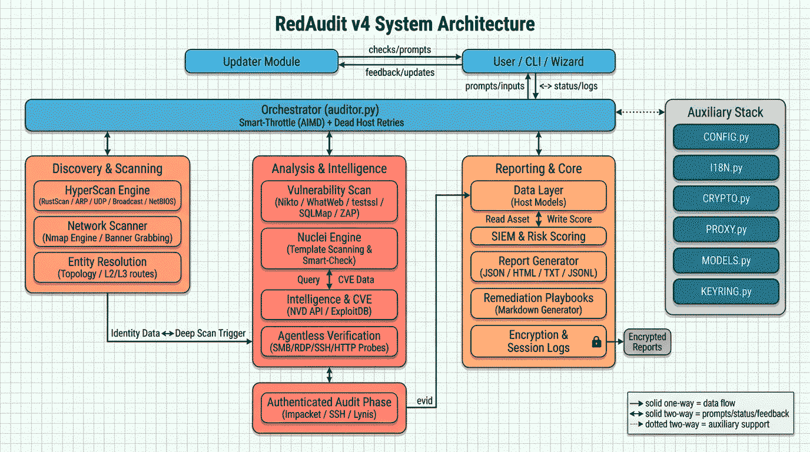

# RedAudit

[](ES/README_ES.md)

[](https://github.com/dorinbadea/RedAudit/releases/latest)


[](https://github.com/dorinbadea/RedAudit/actions/workflows/tests.yml)


<div align="center">


</div>

## What is RedAudit?

RedAudit is an **automated network auditing framework** for authorized assessments. It coordinates discovery, identity resolution, and vulnerability checks with evidence-driven escalation, then consolidates results into structured reports (JSON, TXT, HTML, plus JSONL exports).

Instead of running every tool against every host, RedAudit escalates scanning only when identity remains weak or signals are ambiguous, reducing noise while preserving coverage for hard-to-identify devices. HTTP title/server hints and device-type fingerprints help avoid unnecessary deep scans and heavy web-app scanners on infrastructure devices.

It orchestrates a comprehensive toolchain (nmap, nikto, nuclei, whatweb, testssl.sh, sqlmap, rustscan, and more) and applies **Smart-Check** verification to reduce false positives before reporting.

**Use cases**: Defensive hardening, penetration test scoping, change tracking between assessments.

**Key differentiator**: **HyperScan-First speed optimization** feeds into an identity-driven escalation engine (Deep TCP → UDP probes), combined with **Smart-Check** filtering to drastically reduce false positives without missing critical assets.

---

## How It Works

### Architecture Overview

RedAudit operates as an orchestration layer, managing concurrent execution threads for network interaction and data processing. It implements a multi-stage architecture:

> **Design Philosophy**: *"Optimization by Default, Resilience by Exception."*
> An efficient pipeline that avoids redundancy but ensures absolute fatigue-based certainty when ambiguity arises. This is the optimal design to balance speed and security in audits.

1. **HyperScan**: Async UDP/TCP discovery with **Smart-Throttle (AIMD)** congestion control.
2. **Adaptive Deep Scan**: Targeted enumeration based on host identity.
3. **Entity Resolution**: Identity-Based consolidation of multi-interface devices (heuristic).
4. **Smart Filtering**: Reducing noise via context-aware verification (`verify_vuln.py`).
5. **Resilience**: Automatic **Dead Host Retries** to abandon unresponsive hosts and prevent scan stalls.



### Adaptive Scanning Logic

RedAudit does not apply a fixed scan profile to all hosts. Instead, it uses runtime heuristics to decide escalation, including short HTTP title/meta/heading probes on common login paths for quiet hosts:

```text
┌─────────────────────────────────────────────────────────────┐
│       PHASE 0: HyperScan / RustScan Discovery (Optional)    │
│       Feeds discovered ports to Phase 1 (Speed/Stealth)     │
└─────────────────────────┬───────────────────────────────────┘
                          │
                          ▼

┌─────────────────────────────────────────────────────────────┐
│           PHASE 1: Nmap profile based on scan mode          │
│          fast/normal/full define the base scan              │
└─────────────────────────┬───────────────────────────────────┘
                          │
                          ▼
              ┌───────────────────────┐
              │  Identity Evaluation  │
              │  • MAC/vendor?        │
              │  • Hostname/DNS?      │
              │  • Service version?   │
              │  • CPE/banner?        │
              │  • HTTP title/header? │
              │  • Agentless hints?   │
              └───────────┬───────────┘
                          │
            ┌─────────────┴─────────────┐
            │                           │
            ▼                           ▼
    ┌───────────────┐          ┌────────────────┐
    │  SUFFICIENT   │          │ AMBIGUOUS HOST │
    │  Stop scan    │          │ Trigger Deep   │
    └───────────────┘          └───────┬────────┘
                                       │
                                       ▼
                    ┌──────────────────────────────────────┐
                    │      DEEP PHASE 1: Aggressive TCP    │
                    │      nmap -p- -A --open              │
                    └──────────────────┬───────────────────┘
                                       │
                          ┌────────────┴────────────┐
                          │                         │
                          ▼                         ▼
                  ┌───────────────┐        ┌────────────────┐
                  │  Identity OK  │        │ Still ambiguous│
                  │  Stop         │        │ Continue...    │
                  └───────────────┘        └───────┬────────┘
                                                   │
                                                   ▼
                                ┌──────────────────────────────────────┐
                                │      DEEP PHASE 2a: Priority UDP     │
                                │      17 common ports (DNS/DHCP/etc)  │
                                └──────────────────┬───────────────────┘
                                                   │
                                      ┌────────────┴────────────┐
                                      │                         │
                                      ▼                         ▼
                              ┌───────────────┐        ┌────────────────┐
                              │  Identity OK  │        │ Still ambiguous│
                              │  Stop         │        │ (full mode)    │
                              └───────────────┘        └───────┬────────┘
                                                               │
                                                               ▼
                                          ┌─────────────────────────────────┐
                                          │     DEEP PHASE 2b: Extended UDP │
                                          │     --top-ports N (up to 500)   │
                                          └─────────────────────────────────┘
```

In **full/completo** mode, the base profile is already aggressive, so deep identity scan triggers less often and only when identity remains weak or signals are suspicious.

**Trigger Heuristics** (what makes a host "ambiguous", mostly in fast/normal):

- Low visibility (few open ports) only when identity score is below the threshold
- Suspicious services (`unknown`, `tcpwrapped`)
- Missing MAC/vendor/hostname
- No version info when identity evidence is still weak (title/server/device-type hints)
- Filtered or no-response ports (deep scan fallback)
- Quiet hosts with vendor hints may get a short HTTP/HTTPS title/meta/heading probe on common ports to resolve identity early

**Result**: Faster scans than always-on UDP, while preserving identity for IoT, filtered services, and legacy devices.

### Concurrency Model

RedAudit uses Python's `ThreadPoolExecutor` to scan multiple hosts simultaneously.

| Parameter | Default | Range | Notes |
|:---|:---|:---|:---|
| `--threads` | Auto-detected (fallback 6) | 1-100 | Threads share memory, execute nmap independently |
| `--rate-limit` | 0 | 0-∞ | Seconds between hosts (±30% jitter applied) |

**Guidance**:

- **High threads (50-100)**: Faster, but more network noise. Risk of congestion.
- **Low threads (1-4)**: Slower, stealthier, kinder to legacy networks.
- **Rate limit >0**: Recommended for production environments to avoid IDS triggers.

---

## Quick Start

```bash
# Install
git clone https://github.com/dorinbadea/RedAudit.git
cd RedAudit && sudo bash redaudit_install.sh

# Run your first scan
sudo redaudit --target 192.168.1.0/24 --mode normal --yes
```

For interactive mode (wizard-guided setup), simply run:

```bash
sudo redaudit
```

> **Want to test RedAudit safely?**
> Set up our Vulnerable Lab using Docker: **[Lab Setup Guide](docs/LAB_SETUP.md)**

---

## Core Capabilities

### Scanning & Discovery

| Capability | Description |
|:---|:---|
| **Parallel Deep Scan** | Fully decoupled deep scan phase running in parallel (up to 100 threads) for massive speedups |
| **HyperScan** | Async TCP sweep + UDP discovery probes (including broadcast where supported) + aggressive ARP for fast inventory |
| **Smart-Throttle** | AIMD-based adaptive congestion control that prevents packet loss by dynamically sizing scan batches |
| **Topology Discovery** | L2/L3 mapping (ARP/VLAN/LLDP + gateway/routes) for network context |
| **Network Discovery** | Broadcast protocols (DHCP/NetBIOS/mDNS/UPnP/ARP/FPING) for L2 visibility |
| **Web App Security** | Integrated `sqlmap` (SQLi) and `OWASP ZAP` (DAST) for deep web application scanning, with infra-aware gating |
| **Agentless Verification** | Optional SMB/RDP/LDAP/SSH/HTTP probes for identity hints and fingerprints |
| **VPN Interface Detection** | Classifies VPN endpoints via vendor OUI, VPN ports (500/4500/1194/51820), and hostname patterns |
| **Stealth Mode** | T1 timing, 1 thread, 5s+ delays for IDS-sensitive environments (`--stealth`) |

### Intelligence & Correlation

| Capability | Description |
|:---|:---|
| **CVE Correlation** | NVD API 2.0 with CPE 2.3 matching and 7-day cache |
| **Exploit Lookup** | Automatic ExploitDB (`searchsploit`) queries for detected services |
| **Template Scanning** | Nuclei templates with best-effort false-positive checks (header/vendor/title hints) and partial timeout reporting |
| **Smart-Check Filter** | 3-layer false positive reduction (Content-Type, size, magic bytes) |
| **Network Leak Hints** | Flags multiple DHCP-advertised subnets/VLANs as potential hidden networks |

### Reporting & Integration

| Capability | Description |
|:---|:---|
| **Multi-Format Output** | JSON, TXT, HTML dashboard, JSONL exports for SIEM pipelines |
| **Remediation Playbooks** | Markdown guides auto-generated per host/category |
| **Diff Analysis** | Compare JSON reports to track network changes over time |
| **SIEM-Ready Exports** | JSONL with risk scoring and observable hashing for deduplication |
| **Report Encryption** | AES-128-CBC (Fernet) with PBKDF2-HMAC-SHA256 key derivation |

### Operations

| Capability | Description |
|:---|:---|
| **Persistent Defaults** | User preferences stored in `~/.redaudit/config.json` |
| **Generator-based Targeting** | Streaming target processor for unlimited network size (e.g. /16 or /8) without memory/RAM exhaustion |
| **Interactive Webhooks** | Webhook alerts for high/critical findings (wizard or CLI) |
| **Session Logging** | Dual-format terminal output capture (`.log` raw + `.txt` clean) for audit trails |
| **Timeout-Safe Scanning** | Host scans are bounded by hard timeouts; progress shows upper-bound ETA |
| **IPv6 + Proxy Support** | Dual-stack scanning with SOCKS5 pivoting via proxychains4 (TCP connect only) |
| **Rate Limiting** | Configurable inter-host delay with ±30% jitter to reduce predictability |
| **Bilingual Interface** | Complete English/Spanish localization |
| **Auto-Update** | Atomic staged updates with automatic rollback on failure |

### Recent Enhancements

**Smart-Throttle:** AIMD-based adaptive congestion control automatically adjusts scan batch sizes based on network conditions, ensuring maximum speed without packet loss.

**Generator-based Targeting:** Stream-processing architecture supports unlimited network sizes (e.g., /8 or /16) without memory exhaustion.

**Thread Scaling:** Increased `MAX_THREADS` from 16 to 100 (v4.6.29) to fully utilize modern hardware.

**Enterprise-Grade Risk Scoring:** Configuration findings (Nikto/Nuclei) integrated into decision matrix with Low/Medium/High severity mappings.

See [CHANGELOG](CHANGELOG.md) for complete version history.

---

## Installation

RedAudit requires a Debian-based environment (Kali Linux recommended). `sudo` privileges are recommended for full functionality (raw sockets, OS detection, tcpdump). A limited non-root mode is available via `--allow-non-root`.

```bash
# 1. Clone the repository
git clone https://github.com/dorinbadea/RedAudit.git
cd RedAudit

# 2. Run the installer (handles dependencies and aliases)
sudo bash redaudit_install.sh
```

Optional toolchain pinning:

```bash
# Use latest versions for GitHub-downloaded tools (testssl, kerbrute)
REDAUDIT_TOOLCHAIN_MODE=latest sudo bash redaudit_install.sh

# Or pin specific tool versions explicitly
TESTSSL_VERSION=v3.2 KERBRUTE_VERSION=v1.0.3 RUSTSCAN_VERSION=2.3.0 sudo bash redaudit_install.sh
```

### Docker (Windows / macOS / Linux)

Works on any platform with Docker Desktop. See **[Docker Guide](docs/DOCKER.md)** for detailed setup.

```bash
docker pull ghcr.io/dorinbadea/redaudit:latest

# Interactive wizard
docker run -it --rm -v $(pwd)/reports:/reports ghcr.io/dorinbadea/redaudit:latest

# Direct scan
docker run --rm -v $(pwd)/reports:/reports \
  ghcr.io/dorinbadea/redaudit:latest \
  --target 192.168.1.0/24 --mode normal --yes --output /reports
```

### Activating the Alias

After installation, reload your shell configuration:

| Distribution | Default Shell | Command |
|:---|:---|:---|
| **Kali Linux** (2020.3+) | Zsh | `source ~/.zshrc` |
| **Debian / Ubuntu / Parrot** | Bash | `source ~/.bashrc` |

**Or simply open a new terminal window.**

### Post-Install Verification

```bash
which redaudit            # Should return: /usr/local/bin/redaudit
redaudit --version        # Should show current version
bash redaudit_verify.sh   # Full integrity check
```

### Updating RedAudit

RedAudit includes **automatic update detection**. When launched with `sudo redaudit`, it checks for new versions and prompts:

```
Check for updates? [y/N]:
```

If you accept, RedAudit performs an **atomic staged update** with automatic rollback on failure. No manual steps required.

> **Note for Ubuntu 24.04+ (Noble):** Do **not** use `pip install` directly. The installer uses system packages (`python3-*`) to avoid `externally-managed-environment` errors.
>
> **Note (git checkout):** If you keep a local `~/RedAudit` repo, the updater refreshes tags and fast-forwards `main` when the repo is clean to avoid stale version prompts. If you have local changes or are on a different branch/tag, update manually.

**Manual update (developers only):**

```bash
cd ~/RedAudit
git pull origin main
sudo bash redaudit_install.sh -y
```

---

## Usage

### Interactive Mode (Wizard)

Launch without arguments for guided setup:

```bash
sudo redaudit
```

The wizard offers 4 audit profiles:

- **Express**: Fast discovery (host discovery only). Topology + network discovery enabled; vulnerability scanning disabled.
- **Standard**: Balanced audit (nmap `-F`/top 100 ports + web vuln checks). Timing preset is selected up front.
- **Exhaustive**: Full port scan with deeper discovery. UDP top-ports (500) is enabled for ambiguous hosts; Red Team discovery and agentless verification are enabled. CVE correlation is enabled only if an NVD API key is already configured.
- **Custom**: Full 9-step wizard with back navigation for granular control.

Phase 0 low-impact enrichment is an opt-in wizard prompt across all profiles (default off).
When enabled, it runs DNS/mDNS/SNMP checks and a short HTTP/HTTPS probe for vendor-only hosts with zero open ports.

Scan mode (`fast`/`normal`/`full`) controls coverage and depth; timing preset (Stealth/Normal/Aggressive) controls speed and noise. For full details, see `docs/MANUAL.en.md`.

The wizard covers:

1. **Target Selection**: Choose a local subnet or enter manual CIDR/IP/range targets
2. **Timing Preset**: Stealth (T1), Normal (T4), or Aggressive (T5) for Standard/Exhaustive profiles
3. **Options**: Threads, rate limiting, Phase 0 low-impact enrichment, UDP/topology/net discovery, agentless verification (varies by profile)
4. **Authorization**: Confirm you have permission to scan

### Non-Interactive / Automation

```bash
# Quick host discovery
sudo redaudit --target 192.168.1.0/24 --mode fast --yes

# Standard security audit
sudo redaudit --target 192.168.1.0/24 --mode normal --yes

# Comprehensive audit with encryption
sudo redaudit --target 192.168.1.0/24 --mode full --encrypt --yes

# Stealthy scan with rate limiting
sudo redaudit --target 10.0.0.0/24 --mode normal --rate-limit 2 --threads 4 --yes

# Network discovery with topology mapping
sudo redaudit --target 192.168.1.0/24 --net-discovery --topology --yes

# Differential analysis (compare scans)
redaudit --diff ~/reports/monday.json ~/reports/friday.json
```

### Key CLI Options

| Option | Description |
|:---|:---|
| `-t, --target` | Target network(s) in CIDR notation |
| `-m, --mode` | Scan mode: `fast` / `normal` / `full` (default: normal) |
| `-j, --threads` | Concurrent threads (1-100, auto-detected; fallback 6) |
| `--rate-limit` | Delay between hosts in seconds (±30% jitter applied) |
| `-o, --output` | Output directory |
| `-y, --yes` | Skip confirmations (automation mode) |
| `-e, --encrypt` | Encrypt reports with AES-128 |
| `--net-discovery` | Enhanced L2/broadcast discovery |
| `--topology` | Enable network topology discovery |
| `--nuclei` | Enable Nuclei template scanning (full mode only) |
| `--nuclei-max-runtime` | Max Nuclei runtime in minutes (0 = unlimited; creates resume) |
| `--nuclei-resume` | Resume pending Nuclei run from a scan folder or resume file |
| `--html-report` | Generate interactive HTML dashboard |
| `--diff OLD NEW` | Differential analysis between scans |

See `redaudit --help` or [USAGE.md](docs/USAGE.en.md) for the complete option list.

---

## Configuration

### Timing Modes

RedAudit applies nmap timing templates based on your selection:

| Mode | Nmap Template | Threads | Delay | Use Case |
|:---|:---|:---|:---|:---|
| **Stealth** | `-T1` | 1 (forced by `--stealth`) | 5s+ | IDS-sensitive or fragile networks |
| **Normal** | `-T4` | Auto-detected (configurable) | 0s | Standard audits (balanced speed/noise) |
| **Aggressive** | `-T5` | Auto-detected (cap 100; configurable) | 0s | Time-critical scans on trusted networks |

### Scan Behavior

| Parameter | Purpose | Recommendation |
|:---|:---|:---|
| `--threads N` | Parallel host scanning | Auto-detected by CPU; 2-4 for stealth |
| `--rate-limit N` | Inter-host delay (seconds) | 1-5s for production environments |
| `--udp-ports N` | Top UDP ports in full mode | 100 (default), range 50-500 |
| `--stealth` | Paranoid mode | Use in IDS-sensitive environments |

### Output & Encryption

Reports are saved under the invoking user's Documents directory (e.g., `~/Documents/RedAuditReports` or `~/Documentos/RedAuditReports`) with timestamps.

**Encryption** (when `-e, --encrypt` is used):

1. A random 16-byte salt is generated
2. Your password derives a 32-byte key via PBKDF2-HMAC-SHA256 (480k iterations)
3. Files are encrypted using Fernet (AES-128-CBC)
4. A `.salt` file is saved alongside encrypted reports

When encryption is enabled, plaintext artifacts (HTML/JSONL/playbooks/manifest) are skipped.

If you run `--encrypt` in non-interactive mode without `--encrypt-password`, a random password is generated and printed once.

**Decryption**:

```bash
python3 redaudit_decrypt.py /path/to/report.json.enc
```

### Persistence

Store defaults to avoid repeating flags:

```bash
redaudit --target 192.168.1.0/24 --threads 8 --rate-limit 1 --save-defaults --yes
# Future runs will use these settings automatically
```

Defaults are stored in `~/.redaudit/config.json`.
Use `--defaults {ask,use,ignore}` (or `--use-defaults`/`--ignore-defaults`) to control how persisted settings are applied in non-interactive runs.
Persisted defaults cover scan mode, threads, rate limit, UDP settings, topology/net discovery, Red Team, agentless verification, and Nuclei toggles.

---

## Toolchain Reference

RedAudit orchestrates these tools:

| Category | Tools | Purpose |
|:---|:---|:---|
| **Core Scanner** | `nmap`, `python3-nmap` | TCP/UDP scanning, service/version detection, OS fingerprinting |
| **Web Recon** | `whatweb`, `curl`, `wget`, `nikto` | HTTP headers, technologies, vulnerabilities |
| **Web App Security** | `sqlmap`, `zaproxy` | SQL injection scanning and OWASP ZAP DAST integration (v4.2+) |
| **Template Scanner** | `nuclei` | Optional template scanner (enable via wizard or `--nuclei`) |
| **Exploit Intel** | `searchsploit` | ExploitDB lookup for detected services |
| **CVE Intelligence** | NVD API | CVE correlation for service versions |
| **SSL/TLS Analysis** | `testssl.sh` | Deep SSL/TLS vulnerability scanning (required for TLS deep checks; installed by the installer) |
| **Traffic Capture** | `tcpdump`, `tshark` | Packet capture for protocol analysis |
| **DNS/Whois** | `dig`, `whois` | Reverse DNS and ownership lookup |
| **Topology** | `arp-scan`, `ip route` | L2 discovery, VLAN detection, gateway mapping |
| **Net Discovery** | `nbtscan`, `netdiscover`, `fping`, `avahi` | Broadcast/L2 discovery |
| **Red Team Recon** | `snmpwalk`, `enum4linux`, `rustscan`, `kerbrute` | Optional active enumeration (opt-in) |
| **Encryption** | `python3-cryptography` | AES-128 encryption for reports |

### Project Structure

```text
redaudit/
├── core/                   # Core functionality
│   ├── auditor.py          # Main orchestrator (composition entrypoint)
│   ├── auditor_components.py # Shared orchestration helpers
│   ├── auditor_scan.py     # Scanning logic (Nmap/Masscan/HyperScan adapter)
│   ├── auditor_vuln.py     # Vulnerability scanning (Nikto/Nuclei/Exploits)
│   ├── auditor_runtime.py  # Composition adapter (auditor component bridge)
│   ├── wizard.py           # Interactive UI (Wizard component)
│   ├── ui_manager.py       # Centralized UI/Output manager
│   ├── scanner/            # Low-level Nmap wrapper + IPv6 helpers
│   ├── network.py          # Network interface detection
│   ├── network_scanner.py  # Host scanning orchestration
│   ├── hyperscan.py        # Ultra-fast parallel discovery (Phase 0)
│   ├── rustscan.py         # RustScan integration for port discovery (v4.8+)
│   ├── net_discovery.py    # Enhanced L2/Broadcast discovery
│   ├── redteam.py          # Red Team discovery helpers (opt-in)
│   ├── topology.py         # Network topology discovery (L3/VLAN)
│   ├── udp_probe.py        # UDP probing helpers
│   ├── syn_scanner.py      # TCP SYN scan helpers
│   ├── agentless_verify.py # Agentless SMB/RDP/LDAP/SSH/HTTP checks
│   ├── identity_utils.py   # Identity scoring helpers
│   ├── config_context.py   # Runtime config view / convenience accessors
│   ├── auth_*.py           # Protocol-specific auth handlers (SMB, SSH, SNMP)
│   ├── nuclei.py           # Nuclei template scanner integration
│   ├── playbook_generator.py # Remediation playbook generator
│   ├── nvd.py              # CVE correlation via NVD API
│   ├── osquery.py          # Osquery verification helpers
│   ├── entity_resolver.py  # Asset consolidation / Smart-Check
│   ├── evidence_parser.py  # Evidence parsing helpers
│   ├── reporter.py         # JSON/TXT/HTML/JSONL output
│   ├── html_reporter.py    # HTML report renderer
│   ├── jsonl_exporter.py   # JSONL export for SIEM
│   ├── siem.py             # SIEM integration (ECS-aligned)
│   ├── diff.py             # Differential analysis
│   ├── crypto.py           # AES-128 encryption/decryption
│   ├── command_runner.py   # Safe external command execution
│   ├── power.py            # Sleep inhibition helpers
│   ├── proxy.py            # Proxy handling
│   ├── tool_compat.py      # Toolchain feature/compatibility helpers
│   ├── scanner_versions.py # External tool version detection
│   ├── verify_vuln.py      # Smart-Check false positive filter
│   ├── credentials.py      # Credential provider (keyring/env/file)
│   ├── credentials_manager.py # Credential orchestration helpers
│   ├── models.py           # Shared dataclasses/models
│   └── updater.py          # Auto-update system
├── templates/              # HTML report templates
└── utils/                  # Utilities (i18n, config, constants)
```

---

## Reference

### Terminology

| Term | Definition |
|:---|:---|
| **Deep Scan** | Selective escalation (TCP + UDP fingerprinting) when identity is weak or host is unresponsive |
| **HyperScan** | Ultra-fast async discovery module (batch TCP, UDP IoT, aggressive ARP) |
| **Closed-Port IoT** | Devices with no open TCP ports (WiZ, Tapo) detected via UDP broadcast probes |
| **Smart-Check** | 3-layer false positive filter (Content-Type, size, magic bytes) |
| **Entity Resolution** | Consolidation of multi-interface devices into unified assets |
| **ECS** | Elastic Common Schema alignment for SIEM compatibility |
| **Finding ID** | Deterministic SHA256 hash for cross-scan correlation |
| **CPE** | Common Platform Enumeration v2.3 for NVD matching |
| **JSONL** | JSON Lines format for streaming SIEM ingestion |
| **Fernet** | Symmetric encryption (AES-128-CBC + HMAC-SHA256) |
| **PBKDF2** | Password-based key derivation (480k iterations) |
| **Thread Pool** | Concurrent workers for parallel host scanning |
| **Rate Limiting** | Inter-host delay with ±30% jitter to reduce predictability |
| **Heartbeat** | Background thread that warns after ~60s of silence (fail threshold ~300s) |

### Troubleshooting

For comprehensive troubleshooting, see: 📖 **[Complete Troubleshooting Guide](docs/TROUBLESHOOTING.en.md)**

**Quick Links**:

- [Installation Issues](docs/TROUBLESHOOTING.en.md#1-permission-denied--root-privileges-required)
- [Scanning Problems](docs/TROUBLESHOOTING.en.md#5-scan-appears-frozen--long-pauses)
- [Network Discovery Issues](docs/TROUBLESHOOTING.en.md#12-net-discovery-missing-tools--tool_missing-v32)
- [Encryption/Decryption](docs/TROUBLESHOOTING.en.md#8-decryption-failed-invalid-token)

### Logging

Debug logs are stored in `~/.redaudit/logs/` (rotation: 5 files, 10MB each).

---

## Changelog

See [CHANGELOG.md](CHANGELOG.md) for complete version history.

## Contributing

We welcome contributions! See [CONTRIBUTING.md](CONTRIBUTING.md) for details.

## License

RedAudit is released under the **GNU General Public License v3.0 (GPLv3)**. See [LICENSE](LICENSE).

---

## Acknowledgements

RedAudit integrates the following open source projects:

- **[RustScan](https://github.com/RustScan/RustScan)** - Ultra-fast port scanner by [@bee-san](https://github.com/bee-san). Licensed under GPLv3.
- **[Nmap](https://nmap.org/)** - The network mapper by Gordon Lyon (Fyodor). Licensed under Nmap Public Source License.

---

## Legal Notice

**RedAudit** is a security tool for **authorized auditing only**. Scanning networks without permission is illegal. By using this tool, you accept full responsibility for your actions and agree to use it only on systems you own or have explicit authorization to test.

---

[Full Documentation](docs/INDEX.md) | [Report Schema](docs/REPORT_SCHEMA.en.md) | [Security Specs](docs/SECURITY.en.md)
