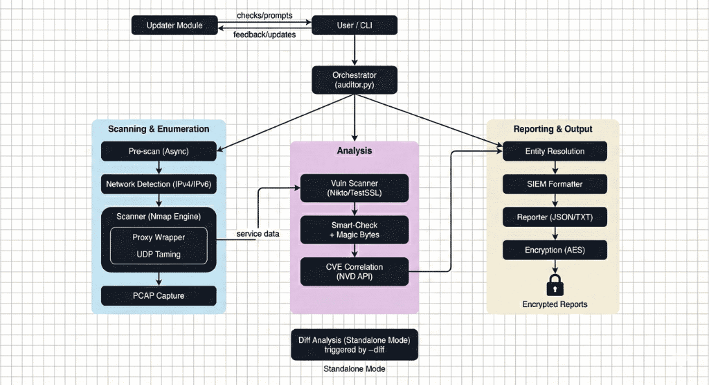

# RedAudit

[](README_ES.md)

RedAudit is a CLI tool for structured network auditing and hardening on Kali/Debian systems.


```text
 ____          _    _             _ _ _
|  _ \ ___  __| |  / \  _   _  __| (_) |_
| |_) / _ \/ _` | / _ \| | | |/ _` | | __|
|  _ <  __/ (_| |/ ___ \ |_| | (_| | | |_
|_| \_\___|\__,_/_/   \_\__,_|\__,_|_|\__|
                                      v3.4.0
        Interactive Network Audit Tool
```

## Overview

RedAudit automates the discovery, enumeration, and reporting phases of network security assessments. It is designed for use in controlled lab environments, defensive hardening workflows, and authorized offensive security exercises. By orchestrating standard industry tools into a coherent concurrent pipeline, it reduces manual overhead and ensures consistent output generation.

The tool bridges the gap between ad-hoc scanning and formal auditing, providing structured artifacts (JSON/TXT/HTML/JSONL + remediation playbooks) that are ready for reporting workflows or SIEM analysis.

## Features

- **3-Phase Adaptive Deep Scan**: Intelligent escalation (TCP aggressive → Priority UDP → Full UDP identity) triggered by host ambiguity
- **Async UDP Priority Probe (v3.1.3)**: Fast concurrent asyncio probing of priority UDP ports during deep scan for rapid service triage
- **Async Topology Discovery (v3.1.3)**: Parallelized L2/L3 collection (ARP/VLAN/LLDP + gateway/routes) for faster network mapping
- **Smart-Check False Positive Filtering**: 3-layer verification (Content-Type, size checks, magic byte validation) reduces Nikto noise by 90%
- **Cross-Validation (v3.1.4)**: Detects Nikto false positives by comparing findings with curl/wget headers
- **Descriptive Titles (v3.1.4)**: Finding titles now describe the issue type, not just the URL
- **Enhanced Net Discovery (v3.2)**: Broadcast/L2 discovery (DHCP/NetBIOS/mDNS/UPNP/ARP/fping) — **auto-enabled in `full` mode** (v3.2.1). Red Team recon available with `--redteam` flag.
- **Staged Atomic Installation with Rollback (v3.2.2)**: Updates use atomic staging with automatic rollback on failure.
- **Network Topology Discovery**: Best-effort L2/L3 mapping (ARP/VLAN/LLDP + gateway/routes) for hidden network detection
- **CVE Intelligence**: NVD API 2.0 integration with CPE 2.3 matching, 7-day caching, and deterministic finding IDs
- **SIEM-Ready Exports**: Auto-generated JSONL flat files (findings, assets, summary) with ECS v8.11 compliance
- **Entity Resolution**: Multi-interface device consolidation via hostname/NetBIOS/mDNS fingerprinting
- **Persistent Defaults**: User preferences stored in `~/.redaudit/config.json` for workflow automation
- **Differential Analysis**: JSON report comparison engine to track network changes over time
- **IPv6 + Proxy Support**: Full dual-stack scanning with SOCKS5 pivoting capabilities
- **Report Encryption**: AES-128-CBC (Fernet) with PBKDF2-HMAC-SHA256 key derivation (480k iterations)
- **Rate Limiting with Jitter**: Configurable inter-host delay (±30% randomization) for IDS evasion
- **Subnet Leak Detection (v3.2.1)**: Automatically identifies potential hidden networks (e.g., Guest zones) by analyzing service leaks (headers, redirects).
- **Interactive Main Menu (v3.2)**: Friendly entrypoint for scanning, updates, and diff analysis (no arguments required).
- **HyperScan Module (v3.2.3)**: Ultra-fast parallel discovery (asyncio batch TCP, 45+ UDP ports, aggressive ARP, IoT broadcast) with backdoor detection.
- **Stealth Mode (v3.2.3)**: `--stealth` flag enables T1 paranoid timing, single-thread scanning, and 5s+ delays for enterprise IDS evasion.
- **Remediation Playbooks (v3.4.0)**: Auto-generated Markdown playbooks per host/category in `<output_dir>/playbooks/` (TLS, headers, CVE, web, ports) (skipped when `--encrypt` is enabled).
- **Bilingual Interface**: Complete English/Spanish localization

## Architecture

RedAudit operates as an orchestration layer, managing concurrent execution threads for network interaction and data processing. It implements a two-phase architecture: generic discovery followed by targeted deep scans.

| **Category** | **Tools** | **Purpose** |
|:---|:---|:---|
| **Core Scanner** | `nmap`, `python3-nmap` | TCP/UDP port scanning, service/version detection, OS fingerprinting. |
| **Web Recon** | `whatweb`, `curl`, `wget`, `nikto` | Analyzes HTTP headers, technologies, and vulnerabilities. |
| **Exploit Intel** | `searchsploit` | Automatic ExploitDB lookup for services with detected versions. |
| **CVE Intelligence** | NVD API | CVE correlation for detected service versions (v3.0). |
| **SSL/TLS Analysis** | `testssl.sh` | Deep SSL/TLS vulnerability scanning (Heartbleed, POODLE, weak ciphers). |
| **Traffic Capture** | `tcpdump`, `tshark` | Captures network packets for detailed protocol analysis. |
| **DNS/Whois** | `dig`, `whois` | Reverse DNS lookups and ownership information for public IPs. |
| **Diff Analysis** | Built-in | Compare JSON reports to track network changes over time (v3.0). |
| **Pivoting** | `proxychains` wrapper | SOCKS5 proxy support for internal network access (v3.0). |
| **Topology** | `arp-scan`, `ip route` | L2 discovery, VLAN detection, and gateway mapping (v3.1+). |
| **Net Discovery** | `nbtscan`, `netdiscover`, `fping`, `avahi` | Enhanced broadcast/L2 discovery for guest networks (v3.2+). |
| **Red Team Recon** | `snmpwalk`, `enum4linux`, `masscan`, `rpcclient`, `ldapsearch`, `bettercap`, `kerbrute`, `scapy` | Optional active enumeration (SNMP, SMB, LDAP, Kerberos, L2 attacks) for deep Blue Team analysis (v3.2+). |
| **HyperScan** | Python `asyncio` | Ultra-fast parallel discovery: batch TCP, UDP IoT broadcast, aggressive ARP (v3.2.3). |
| **Orchestrator** | `concurrent.futures` (Python) | Manages thread pools for parallel host scanning. |
| **Encryption** | `python3-cryptography` | AES-128 encryption for sensitive audit reports. |
| **Remediation Playbooks** | Built-in | Generates actionable Markdown playbooks per host/category (v3.4.0). |

### System Overview



Deep scans are triggered selectively: web auditing modules launch only upon detection of HTTP/HTTPS services, and SSL inspection is reserved for encrypted ports.

### Project Structure

```text
redaudit/
├── core/               # Core functionality
│   ├── auditor.py      # Main orchestrator class
│   ├── prescan.py      # Asyncio fast port discovery
│   ├── scanner.py      # Nmap scanning logic + IPv6 support
│   ├── crypto.py       # AES-128 encryption/decryption
│   ├── network.py      # Interface detection (IPv4/IPv6)
│   ├── reporter.py     # JSON/TXT/HTML/JSONL + playbooks output
│   ├── html_reporter.py  # Interactive HTML report generator (v3.3)
│   ├── playbook_generator.py  # Remediation playbook generator (v3.4)
│   ├── updater.py      # Reliable auto-update (git clone)
│   ├── verify_vuln.py  # Smart-Check false positive filtering
│   ├── entity_resolver.py  # Multi-interface host grouping
│   ├── siem.py         # Professional SIEM integration
│   ├── nvd.py          # CVE correlation via NVD API
│   ├── diff.py         # Differential analysis module
│   ├── proxy.py        # SOCKS5 proxy support
│   ├── scanner_versions.py  # Tool version detection (v3.1)
│   ├── evidence_parser.py   # Observation extraction (v3.1)
│   ├── jsonl_exporter.py    # JSONL exports (v3.1)
│   ├── udp_probe.py     # Async UDP probing (v3.1.3)
│   ├── topology.py      # Async topology discovery (v3.1+)
│   ├── net_discovery.py # Enhanced network discovery (v3.2+)
│   └── hyperscan.py     # Ultra-fast parallel discovery (v3.2.3)
├── templates/          # HTML report / diff templates
│   ├── report.html.j2  # HTML dashboard template (v3.3)
│   └── diff.html.j2    # HTML diff template (v3.3)
└── utils/              # Utilities
	    ├── constants.py    # Configuration constants
	    ├── i18n.py         # Internationalization
	    ├── config.py       # Persistent configuration
	    └── webhook.py      # Webhook alerting (v3.3)
```

## Installation

RedAudit requires a Debian-based environment (Kali Linux recommended). `sudo` privileges are recommended for full functionality (raw sockets, OS detection, tcpdump). A limited non-root mode is available via `--allow-non-root`.

```bash
# 1. Clone the repository
git clone https://github.com/dorinbadea/RedAudit.git
cd RedAudit

# 2. Run the installer (handles dependencies and aliases)
sudo bash redaudit_install.sh
```

### Activating the Alias

After installation, you need to reload your shell configuration to use the `redaudit` command:

| Distribution | Default Shell | Command |
|:---|:---|:---|
| **Kali Linux** (2020.3+) | Zsh | `source ~/.zshrc` |
| **Debian / Ubuntu / Parrot** | Bash | `source ~/.bashrc` |

**Or simply open a new terminal window.**

> **Why two shells?** Kali Linux switched from Bash to Zsh in 2020 for enhanced features and customization. Most other Debian-based distros still use Bash as default. The installer automatically detects your shell and configures the correct file.

### Post-Install Verification

Verify installation integrity:

```bash
# 1. Check command is available
which redaudit  # Should return: /usr/local/bin/redaudit

# 2. Verify version
redaudit --version  # Should show: RedAudit v3.4.0

# 3. Check core dependencies
command -v nmap && command -v tcpdump && command -v python3  # All should succeed

# 4. Optional: Run verification script
bash redaudit_verify.sh  # Checks checksums, dependencies, and configuration
```

**Optional Configuration (v3.1.1):**

```bash
# Store NVD API key for CVE correlation (one-time setup)
redaudit  # Launches Interactive Main Menu (Scan / Update / Diff)

# Set persistent defaults to avoid repeating flags
redaudit --target 192.168.1.0/24 --threads 8 --rate-limit 1 --save-defaults --yes
# Future runs will use these settings automatically
```

### Usage Examples

```bash
# Quick host discovery
sudo redaudit --target 192.168.1.0/24 --mode fast --yes

# Standard security audit
sudo redaudit --target 192.168.1.0/24 --mode normal --yes

# Comprehensive audit with encryption
sudo redaudit --target 192.168.1.0/24 --mode full --encrypt --yes

# Stealthy scan with rate limiting
sudo redaudit --target 10.0.0.0/24 --mode normal --rate-limit 2 --threads 4 --yes

# Network discovery with topology mapping
sudo redaudit --target 192.168.1.0/24 --net-discovery --topology --yes

# Differential analysis (compare scans)
redaudit --diff ~/reports/monday.json ~/reports/friday.json
```

For more examples including IPv6, CVE correlation, SOCKS5 pivoting, and SIEM integration, see:
📖 **[Complete Usage Guide](docs/en/USAGE.md)**

**Core CLI Options:**

- `-t, --target`: Target network(s) in CIDR notation
- `-m, --mode`: Scan mode (fast/normal/full, default: normal)
- `-j, --threads`: Concurrent threads (1-16, default: 6)
- `--rate-limit`: Delay between hosts in seconds (includes ±30% jitter)
- `-e, --encrypt`: Encrypt reports with AES-128
- `-o, --output`: Output directory (default: ~/Documents/RedAuditReports)
- `--topology`: Enable network topology discovery **(v3.1+)**
- `--net-discovery`: Enhanced L2/broadcast discovery **(v3.2+)**
- `--cve-lookup`: CVE correlation via NVD API **(v3.0)**
- `--diff OLD NEW`: Differential analysis between scans **(v3.0)**
- `--html-report`: Generate interactive HTML dashboard **(v3.3)**
- `--webhook URL`: Send real-time alerts to webhook endpoint **(v3.3)**
- `Playbooks`: Auto-generated remediation playbooks in `<output_dir>/playbooks/` **(v3.4.0, no flag; skipped when `--encrypt`)**
- `--ipv6`: IPv6-only scanning mode **(v3.0)**
- `-y, --yes`: Skip confirmations (automation mode)

See `redaudit --help` or [USAGE.md](docs/en/USAGE.md) for the complete list of 40+ options.

## Configuration & Internal Parameters

### Concurrency (Threads)

RedAudit uses Python's `ThreadPoolExecutor` to scan multiple hosts simultaneously.

- **Parameter**: `threads` (Default: 6).
- **Range**: 1–16.
- **Behavior**: These are *threads*, not processes. They share memory but execute Nmap instances independently.
  - **Higher (10-16)**: Faster scan, but higher network noise and CPU load. Risk of congestion.
  - **Lower (1-4)**: Slower, stealthier, kinder to legacy networks.

### Rate Limiting (Stealth)

Controlled by the `rate_limit_delay` parameter.

- **Mechanism**: Introduces a `time.sleep(N)` *before* each host scan task starts.
- **Settings**:
  - **0s**: Max speed. Best for CTFs or labs.
  - **1-5s**: Balanced. Recommended for internal audits to avoid simple rate-limiter triggers.
  - **>5s**: Paranoid/Conservative. Use for sensitive production environments.

### Adaptive Deep Scan

RedAudit applies a smart 3-phase adaptive scan to maximize information gathering:

1. **Phase 1 - Aggressive TCP**: Full port scan with version detection (`-A -p- -sV -Pn`)
2. **Phase 2a - Priority UDP**: Quick scan of 17 common UDP ports (DNS, DHCP, SNMP, NetBIOS)
3. **Phase 2b - Extended UDP identity**: Only in `full` mode if no identity found yet (`-O -sU --top-ports N`, configurable via `--udp-ports`)

**Deep Scan features:**

- **Concurrent PCAP Capture**: Traffic is captured during deep scans (not after)
- **Banner Grab Fallback**: Uses `--script banner,ssl-cert` for unidentified ports
- **Host Status Accuracy**: New status types (`up`, `filtered`, `no-response`, `down`)
- **Intelligent Skip**: Phases 2a/2b are skipped if MAC/OS is already detected

- **Trigger**: Automatic based on heuristics (few ports, suspicious services, etc.)
- **Output**: Full logs, MAC/Vendor data, and (when captured) PCAP metadata in `host.deep_scan.pcap_capture`

### UDP Taming

Faster UDP scanning without sacrificing detection quality:

- Uses `--top-ports N` (default: 100, configurable via `--udp-ports`) instead of full 65535 ports
- Strict `--host-timeout 300s` per host
- Reduced retries (`--max-retries 1`) for LAN efficiency
- **Result**: 50-80% faster UDP scans

### Reliable Auto-Update

RedAudit can check for and install updates automatically:

- **Startup Check**: Prompts to check for updates when launching in interactive mode
- **Staged Installation**: Updates use atomic staging with automatic rollback on failure (v3.2.2+)
- **Auto-Install**: Downloads and installs updates via `git clone`
- **Auto-Restart**: Automatically restarts with new code using `os.execv()`
- **Skip Flag**: Use `--skip-update-check` to disable update checking

> **Note**: The updater verifies git commit hashes for integrity but does not perform cryptographic signature verification. See [SECURITY.md](docs/en/SECURITY.md#7-reliable-auto-update) for details.

**Alternative invocation:**

```bash
python -m redaudit --help
```

## 8. Reports, Encryption & Decryption

Reports are saved to `~/Documents/RedAuditReports` (default) with timestamps.

### Encryption (`.enc`)

If you check **"Encrypt reports?"** during setup:

1. A random 16-byte salt is generated.
2. Your password derives a 32-byte key via **PBKDF2HMAC-SHA256** (480,000 iterations).
3. Files are encrypted using **Fernet (AES-128-CBC)**.
    - `report.json` → `report.json.enc`
    - `report.txt` → `report.txt.enc`
    - A `.salt` file is saved alongside.

### Decryption

To read your reports, you **must** have the `.salt` file and recall your password.

```bash
python3 redaudit_decrypt.py /path/to/report_NAME.json.enc
```

*The script automatically locates the corresponding `.salt` file.*

## 9. Logging & Heartbeat

### Application Logs

Debug and audit logs are stored in `~/.redaudit/logs/`.

- **Rotation**: Keeps last 5 logs, max 10MB each.
- **Content**: Tracks user PID, command arguments, and exceptions.

### Heartbeat Monitor

A background `threading.Thread` monitors the scan state every 30 seconds.

- **<60s silence**: Normal (no output).
- **60-300s silence**: Logs a **WARNING** that the tool may be busy.
- **>300s silence**: Logs a **WARNING** with message "The active tool is still running; this is normal for slow or filtered hosts."
- **Purpose**: Assures the operator that the tool is alive during long operations (e.g., deep scans, nikto, testssl).

## 10. Verification Script

Verify your environment integrity (checksums, dependencies, alias) at any time:

```bash
bash redaudit_verify.sh
```

*Useful after OS updates or git pulls.*

## 11. Glossary

### Infrastructure & Cryptography

- **Fernet**: Symmetric encryption standard using AES-128-CBC and HMAC-SHA256, providing authenticated encryption for report confidentiality.
- **PBKDF2**: Password-Based Key Derivation Function 2. Transforms user passwords into cryptographic keys through 480,000 iterations to resist brute-force attacks.
- **Salt**: Random 16-byte data added to password hashing to prevent rainbow table attacks, stored in `.salt` files alongside encrypted reports.
- **Thread Pool**: Concurrent worker collection managed by `ThreadPoolExecutor` for parallel host scanning (default: 6 threads, configurable via `-j`).
- **Heartbeat**: Background monitoring thread that checks scan progress every 30s and warns if tools are silent for >300s, indicating potential hangs.
- **Rate Limiting**: Configurable inter-host delay with ±30% jitter to evade IDS threshold detection (activated via `--rate-limit`).
- **ECS**: Elastic Common Schema v8.11 compatibility for SIEM integration with event typing, risk scoring (0-100), and observable hashing for deduplication.
- **Finding ID**: Deterministic SHA256 hash (`asset_id + scanner + port + signature + title`) for cross-scan correlation and deduplication.
- **CPE**: Common Platform Enumeration v2.3 format used for matching software versions against NVD CVE database.
- **JSONL**: JSON Lines format - one JSON object per line, optimized for streaming ingestion into SIEM/AI pipelines.

### Operations & Reporting

- **Entity Resolution**: Consolidation of multi-interface devices into `unified_assets[]` for cleaner asset tracking and SIEM ingestion.
- **Deep Scan / Identity Refinement**: Selective escalation (TCP + UDP fingerprinting) to improve identification on ambiguous or filtered hosts.
- **Remediation Playbook**: Auto-generated Markdown guide per host/category describing actionable remediation steps and references (saved under `<output_dir>/playbooks/`).

**Note**: For detailed explanations of scanning strategies (Deep Scan, Smart-Check, Topology Discovery, etc.), see the Features section above.

## 12. Troubleshooting

For comprehensive troubleshooting covering all scenarios, see the full guide:
📖 **[Complete Troubleshooting Guide](docs/en/TROUBLESHOOTING.md)**

**Quick Links**:

- [Installation Issues](docs/en/TROUBLESHOOTING.md#1-permission-denied--root-privileges-required)
- [Scanning Problems](docs/en/TROUBLESHOOTING.md#5-scan-appears-frozen--long-pauses)
- [Network Discovery Issues](docs/en/TROUBLESHOOTING.md#12-net-discovery-missing-tools--tool_missing-v32)
- [Encryption/Decryption](docs/en/TROUBLESHOOTING.md#8-decryption-failed-invalid-token)
- [Performance Tuning](docs/en/TROUBLESHOOTING.md#15-scans-too-slow-on-large-networks)

## 13. Changelog

See [CHANGELOG.md](CHANGELOG.md) for complete version history and detailed release notes.

## 14. Contributing

We welcome contributions! Please see [CONTRIBUTING.md](.github/CONTRIBUTING.md) for details.

## 15. License

RedAudit is released under the **GNU General Public License v3.0 (GPLv3)**.
See the [LICENSE](LICENSE) file for the full text and terms.

## 16. Internals & Glossary (Why RedAudit behaves this way)

### Thread pool (`threads`)

RedAudit uses a thread pool to scan multiple hosts in parallel.
The `threads` setting controls how many hosts are scanned concurrently:

- Low (2–4): slower but stealthier and less noisy.
- Medium (default 6): balanced for most environments.
- High (10–16): faster, but may create more noise and timeouts.

### Rate limiting

RedAudit can insert a small delay between host scans.
This trades raw speed for stability and stealth during long operations.

### Heartbeat & watchdog

During long scans, RedAudit prints heartbeat messages if no output appears for a while.
This helps distinguish a "silent but healthy" scan from a real freeze.

### Encrypted reports

Reports can be encrypted with a user password.
Keys are derived with PBKDF2-HMAC-SHA256 (480k iterations) and a separate `.salt` file, so decryption is possible later with `redaudit_decrypt.py`.

## 17. Legal Notice

**RedAudit** is a security tool for **authorized auditing only**.
Scanning networks without permission is illegal. By using this tool, you accept full responsibility for your actions and agree to use it only on systems you own or have explicit authorization to test.

---
[Full Documentation](docs/README.md) | [Report Schema](docs/en/REPORT_SCHEMA.md) | [Security Specs](docs/en/SECURITY.md)
