# RedAudit

[](README_ES.md)

RedAudit is a CLI tool for structured network auditing and hardening on Kali/Debian systems.


```text
 ____          _    _             _ _ _   
|  _ \ ___  __| |  / \  _   _  __| (_) |_ 
| |_) / _ \/ _` | / _ \| | | |/ _` | | __|
|  _ <  __/ (_| |/ ___ \ |_| | (_| | | |_ 
|_| \_\___|\__,_/_/   \_\__,_|\__,_|_|\__|
                                     v2.7
        Interactive Network Audit Tool
```

## Overview

RedAudit automates the discovery, enumeration, and reporting phases of network security assessments. It is designed for use in controlled lab environments, defensive hardening workflows, and authorized offensive security exercises. By orchestrating standard industry tools into a coherent concurrent pipeline, it reduces manual overhead and ensures consistent output generation.

The tool bridges the gap between ad-hoc scanning and formal auditing, providing structured artifacts (JSON/TXT) that are ready for ingestion into reporting frameworks or SIEM analysis.

## Architecture

RedAudit operates as an orchestration layer, managing concurrent execution threads for network interaction and data processing. It implements a two-phase architecture: generic discovery followed by targeted deep scans.

| **Category** | **Tools** | **Purpose** |
|:---|:---|:---|
| **Core Scanner** | `nmap`, `python3-nmap` | TCP/UDP port scanning, service/version detection, OS fingerprinting. |
| **Web Recon** | `whatweb`, `curl`, `wget`, `nikto` | Analyzes HTTP headers, technologies, and vulnerabilities. |
| **Exploit Intel** | `searchsploit` (v2.6.1+) | Automatic ExploitDB lookup for services with detected versions. |
| **SSL/TLS Analysis** | `testssl.sh` (v2.6.1+) | Deep SSL/TLS vulnerability scanning (Heartbleed, POODLE, weak ciphers). |
| **Traffic Capture** | `tcpdump`, `tshark` | Captures network packets for detailed protocol analysis. |
| **DNS/Whois** | `dig`, `whois` | Reverse DNS lookups and ownership information for public IPs. |
| **Orchestrator** | `concurrent.futures` (Python) | Manages thread pools for parallel host scanning. |
| **Encryption** | `python3-cryptography` | AES-128 encryption for sensitive audit reports. |

### System Overview

> **Note**: If the diagram below doesn't render (e.g., on mobile), view the [static image](assets/system_overview.png).

```mermaid
%%{init: {'theme': 'dark', 'themeVariables': { 'primaryColor': '#1a365d', 'primaryTextColor': '#fff', 'primaryBorderColor': '#4299e1', 'lineColor': '#a0aec0', 'secondaryColor': '#2d3748', 'tertiaryColor': '#1a202c', 'background': '#0d1117', 'mainBkg': '#0d1117', 'nodeBorder': '#4299e1', 'clusterBkg': '#1a202c', 'clusterBorder': '#4a5568', 'titleColor': '#fff'}}}%%
flowchart TB
    subgraph Input["🖥️ User Input"]
        A["CLI / Interactive Mode"]
    end
    
    subgraph Core["📦 redaudit/core/"]
        B["auditor.py<br/>Orchestrator"]
        C["scanner.py<br/>Nmap + Deep Scan"]
        C2["prescan.py<br/>Asyncio Discovery"]
        D["network.py<br/>Interface Detection"]
        E["reporter.py<br/>JSON/TXT + SIEM"]
        F["crypto.py<br/>AES-128 + PBKDF2"]
    end
    
    subgraph Utils["⚙️ redaudit/utils/"]
        G["constants.py"]
        H["i18n.py"]
    end
    
    subgraph Scanning["🔍 Port Discovery"]
        I["nmap"]
    end
    
    subgraph WebAudit["🌐 Web Recon"]
        J["whatweb"]
        K["nikto"]
        L["curl / wget"]
    end
    
    subgraph SSL["🔒 SSL/TLS"]
        M["testssl.sh"]
        N["openssl"]
    end
    
    subgraph Traffic["📡 Traffic"]
        O["tcpdump"]
        P["tshark"]
    end
    
    subgraph Intel["🎯 Threat Intel"]
        Q["searchsploit"]
        R["dig / whois"]
    end
    
    A --> B
    B --> C & C2 & D & E & F
    B -.-> G & H
    C2 --> C
    C --> I
    C --> J & K & L
    C --> M & N
    C --> O & P
    C --> Q & R
    E --> Output[("💾 Encrypted Reports")]
    F --> Output

    style A fill:#4299e1,stroke:#2b6cb0,color:#fff
    style B fill:#48bb78,stroke:#2f855a,color:#fff
    style C fill:#4299e1,stroke:#2b6cb0,color:#fff
    style C2 fill:#4299e1,stroke:#2b6cb0,color:#fff
    style D fill:#4299e1,stroke:#2b6cb0,color:#fff
    style E fill:#4299e1,stroke:#2b6cb0,color:#fff
    style F fill:#4299e1,stroke:#2b6cb0,color:#fff
    style G fill:#68d391,stroke:#38a169,color:#1a202c
    style H fill:#68d391,stroke:#38a169,color:#1a202c
    style I fill:#ed8936,stroke:#c05621,color:#fff
    style J fill:#ed8936,stroke:#c05621,color:#fff
    style K fill:#ed8936,stroke:#c05621,color:#fff
    style L fill:#ed8936,stroke:#c05621,color:#fff
    style M fill:#ed8936,stroke:#c05621,color:#fff
    style N fill:#ed8936,stroke:#c05621,color:#fff
    style O fill:#ed8936,stroke:#c05621,color:#fff
    style P fill:#ed8936,stroke:#c05621,color:#fff
    style Q fill:#ed8936,stroke:#c05621,color:#fff
    style R fill:#ed8936,stroke:#c05621,color:#fff
    style Output fill:#9f7aea,stroke:#805ad5,color:#fff
```



Deep scans are triggered selectively: web auditing modules launch only upon detection of HTTP/HTTPS services, and SSL inspection is reserved for encrypted ports.

## Quick demo

A short terminal recording will be linked here once published.

[Watch the terminal demo](https://asciinema.org/a/PLACEHOLDER)

## Installation

RedAudit requires a Debian-based environment (Kali Linux recommended) and `sudo` privileges for raw socket access.

```bash
# 1. Clone the repository
git clone https://github.com/dorinbadea/RedAudit.git
cd RedAudit

# 2. Run the installer (handles dependencies and aliases)
sudo bash redaudit_install.sh
```

### Activating the Alias

After installation, you need to reload your shell configuration to use the `redaudit` command:

| Distribution | Default Shell | Command |
|:---|:---|:---|
| **Kali Linux** (2020.3+) | Zsh | `source ~/.zshrc` |
| **Debian / Ubuntu / Parrot** | Bash | `source ~/.bashrc` |

**Or simply open a new terminal window.**

> **Why two shells?** Kali Linux switched from Bash to Zsh in 2020 for enhanced features and customization. Most other Debian-based distros still use Bash as default. The installer automatically detects your shell and configures the correct file.

### Usage Examples

```bash
# Multiple targets
sudo redaudit --target "192.168.1.0/24,10.0.0.0/24" --mode normal --threads 6

# Skip legal warning (for automation)
sudo redaudit --target 192.168.1.0/24 --mode fast --yes

# With encryption (random password generated)
sudo redaudit --target 192.168.1.0/24 --mode normal --encrypt --yes

# With encryption (custom password)
sudo redaudit --target 192.168.1.0/24 --mode normal --encrypt --encrypt-password "MySecurePassword123" --yes
```

**Available CLI Options:**

- `--target, -t`: Target network(s) in CIDR notation (required for non-interactive)
- `--mode, -m`: Scan mode (fast/normal/full, default: normal)
- `--threads, -j`: Concurrent threads (1-16, default: 6)
- `--rate-limit`: Delay between hosts in seconds (default: 0)
- `--encrypt, -e`: Encrypt reports with password
- `--output, -o`: Output directory (default: ~/RedAuditReports)
- `--max-hosts`: Maximum hosts to scan (default: all)
- `--no-vuln-scan`: Disable web vulnerability scanning
- `--no-txt-report`: Disable TXT report generation
- `--no-deep-scan`: Disable adaptive deep scan
- `--prescan`: Enable fast asyncio pre-scan before nmap (v2.7)
- `--prescan-ports`: Port range for pre-scan (default: 1-1024)
- `--prescan-timeout`: Pre-scan timeout in seconds (default: 0.5)
- `--yes, -y`: Skip legal warning (use with caution)
- `--lang`: Language (en/es)

See `redaudit --help` for full details.

## Configuration & Internal Parameters

### Concurrency (Threads)

RedAudit uses Python's `ThreadPoolExecutor` to scan multiple hosts simultaneously.

- **Parameter**: `threads` (Default: 6).
- **Range**: 1–16.
- **Behavior**: These are *threads*, not processes. They share memory but execute Nmap instances independently.
  - **Higher (10-16)**: Faster scan, but higher network noise and CPU load. Risk of congestion.
  - **Lower (1-4)**: Slower, stealthier, kinder to legacy networks.

### Rate Limiting (Stealth)

Controlled by the `rate_limit_delay` parameter.

- **Mechanism**: Introduces a `time.sleep(N)` *before* each host scan task starts.
- **Settings**:
  - **0s**: Max speed. Best for CTFs or labs.
  - **1-5s**: Balanced. Recommended for internal audits to avoid simple rate-limiter triggers.
  - **>5s**: Paranoid/Conservative. Use for sensitive production environments.

### Adaptive Deep Scan (v2.5+)

RedAudit applies a smart 2-phase scan to "silent" or complex hosts:

1. **Phase 1**: Aggressive TCP (`-A -p- -sV -Pn`).
2. **Phase 2**: If Phase 1 yields no MAC/OS info, it launches OS+UDP detection (`-O -sSU`).

- **Trigger**: Automatic.
- **Benefit**: Saves time by skipping Phase 2 if the host is already identified.
- **Output**: Full logs and MAC/Vendor data in `host.deep_scan`.

## Modular Architecture (v2.7)

RedAudit is organized as a modular Python package:

```text
redaudit/
├── core/           # Core functionality
│   ├── auditor.py  # Main orchestrator class
│   ├── prescan.py  # Asyncio fast port discovery (v2.7)
│   ├── scanner.py  # Nmap scanning logic
│   ├── crypto.py   # AES-128 encryption/decryption
│   ├── network.py  # Interface detection
│   └── reporter.py # JSON/TXT + SIEM output
└── utils/          # Utilities
    ├── constants.py # Configuration constants
    └── i18n.py      # Internationalization
```

**Alternative invocation:**

```bash
python -m redaudit --help
```

## 8. Reports, Encryption & Decryption

Reports are saved to `~/RedAuditReports` (default) with timestamps.

### Encryption (`.enc`)

If you check **"Encrypt reports?"** during setup:

1. A random 16-byte salt is generated.
2. Your password derives a 32-byte key via **PBKDF2HMAC-SHA256** (480,000 iterations).
3. Files are encrypted using **Fernet (AES-128-CBC)**.
    - `report.json` → `report.json.enc`
    - `report.txt` → `report.txt.enc`
    - A `.salt` file is saved alongside.

### Decryption

To read your reports, you **must** have the `.salt` file and recall your password.

```bash
python3 redaudit_decrypt.py /path/to/report_NAME.json.enc
```

*The script automatically locates the corresponding `.salt` file.*

## 9. Logging & Heartbeat

### Application Logs

Debug and audit logs are stored in `~/.redaudit/logs/`.

- **Rotation**: Keeps last 5 logs, max 10MB each.
- **Content**: Tracks user PID, command arguments, and exceptions.

### Heartbeat Monitor

A background `threading.Thread` monitors the scan state every 30 seconds.

- **<60s silence**: Normal (no output).
- **60-300s silence**: Logs a **WARNING** that Nmap might be busy.
- **>300s silence**: Logs a **WARNING** with message "Nmap is still running; this is normal on slow or filtered hosts."
- **Purpose**: Assures the operator that the tool is alive during long Nmap operations (e.g., `-p-` scans).

## 10. Verification Script

Verify your environment integrity (checksums, dependencies, alias) at any time:

```bash
bash redaudit_verify.sh
```

*Useful after OS updates or git pulls.*

## 11. Glossary

- **Fernet**: Symmetric encryption standard using AES-128 and HMAC-SHA256.
- **Heartbeat**: Background task ensuring the main process is responsive.
- **Deep Scan**: Automated fallback scan (`-A`) triggered when a host returns limited data.
- **PBKDF2**: Key derivation function making brute-force attacks expensive (configured to 480k iterations).
- **Salt**: Random data added to password hashing to prevent rainbow table attacks. stored in `.salt` files.
- **Thread Pool**: Collection of worker threads that execute tasks (host scans) concurrently.

## 12. Troubleshooting

See [docs/TROUBLESHOOTING.md](docs/TROUBLESHOOTING.md) for detailed fixes.

- **"Permission denied"**: Ensure you run with `sudo`.
- **"Cryptography missing"**: Run `sudo apt install python3-cryptography`.
- **"Scan frozen"**: Check `~/.redaudit/logs/` or reduce `rate_limit_delay`.

## 13. Changelog (v2.7.0 Summary)

- **Pre-scan Asyncio Engine**: Fast port discovery using asyncio TCP connect (RustScan-style)
- **SIEM-Compatible Output**: Enhanced JSON reports with `schema_version`, `event_type`, `session_id`
- **Jitter Rate-Limiting**: ±30% random variance for IDS evasion
- **Bandit Security Linting**: Static security analysis in CI pipeline

### Previous (v2.6.x)

- **Signal Handling Hotfix**: Proper subprocess cleanup on Ctrl+C
- **Modular Architecture**: Refactored into organized package structure (8 modules)
- **CI/CD Pipeline**: GitHub Actions workflow for automated testing

For detailed changelog, see [CHANGELOG.md](CHANGELOG.md)

## 14. License

RedAudit is released under the **GNU General Public License v3.0 (GPLv3)**.  
See the [LICENSE](LICENSE) file for the full text and terms.

## 15. Internals & Glossary (Why RedAudit behaves this way)

### Thread pool (`threads`)

RedAudit uses a thread pool to scan multiple hosts in parallel.  
The `threads` setting controls how many hosts are scanned concurrently:

- Low (2–4): slower but stealthier and less noisy.
- Medium (default 6): balanced for most environments.
- High (10–16): faster, but may create more noise and timeouts.

### Rate limiting

RedAudit can insert a small delay between host scans.  
This trades raw speed for stability and stealth during long operations.

### Heartbeat & watchdog

During long scans, RedAudit prints heartbeat messages if no output appears for a while.  
This helps distinguish a "silent but healthy" scan from a real freeze.

### Encrypted reports

Reports can be encrypted with a user password.  
Keys are derived with PBKDF2-HMAC-SHA256 (480k iterations) and a separate `.salt` file, so decryption is possible later with `redaudit_decrypt.py`.

## 16. Legal Notice

**RedAudit** is a security tool for **authorized auditing only**.
Scanning networks without permission is illegal. By using this tool, you accept full responsibility for your actions and agree to use it only on systems you own or have explicit authorization to test.

---
[Full Documentation](docs/) | [Report Schema](docs/REPORT_SCHEMA.md) | [Security Specs](docs/SECURITY.md)
