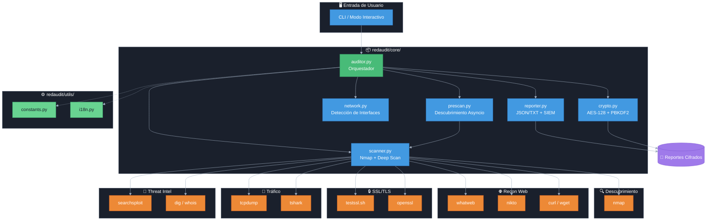

# RedAudit

[](README.md)

RedAudit es una herramienta CLI para auditoría de red estructurada y hardening en sistemas Kali/Debian.


```text
 ____          _    _             _ _ _   
|  _ \ ___  __| |  / \  _   _  __| (_) |_ 
| |_) / _ \/ _` | / _ \| | | |/ _` | | __|
|  _ <  __/ (_| |/ ___ \ |_| | (_| | | |_ 
|_| \_\___|\__,_/_/   \_\__,_|\__,_|_|\__|
                                     v2.7
     Herramienta Interactiva de Auditoría de Red
```

## Visión General

RedAudit automatiza las fases de descubrimiento, enumeración y reporte en evaluaciones de seguridad de red. Está diseñado para su uso en entornos de laboratorio controlados, flujos de trabajo de hardening defensivo y ejercicios de seguridad ofensiva autorizados. Al orquestar herramientas estándar de la industria en un pipeline concurrente coherente, reduce la carga manual y garantiza una generación de resultados consistente.

La herramienta cubre la brecha entre el escaneo ad-hoc y la auditoría formal, proporcionando artefactos estructurados (JSON/TXT) listos para su ingesta en frameworks de reporte o análisis SIEM.

## Arquitectura

RedAudit opera como una capa de orquestación, gestionando hilos de ejecución concurrentes para la interacción de red y el procesamiento de datos. Implementa una arquitectura de dos fases: descubrimiento genérico seguido de escaneos profundos dirigidos.

| **Categoría** | **Herramientas** | **Propósito** |
|:---|:---|:---|
| **Escáner Core** | `nmap`, `python3-nmap` | Escaneo de puertos TCP/UDP, detección de servicios/versión, fingerprinting de SO. |
| **Reconocimiento Web** | `whatweb`, `curl`, `wget`, `nikto` | Analiza cabeceras HTTP, tecnologías y vulnerabilidades. |
| **Inteligencia de Exploits** | `searchsploit` (v2.6.1+) | Búsqueda automática en ExploitDB para servicios con versiones detectadas. |
| **Análisis SSL/TLS** | `testssl.sh` (v2.6.1+) | Escaneo profundo de vulnerabilidades SSL/TLS (Heartbleed, POODLE, cifrados débiles). |
| **Captura de Tráfico** | `tcpdump`, `tshark` | Captura de paquetes de red para análisis detallado de protocolos. |
| **DNS/Whois** | `dig`, `whois` | Búsquedas DNS inversas e información de propiedad para IPs públicas. |
| **Orquestador** | `concurrent.futures` (Python) | Gestiona pools de hilos para escaneo paralelo de hosts. |
| **Cifrado** | `python3-cryptography` | Cifrado AES-128 para reportes de auditoría sensibles. |

### Vista General del Sistema

> **Nota**: Si el diagrama no se renderiza (ej: en móvil), ver la [imagen estática](assets/system_overview.png).



Los escaneos profundos se activan selectivamente: los módulos de auditoría web solo se lanzan tras la detección de servicios HTTP/HTTPS, y la inspección SSL se reserva para puertos cifrados.

## Demo rápida

Aquí se enlazará una grabación breve de terminal una vez publicada.

[Ver demo de terminal](https://asciinema.org/a/PLACEHOLDER)

## Instalación

RedAudit requiere un entorno basado en Debian (se recomienda Kali Linux) y privilegios `sudo` para acceso a sockets raw.

```bash
# 1. Clonar el repositorio
git clone https://github.com/dorinbadea/RedAudit.git
cd RedAudit

# 2. Ejecutar el instalador (gestiona dependencias y aliases)
sudo bash redaudit_install.sh
```

### Activar el Alias

Después de la instalación, necesitas recargar la configuración de tu shell para usar el comando `redaudit`:

| Distribución | Shell por Defecto | Comando |
|:---|:---|:---|
| **Kali Linux** (2020.3+) | Zsh | `source ~/.zshrc` |
| **Debian / Ubuntu / Parrot** | Bash | `source ~/.bashrc` |

**O simplemente abre una nueva ventana de terminal.**

> **¿Por qué dos shells?** Kali Linux cambió de Bash a Zsh en 2020 para ofrecer características mejoradas y más personalización. La mayoría de otras distros basadas en Debian siguen usando Bash por defecto. El instalador detecta automáticamente tu shell y configura el archivo correcto.

### Asistente Interactivo

El asistente te guiará:

1. **Selección de Objetivo**: Elige una subred local o introduce un CIDR manual (ej: `10.0.0.0/24`)
2. **Modo de Escaneo**: Selecciona RÁPIDO, NORMAL o COMPLETO
3. **Opciones**: Configura hilos, límite de velocidad y cifrado
4. **Autorización**: Confirma que tienes permiso para escanear

### Modo No Interactivo

Para automatización y scripting:

```bash
# Escaneo básico
sudo redaudit --target 192.168.1.0/24 --mode normal

# Escaneo completo con cifrado
sudo redaudit --target 10.0.0.0/24 --mode full --threads 8 --encrypt --output /tmp/reports

# Múltiples objetivos
sudo redaudit --target "192.168.1.0/24,10.0.0.0/24" --mode normal --threads 6

    # Saltar advertencia legal (para automatización)
    sudo redaudit --target 192.168.1.0/24 --mode fast --yes

    # Con cifrado (contraseña aleatoria generada)
    sudo redaudit --target 192.168.1.0/24 --mode normal --encrypt --yes

    # Con cifrado (contraseña personalizada)
    sudo redaudit --target 192.168.1.0/24 --mode normal --encrypt --encrypt-password "MiContraseñaSegura123" --yes
```

**Opciones CLI Disponibles:**

- `--target, -t`: Red(es) objetivo en notación CIDR (requerido para modo no interactivo)
- `--mode, -m`: Modo de escaneo (fast/normal/full, por defecto: normal)
- `--threads, -j`: Hilos concurrentes (1-16, por defecto: 6)
- `--rate-limit`: Retardo entre hosts en segundos (por defecto: 0)
- `--encrypt, -e`: Cifrar reportes con contraseña
- `--output, -o`: Directorio de salida (por defecto: ~/RedAuditReports)
- `--max-hosts`: Máximo de hosts a escanear (por defecto: todos)
- `--no-vuln-scan`: Desactivar escaneo de vulnerabilidades web
- `--no-txt-report`: Desactivar generación de reporte TXT
- `--no-deep-scan`: Desactivar deep scan adaptativo
- `--prescan`: Activar pre-escaneo rápido asyncio antes de nmap (v2.7)
- `--prescan-ports`: Rango de puertos para pre-scan (defecto: 1-1024)
- `--prescan-timeout`: Timeout de pre-scan en segundos (defecto: 0.5)
- `--yes, -y`: Saltar advertencia legal (usar con precaución)
- `--lang`: Idioma (en/es)

Ver `redaudit --help` para detalles completos.

## 7. Configuración y Parámetros Internos

### Concurrencia (Hilos)

RedAudit usa `ThreadPoolExecutor` de Python para escanear múltiples hosts simultáneamente.

- **Parámetro**: `threads` (Defecto: 6).
- **Rango**: 1–16.
- **Comportamiento**: Son *hilos* (threads), no procesos independientes. Comparten memoria pero ejecutan instancias de Nmap por separado.
  - **Alto (10-16)**: Escaneo más rápido, pero mayor carga de CPU y ruido en la red. Riesgo de congestión.
  - **Bajo (1-4)**: Más lento, más sigiloso y amable con redes antiguas o saturadas.

### Rate Limiting (Sigilo)

Controlado por el parámetro `rate_limit_delay`.

- **Mecanismo**: Introduce un `time.sleep(N)` *antes* de iniciar la tarea de escaneo de cada host.
- **Ajustes**:
  - **0s**: Velocidad máxima. Ideal para laboratorios o CTFs.
  - **1-5s**: Equilibrado. Recomendado para auditorías internas para evitar disparar limitadores simples.
  - **>5s**: Paranoico/Conservador. Úsalo en entornos de producción sensibles.

### Deep Scan Adaptativo (v2.5+)

RedAudit aplica un escaneo inteligente de 2 fases a hosts "silenciosos" o complejos:

1. **Fase 1**: TCP Agresivo (`-A -p- -sV -Pn`).
2. **Fase 2**: Si la Fase 1 no revela MAC/SO, lanza detección de SO+UDP (`-O -sSU`).

- **Activación**: Automática.
- **Beneficio**: Ahorra tiempo saltando la Fase 2 si el host ya está identificado.
- **Salida**: Logs completos y datos MAC/Vendor en `host.deep_scan`.

## Arquitectura Modular (v2.7)

RedAudit está organizado como un paquete Python modular:

```text
redaudit/
├── core/           # Funcionalidad principal
│   ├── auditor.py  # Clase orquestadora principal
│   ├── prescan.py  # Descubrimiento rápido asyncio (v2.7)
│   ├── scanner.py  # Lógica de escaneo Nmap
│   ├── crypto.py   # Cifrado/descifrado AES-128
│   ├── network.py  # Detección de interfaces
│   └── reporter.py # Salida JSON/TXT + SIEM
└── utils/          # Utilidades
    ├── constants.py # Constantes de configuración
    └── i18n.py      # Internacionalización
```

**Invocación alternativa:**

```bash
python -m redaudit --help
```

## 8. Reportes, Cifrado y Descifrado

Los reportes se guardan en `~/RedAuditReports` (por defecto) con fecha y hora.

### Cifrado (`.enc`)

Si activas **"¿Cifrar reportes?"** durante la configuración:

1. Se genera un salt aleatorio de 16 bytes.
2. Tu contraseña deriva una clave de 32 bytes vía **PBKDF2HMAC-SHA256** (480,000 iteraciones).
3. Los archivos se cifran usando **Fernet (AES-128-CBC)**.
    - `report.json` → `report.json.enc`
    - `report.txt` → `report.txt.enc`
    - Se guarda un archivo `.salt` junto a ellos.

### Descifrado

Para leer tus reportes, **debes** tener el archivo `.salt` y recordar tu contraseña.

```bash
python3 redaudit_decrypt.py /ruta/a/report_NOMBRE.json.enc
```

*El script localiza automáticamente el archivo `.salt` correspondiente.*

## 9. Logging y Monitor de Actividad (Heartbeat)

### Logs de Aplicación

Logs de depuración y auditoría se guardan en `~/.redaudit/logs/`.

- **Rotación**: Mantiene los últimos 5 archivos, máx 10MB cada uno.
- **Contenido**: Rastrea PID de usuario, argumentos de comandos y excepciones.

### Monitor de Actividad (Heartbeat)

Un hilo en segundo plano (`threading.Thread`) monitoriza el estado del escaneo cada 30 segundos.

- **<60s silencio**: Normal (sin salida).
- **60-300s silencio**: Registra un **WARNING** indicando que Nmap puede estar ocupado.
- **>300s silencio**: Registra un **WARNING** con el mensaje "Nmap sigue ejecutándose; esto es normal en hosts lentos o filtrados."
- **Propósito**: Asegurar al operador que la herramienta sigue viva durante operaciones largas de Nmap (ej: escaneos `-p-`).

## 10. Script de Verificación

Verifica la integridad de tu entorno (checksums, dependencias, alias) en cualquier momento:

```bash
bash redaudit_verify.sh
```

*Útil tras actualizaciones del sistema o `git pull`.*

## 11. Glosario

- **Fernet**: Estándar de cifrado simétrico usando AES-128 y HMAC-SHA256.
- **Heartbeat**: Tarea en segundo plano que asegura que el proceso principal responde.
- **Deep Scan**: Escaneo de respaldo automático (`-A`) disparado cuando un host devuelve datos limitados.
- **PBKDF2**: Función de derivación de claves que encarece los ataques de fuerza bruta (configurada a 480k iteraciones).
- **Salt**: Dato aleatorio añadido al hash de contraseña para evitar ataques de rainbow table, guardado en archivos `.salt`.
- **Thread Pool**: Colección de hilos trabajadores que ejecutan tareas (escaneos de host) concurrentemente.

## 12. Solución de Problemas

Consulta [docs/TROUBLESHOOTING.md](docs/TROUBLESHOOTING.md) para soluciones detalladas.

- **"Permission denied"**: Asegúrate de usar `sudo`.
- **"Cryptography missing"**: Ejecuta `sudo apt install python3-cryptography`.
- **"Scan frozen"**: Revisa `~/.redaudit/logs/` o reduce `rate_limit_delay`.

## 13. Historial de Cambios (Resumen v2.7.0)

- **Motor Pre-scan Asyncio**: Descubrimiento rápido de puertos usando TCP connect asyncio (estilo RustScan)
- **Salida Compatible SIEM**: Reportes JSON mejorados con `schema_version`, `event_type`, `session_id`
- **Rate-Limiting con Jitter**: Varianza aleatoria ±30% para evasión de IDS
- **Linting de Seguridad Bandit**: Análisis de seguridad estático en pipeline CI

### Anterior (v2.6.x)

- **Hotfix de Señales**: Limpieza correcta de subprocesos en Ctrl+C
- **Arquitectura Modular**: Refactorizado en estructura de paquete organizada (8 módulos)
- **Pipeline CI/CD**: Workflow de GitHub Actions para testing automatizado

Para el changelog detallado, consulta [CHANGELOG.md](CHANGELOG.md)

## 14. Licencia

RedAudit se distribuye bajo la **GNU General Public License v3.0 (GPLv3)**.  
Consulta el archivo [LICENSE](LICENSE) para ver el texto completo y las condiciones.

## 15. Internos & Glosario (Por qué RedAudit se comporta así)

### Pool de hilos (`threads`)

RedAudit utiliza un *pool* de hilos para escanear varios hosts en paralelo.  
El parámetro `threads` controla cuántos hosts se analizan simultáneamente:

- Valor bajo (2–4): más lento, pero más sigiloso y con menos ruido.
- Valor medio (por defecto, 6): buen equilibrio para la mayoría de entornos.
- Valor alto (10–16): más rápido, pero puede generar más ruido y más timeouts.

### Limitación de tasa (*rate limiting*)

Para no saturar la red, RedAudit puede introducir un pequeño retardo entre host y host.  
Esto sacrifica velocidad a cambio de estabilidad y menor huella en entornos sensibles.

### Heartbeat y watchdog

En escaneos largos, RedAudit muestra mensajes de *heartbeat* cuando lleva un tiempo sin imprimir nada.  
Sirve para distinguir un escaneo "silencioso pero sano" de un bloqueo real.

### Reportes cifrados

Los reportes pueden cifrarse con contraseña.  
La clave se deriva con PBKDF2-HMAC-SHA256 (480k iteraciones) y se acompaña de un archivo `.salt` para poder descifrarlos posteriormente con `redaudit_decrypt.py`.

## 16. Aviso Legal

**RedAudit** es una herramienta de seguridad únicamente para **auditorías autorizadas**.
Escanear redes sin permiso es ilegal. Al usar esta herramienta, aceptas total responsabilidad por tus acciones y acuerdas usarla solo en sistemas de tu propiedad o para los que tengas autorización explícita.

---
[Documentación Completa](docs/) | [Esquema de Reporte](docs/REPORT_SCHEMA.md) | [Especificaciones de Seguridad](docs/SECURITY.md)
