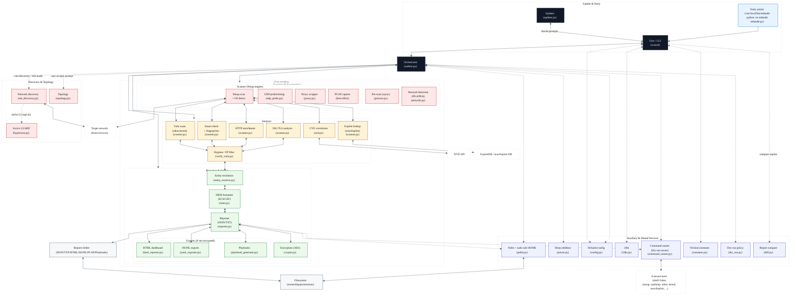

# RedAudit

[](README.md)

Auditoría y hardening de red para sistemas Kali/Debian — asistente interactivo + salida CLI pensada para CI.


<details>
<summary>Banner</summary>

```text
 ____          _    _             _ _ _
|  _ \ ___  __| |  / \  _   _  __| (_) |_
| |_) / _ \/ _` | / _ \| | | |/ _` | | __|
|  _ <  __/ (_| |/ ___ \ |_| | (_| | | |_
|_| \_\___|\__,_|/_/   \_\__,_|\__,_|_|\__|
     Herramienta Interactiva de Auditoría de Red
```

</details>

## Inicio rápido

```bash
git clone https://github.com/dorinbadea/RedAudit.git
cd RedAudit
sudo bash redaudit_install.sh
```

Ejecuta el asistente interactivo:

```bash
sudo redaudit
```

O ejecuta en modo no interactivo:

```bash
sudo redaudit --target 192.168.1.0/24 --mode normal --yes
```

## Documentación

- Uso (flags + ejemplos): `docs/es/USAGE.md`
- Manual (instalación, conceptos, salidas): `docs/es/MANUAL.md`
- Esquema de reportes: `docs/es/REPORT_SCHEMA.md`
- Modelo de seguridad y notas del updater: `docs/es/SECURITY.md`
- Troubleshooting: `docs/es/TROUBLESHOOTING.md`
- Registro de cambios: `CHANGELOG_ES.md`

## Qué obtienes

RedAudit orquesta herramientas estándar (p. ej. `nmap`, `whatweb`, `nikto`, `testssl.sh`) en un pipeline consistente y genera artefactos listos para reporting e ingesta SIEM.

Capacidades clave:

- Deep scan adaptativo de identidad (TCP + UDP) con capturas PCAP best-effort
- Descubrimiento de topología y descubrimiento broadcast/L2 opcionales (`--topology`, `--net-discovery`)
- Recon Red Team opt-in dentro de net discovery (`--redteam`, guarded; requiere root)
- Soporte completo de `--dry-run` (no se ejecutan comandos externos; se imprimen)
- Dashboard HTML + exportaciones JSONL + playbooks (omitidos si el cifrado está activado)

## Salidas

Cada ejecución crea una carpeta con sello temporal (por defecto: `~/Documents/RedAuditReports/RedAudit_YYYY-MM-DD_HH-MM-SS/`) con:

- `redaudit_<timestamp>.json` y `redaudit_<timestamp>.txt` (o `.enc` + `.salt` si hay cifrado)
- `report.html` (dashboard HTML, si el cifrado está desactivado)
- `findings.jsonl`, `assets.jsonl`, `summary.json` (exportaciones planas para SIEM/IA, si el cifrado está desactivado)
- `run_manifest.json` (métricas + lista de artefactos, si el cifrado está desactivado)
- `playbooks/` (guías de remediación en Markdown, si el cifrado está desactivado)
- `traffic_*.pcap` (micro-capturas best-effort durante deep scan si aplica)

## Seguridad y requisitos

- Ejecuta con `sudo` para funcionalidad completa (raw sockets, OS detection, `tcpdump`/capturas). Existe modo limitado: `--allow-non-root`.
- Las funciones Red Team son opt-in y solo para auditorías autorizadas.
- Si actualizas y el banner/versión no se refresca, reinicia el terminal o ejecuta `hash -r`.

## Arquitectura


```mermaid
%%{init: {"theme":"base","flowchart":{"curve":"linear","nodeSpacing":14,"rankSpacing":22},"themeVariables":{"fontFamily":"Inter, ui-sans-serif, system-ui, -apple-system, Segoe UI, Roboto, Arial","fontSize":"13px","primaryColor":"#F6F8FA","primaryTextColor":"#0B0F14","primaryBorderColor":"#D0D7DE","lineColor":"#57606A","tertiaryColor":"#FFFFFF"}}}%%
flowchart TB

  classDef entry fill:#E7F3FF,stroke:#0969DA,stroke-width:1px,color:#0B0F14;
  classDef orch fill:#111827,stroke:#0B0F14,stroke-width:1px,color:#FFFFFF;
  classDef scan fill:#FDE7E7,stroke:#CF222E,stroke-width:1px,color:#0B0F14;
  classDef analysis fill:#FFF3D6,stroke:#9A6700,stroke-width:1px,color:#0B0F14;
  classDef report fill:#EAF9EA,stroke:#1A7F37,stroke-width:1px,color:#0B0F14;
  classDef aux fill:#EEF2FF,stroke:#4F46E5,stroke-width:1px,color:#0B0F14;
  classDef io fill:#F6F8FA,stroke:#57606A,stroke-width:1px,color:#0B0F14;
  classDef ext fill:#FFFFFF,stroke:#D0D7DE,stroke-width:1px,stroke-dasharray: 3 3,color:#0B0F14;

  subgraph ENTRY["Update & Entry"]
    direction LR
    updater["Updater\n(updater.py)"]:::orch
    user_cli["User / CLI\n(wizard)"]:::orch
    entrypoints["Entry points\n(/usr/local/bin/redaudit\npython -m redaudit\nredaudit.py)"]:::entry
  end

  updater <--> |checks/prompts| user_cli
  entrypoints --> user_cli

  orchestrator["Orchestrator\n(auditor.py)"]:::orch
  user_cli <--> orchestrator

  subgraph PIPE["Core pipeline"]
    direction LR

    subgraph SCANNING["Scanning & Enumeration"]
      direction TB
      prescan["Pre-scan (async)\n(prescan.py)"]:::scan
      net_detect["Network detection\n(IPv4/IPv6)\n(network.py)"]:::scan

      subgraph SCANNER_ENGINE["Scanner (Nmap engine)\n(scanner.py)"]
        direction TB
        nmap_engine["Nmap scan\n+ OS detect"]:::scan
        udp_timing["UDP probe/timing\n(udp_probe.py)"]:::scan
        proxy_wrap["Proxy wrapper\n(proxy.py)"]:::scan
        pcap_capture["PCAP capture\n(best-effort)"]:::scan
      end
    end

    subgraph ANALYSIS["Analysis"]
      direction TB
      vuln_scans["Vuln scans\n(nikto/testssl)\n(scanner.py)"]:::analysis
      smart_checks["Smart-check\n+ fingerprints\n(scanner.py)"]:::analysis
      http_enrich["HTTP enrichment\n(scanner.py)"]:::analysis
      tls_analysis["SSL/TLS analysis\n(scanner.py)"]:::analysis
      exploit_lookup["Exploit lookup\n(searchsploit)\n(scanner.py)"]:::analysis
      cve_corr["CVE correlation\n(nvd.py)"]:::analysis
      fp_filter["Hygiene / FP filter\n(verify_vuln.py)"]:::analysis
    end

    subgraph OUTPUT["Reporting & Output"]
      direction TB
      entity["Entity resolution\n(entity_resolver.py)"]:::report
      siem["SIEM formatter\n(ECS/CEF)\n(siem.py)"]:::report
      reporter["Reporter\n(JSON/TXT)\n(reporter.py)"]:::report
      encryption["Encryption (AES)\n(crypto.py)"]:::report

      subgraph EXPORTS["Exports (if not encrypted)"]
        direction TB
        html["HTML dashboard\n(html_reporter.py)"]:::report
        jsonl["JSONL exports\n(jsonl_exporter.py)"]:::report
        playbooks["Playbooks\n(playbook_generator.py)"]:::report
      end
    end
  end

  subgraph DISCOVERY["Discovery & Topology"]
    direction LR
    net_discovery["Network discovery\n(net_discovery.py)"]:::scan
    hyperscan["Active L2/ARP\n(hyperscan.py)"]:::scan
    topology["Topology\n(topology.py)"]:::scan
  end

  subgraph AUX["Auxiliary & Shared Services"]
    direction TB
    cmd["Command runner\n(dry-run aware)\n(command_runner.py)"]:::aux
    power["Sleep inhibitor\n(power.py)"]:::aux
    cfg["Defaults/config\n(config.py)"]:::aux
    i18n["i18n\n(i18n.py)"]:::aux
    paths["Paths + sudo-safe HOME\n(paths.py)"]:::aux
    constants["Version/constants\n(constants.py)"]:::aux
    dryrun["Dry-run policy\n(dry_run.py)"]:::aux
    diff["Report compare\n(diff.py)"]:::aux
  end

  ext_tools["External tools\n(shell=false)\n(nmap, tcpdump, nikto, testssl,\nsearchsploit, ...)"]:::ext
  targets["Target network\n(hosts/services)"]:::ext
  nvd_api["NVD API"]:::ext
  exploitdb["ExploitDB / searchsploit DB"]:::ext
  artifacts["Reports folder\n(JSON/TXT/HTML/JSONL/PCAP/Playbooks)"]:::io
  filesystem["Filesystem\n(ownership/permissions)"]:::io

  orchestrator <--> SCANNING
  orchestrator <--> ANALYSIS
  orchestrator <--> OUTPUT
  orchestrator -. "--net-discovery / full mode" .-> net_discovery
  orchestrator -. "user accepts prompt" .-> topology
  net_discovery -. "active L2 (opt-in)" .-> hyperscan

  nmap_engine <--> vuln_scans
  nmap_engine <--> smart_checks
  nmap_engine <--> http_enrich
  nmap_engine <--> tls_analysis
  nmap_engine <--> exploit_lookup
  nmap_engine <--> cve_corr
  vuln_scans <--> fp_filter
  smart_checks <--> fp_filter
  http_enrich <--> fp_filter
  tls_analysis <--> fp_filter

  fp_filter <--> entity
  entity <--> siem
  siem <--> reporter
  reporter <--> encryption
  reporter <--> html
  reporter <--> jsonl
  reporter <--> playbooks

  user_cli <-.-> cfg
  user_cli <-.-> i18n
  user_cli <-.-> constants
  orchestrator <-.-> cfg
  orchestrator <-.-> paths
  orchestrator <-.-> power
  orchestrator <-.-> dryrun
  orchestrator <-.-> cmd
  reporter <-.-> paths
  reporter <-.-> cmd
  user_cli -. "compare reports" .-> diff

  cmd <--> ext_tools
  nmap_engine <--> targets
  net_discovery <--> targets
  cve_corr <--> nvd_api
  exploit_lookup <--> exploitdb

  reporter --> artifacts
  artifacts <--> filesystem
  paths <--> filesystem
```

Enlace PNG (móvil / sin soporte Mermaid): `docs/images/system_overview_es_v3.png`

## Contribuir

Ver `.github/CONTRIBUTING.md`.

## Licencia

GNU GPLv3. Ver `LICENSE`.
