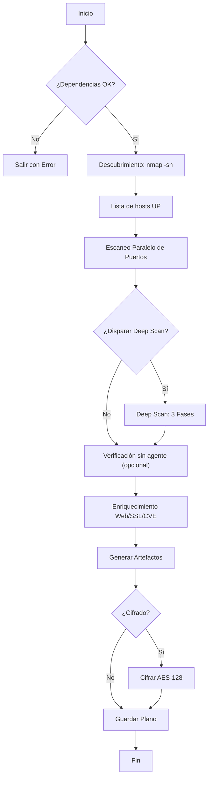

# Guía para Instructores de RedAudit

**Audiencia:** Instructores, profesores y mentores.

**Propósito:** Enseñar conceptos de auditoría de red usando RedAudit como herramienta práctica.

**Conocimiento previo:** Fundamentos TCP/IP y uso básico de CLI Linux.

**Fuente de verdad:** `redaudit/core/auditor.py`, `redaudit/core/auditor_scan.py`

> **Esto NO es un manual de software.** Para referencia CLI, ver [USAGE.es.md](USAGE.es.md). Para detalles de arquitectura, ver [MANUAL.es.md](MANUAL.es.md).

---

## 1. Resumen Ejecutivo para Instructores

### Guía de Planificación de Sesiones

| Duración | Alcance | Temas | Lab |
|:---|:---|:---|:---|
| **30 min** | Solo Demo | ¿Qué es orquestación? Escaneo en vivo de 1 host. Salida JSON. | Ninguno |
| **60 min** | Introducción | Orquestación + Heurísticas. Escanear subred /28. | Lab 1 (Básico) |
| **90 min** | Estándar | Lo anterior + Lógica Deep Scan + Estructura de informes. | Lab 1 + Lab 2 |
| **120 min** | Avanzado | Lo anterior + Integración SIEM + Revisión de código. | Los tres labs |

### Checklist de Materiales

- [ ] VM con Kali/Parrot (RedAudit preinstalado)
- [ ] Red de laboratorio aislada (10.0.0.0/24 o similar)
- [ ] Al menos 3 hosts objetivo con servicios variados (1 web, 1 solo SSH, 1 "vacío")
- [ ] Proyector/pantalla para demo en vivo
- [ ] Rúbrica impresa (Sección 5)

Sugerencia para el instructor: Al iniciar escaneos, muestra el resumen de objetivos normalizados (hosts estimados) para reforzar la validación de alcance.

---

## 2. Conceptos Clave para Enseñar

### Concepto 1: Orquestación vs. Escaneo Manual

**Qué explicar:**
Ejecutar `nmap`, `nikto`, `testssl` manualmente produce salidas dispersas. Correlacionar "¿qué vulnerabilidades existen en el puerto 443 del host X?" requiere grep/análisis manual.

**Orquestación** significa:

1. Un programa central llama múltiples herramientas en secuencia.
2. Los resultados se unifican en un documento estructurado único (JSON).
3. Las decisiones (ej: "¿debemos escanear UDP?") se toman automáticamente vía heurísticas.

**Ubicación en código:** [`run_complete_scan()`](../redaudit/core/auditor.py) orquesta todas las fases.

---

### Concepto 2: Auditoría Basada en Evidencia

**Qué explicar:**
Las auditorías profesionales requieren **evidencia verificable**. Un informe que dice "puerto 22 está abierto" no tiene valor sin:

- Timestamp del escaneo
- Herramienta y versión usada
- Salida cruda (o hash de la misma)

**RedAudit proporciona:**

- JSON con `timestamp`, `version`, `scan_duration`
- Capturas PCAP opcionales
- Permisos de archivo (0600) para prevenir manipulación
- Metadatos de evidencia por hallazgo (herramienta fuente, matched_at, hash/ref de salida cruda si aplica)
- Manifiesto de ejecución con snapshot de config y pipeline (si el cifrado está deshabilitado)

**Pregunta práctica:** "Si un cliente disputa tus hallazgos, ¿cómo demuestras que ejecutaste el escaneo correctamente?"

---

### Concepto 3: Toma de Decisiones Heurística (Deep Scan)

**Qué explicar:**
Escanear cada host con UDP completo (-p- -sU) tomaría horas. RedAudit usa **heurísticas** para decidir cuándo vale la pena el esfuerzo extra.

**Condiciones de disparo (verificadas contra código):**

| Condición | Razonamiento |
|:---|:---|
| Puntuación de identidad por debajo del umbral (p. ej., falta de MAC/fabricante/nombre de host, sin CPE/banner, señales HTTP de título/servidor o sin agente débiles) | Identidad sigue débil |
| ≤3 puertos abiertos **y** la identidad es débil | Baja visibilidad, requiere sondeo extra |
| Fingerprint de servicio débil (`unknown`, `tcpwrapped` o sin versión sin evidencia HTTP) | Identidad ambigua o filtrada |
| >8 puertos abiertos **o** pistas de dispositivo de red | Host complejo o infraestructura, merece enumeración adicional |

**Ubicación en código:** Condiciones en [`scan_host_ports()`](../redaudit/core/auditor_scan.py)

**Nota operativa:** El resumen de pipeline en JSON/HTML incluye args/timing de Nmap, ajustes de deep scan y el resumen HyperScan vs final (cuando existe).

---

---

### Concepto 4: Informes Estructurados (Alineados a ECS)

**Qué explicar:**
La salida de texto crudo es legible para humanos pero hostil para máquinas. JSON estructurado permite:

- Ingesta en SIEM (Elastic Stack y otros SIEM)
- Alertas automatizadas
- Análisis de tendencias en el tiempo

RedAudit enriquece el informe principal con campos alineados a ECS:

- `ecs.version` y `event.*` en la raíz del informe (metadatos del escaneo)
- `hosts[].ecs_host` con campos de identidad (`ip`, `hostname`, `mac`, `vendor`)
- Exportaciones JSONL planas para SIEM (mapeadas vía las configs incluidas)

**Ubicación en código:** [`siem.py`](../redaudit/core/siem.py) define los mapeos ECS.

---

### Concepto 5: Cómo RedAudit Filtra el Ruido (Smart-Check)

**Qué explicar:**
Una frustración común en auditorías son los "Falsos Positivos" (herramientas que informan de problemas que no existen). RedAudit implementa una capa lógica para verificar hallazgos antes de reportarlos.

**El Mecanismo "Smart-Check":**

1. **Verificación de Contenido Nikto:** Si Nikto afirma haber encontrado `backup.tar`, RedAudit descarga los primeros 512 bytes.
    - *Verificación:* ¿Están presentes los "magic bytes" distintivos de un archivo TAR?
    - *Verificación:* ¿Es el Content-Type `application/x-tar`?
    - *Resultado:* Si el archivo es realmente una página de error HTML (Soft 404), el hallazgo se descarta silenciosamente.
2. **Conciencia de Contexto Nuclei:** Si un escáner reporta un CVE específico para "Mitel VoIP", pero RedAudit ya identificó el dispositivo como "HP Printer", marca el hallazgo como `suspected_false_positive` o lo descarta.

**Ubicación en código:** [`redaudit/core/verify_vuln.py`](../redaudit/core/verify_vuln.py)

---

### Concepto 6: Arquitectura - Async vs. Threading

**Qué explicar:**
¿Por qué usar modelos de escalado diferentes?

- **Escaneo de Hosts (Threading):** Nmap es un proceso bloqueante. Usamos `ThreadPoolExecutor` (2-100 hilos, auto-detectado según CPU) para que un host lento no bloquee todo el escaneo.
- **Descubrimiento (Async):** La transmisión de paquetes UDP (para IoT/Descubrimiento de Servicios) es intensiva en E/S. Usamos `asyncio` en `HyperScan` para lanzar miles de paquetes pequeños instantáneamente sin crear miles de hilos del sistema operativo.

**Ubicación en código:**

- Threading: `scan_hosts_concurrent()` en `auditor_scan.py`
- Async: Módulos de `hyperscan.py`

---

## 3. Flujo Operativo (Simplificado)

Usa este diagrama en las clases. Refleja con precisión el flujo real del código.

**Tip para enseñar:** Recorre el diagrama antes de la primera demo. Después de la demo, pide a los estudiantes que identifiquen qué fase observaron.

---

## 4. Labs Guiados

### Lab 1: Descubrimiento Básico (30 min)

**Objetivo:** Ejecutar un escaneo, localizar la salida, interpretar el JSON.

**Configuración:**

- Objetivo: Un solo host con SSH + HTTP (ej: Metasploitable)
- Modo: `normal`

**Pasos:**

1. Ejecutar: `sudo redaudit -t 10.0.0.5 -m normal --yes`
2. Localizar la carpeta de salida: `ls ~/Documents/RedAuditReports/`
3. Abrir el JSON: `cat redaudit_*.json | jq '.hosts[0].ports'`
4. Responder: ¿Cuántos puertos están abiertos? ¿Qué servicios se detectaron?

**Resultado Esperado:** Los estudiantes pueden navegar la estructura de archivos y extraer datos del JSON.

---

### Lab 2: Análisis de Disparo de Deep Scan (45 min)

**Objetivo:** Observar la toma de decisiones heurística y entender el comportamiento adaptativo.

**Configuración:**

- Objetivo A: Host con 10+ puertos abiertos (complejo)
- Objetivo B: Host con 1 puerto abierto (mínimo)
- Modo: `full`

**Pasos:**

1. Ejecutar: `sudo redaudit -t 10.0.0.0/28 -m full --yes`
2. Durante el escaneo, observar la salida de consola buscando marcadores `[deep]`.
3. Después del escaneo, examinar el JSON buscando objetos `deep_scan`.
4. Comparar Objetivo A vs Objetivo B: ¿Cuál disparó Deep Scan? ¿Por qué?

**Pregunta de Discusión:** "¿Qué pasaría si RedAudit siempre ejecutara Deep Scan?"

---

### Lab 3: Reto de Integración de Informes (60 min)

**Objetivo:** Ingestar la salida de RedAudit en un sistema tipo SIEM.

**Configuración:**

- Resultados de escaneo previo (JSON)
- Instancia de Elasticsearch (o sandbox Kibana)
- Opcional: jq, curl

**Pasos:**

1. Extraer hosts de alto riesgo: `cat redaudit_*.json | jq '.hosts[] | select(.risk_score > 70)'`
2. Convertir a JSONL: Usar el archivo `findings.jsonl` directamente.
3. Ingestar en Elasticsearch (ejemplo en [MANUAL.es.md](MANUAL.es.md#integration)).
4. Crear una visualización simple en Kibana.

**Resultado Esperado:** Los estudiantes entienden el puente entre escaneo y operaciones.

---

## 5. Evaluación y Rúbrica

### Preguntas de Respuesta Corta

1. ¿Cuál es la diferencia entre `--mode fast` y `--mode full`?
2. ¿Bajo qué condiciones RedAudit dispara un Deep Scan?
3. ¿Por qué no se generan archivos JSONL cuando `--encrypt` está habilitado?
4. ¿Cuál es el propósito del archivo `.salt`?

### Rúbrica de Calificación (Lab 2)

| Criterio | Excelente (4) | Bueno (3) | En Desarrollo (2) | Incompleto (1) |
|:---|:---|:---|:---|:---|
| Identifica disparadores de Deep Scan | Las 4 condiciones | 3 condiciones | 2 condiciones | 0-1 condiciones |
| Explica el razonamiento | Claro, preciso | Errores menores | Vago | Faltante |
| Localiza evidencia en JSON | Ruta + clave correctas | Ruta correcta | Ruta incorrecta | No intentado |

---

## 6. Errores Comunes de Estudiantes

Basados en observaciones reales en aula:

| Error | Síntoma | Corrección |
|:---|:---|:---|
| Ejecutar sin `sudo` | `Permission denied` en sockets | Explicar requisitos de raw sockets |
| Escanear IPs públicas | El escaneo tarda eternamente o falla | Usar solo redes de laboratorio. Discutir legalidad. |
| Esperar playbooks con `--encrypt` | Carpeta `playbooks/` vacía | El cifrado deshabilita artefactos en texto plano |
| Comparar informes antiguos/nuevos falla | `--diff` devuelve "No scan performed" | Explicar que `--diff` es solo comparación, no escaneo |
| Editar constants.py sin reiniciar | Los cambios no aplican | Python cachea imports; reinicio requerido |
| Confundir modo scan con modo UDP | Se escanean puertos incorrectos | `--mode` ≠ `--udp-mode`. Uno es intensidad, otro es alcance de protocolo. |
| Tratar el ETA como exacto | ETA parece “clavado” o muy alto | Explicar `ETA≤` como límite por timeout y `ETA≈` como estimación dinámica |

---

## 7. Referencias de Código para Enseñar

Estas son las ubicaciones de código más útiles pedagógicamente. Úsalas para estudiantes avanzados o walkthroughs de código en vivo.

| Concepto | Archivo | Función/Área |
|:---|:---|:---|
| Orquestación principal | `core/auditor.py` | `run_complete_scan()` |
| Disparadores de Deep Scan | `core/auditor_scan.py` | `scan_host_ports()` (buscar `trigger_deep`) |
| Ejecución paralela | `core/auditor_scan.py` | `scan_hosts_concurrent()` con `ThreadPoolExecutor` |
| UI de progreso + ETA | `core/auditor_components.py` | `_progress_columns()` |
| Escaneos con timeout | `core/auditor_scan.py` | `_run_nmap_xml_scan()` |
| Descubrimiento async | `core/hyperscan.py` | Descubrimiento TCP/UDP/ARP asíncrono usando `asyncio` |
| Mapeo schema ECS | `core/siem.py` | `build_ecs_event()` |
| Cifrado | `core/crypto.py` | `encrypt_file()`, `derive_key_from_password()` |
| Generación de playbooks | `core/playbook_generator.py` | `generate_playbook()`, `save_playbooks()` |
| Logging de sesión (v3.7) | `utils/session_log.py` | `SessionLogger`, `start_session_log()` (`session_logs/session_*.log/.txt`) |

> **Nota:** Evita referenciar números de línea específicos ya que cambian entre versiones. Referencia nombres de funciones en su lugar.

---

## 8. Lectura Adicional

- [MANUAL.es.md](MANUAL.es.md) – Arquitectura completa y referencia CLI
- [USAGE.es.md](USAGE.es.md) – Ejemplos prácticos por escenario
- [REPORT_SCHEMA.es.md](REPORT_SCHEMA.es.md) – Definiciones de campos JSON
- [TROUBLESHOOTING.es.md](TROUBLESHOOTING.es.md) – Resolución de errores

---

[Volver al Índice de Documentación](INDEX.md)
