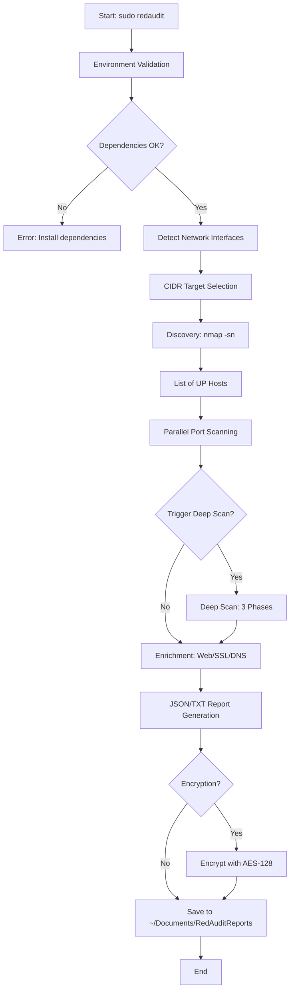
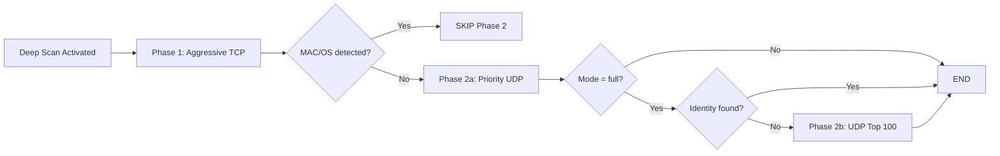
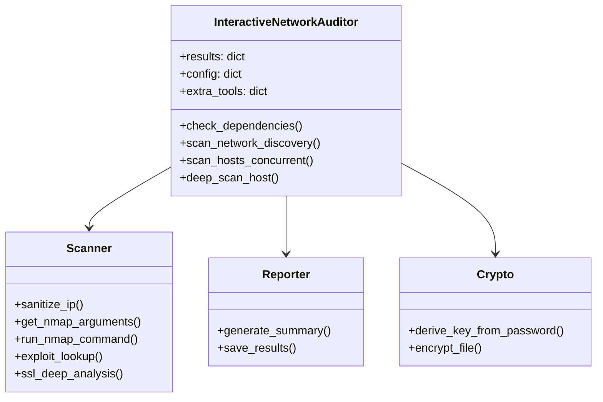

# RedAudit Didactic Guide: Professional

 Manual for Professors and Instructors

[](GUIA_DIDACTICA.md)

This guide is designed to help professors, instructors, and mentors explain the complete functionality of **RedAudit v3.0.1**. The document breaks down the tool from a pedagogical perspective, combining theory, visual diagrams, practical exercises, and code references.

> **TL;DR for Instructors**: RedAudit is a network auditing orchestration tool perfect for teaching structured security workflows. Key teaching points: (1) Automated tool orchestration vs manual scanning, (2) Adaptive heuristics (Deep Scan triggers), (3) Professional reporting (SIEM-ready JSON). For a 60-minute lecture, focus on Sections 1-3. For hands-on labs, use Section 8 practical exercises. For research students, Section 5 provides Python internals reference.

---

## Table of Contents

1. [Introduction and Philosophy](#1-introduction-and-philosophy)
2. [Operational Mechanics: The Complete Flow](#2-operational-mechanics-the-complete-flow)
3. [Deep Scan Logic and Heuristics](#3-deep-scan-logic-and-heuristics)
4. [Components and Tools](#4-components-and-tools)
5. [Developer's Guide: Python Internals](#5-developers-guide-python-internals)
6. [Real Output Examples](#6-real-output-examples)
7. [Educational Use Cases](#7-educational-use-cases)
8. [Practical Exercises for Students](#8-practical-exercises-for-students)
9. [Technical Glossary](#9-technical-glossary)
10. [Source Code References](#10-source-code-references)

---

## 1. Introduction and Philosophy

### What is RedAudit?

RedAudit isn't just "another scanning script." It's an **intelligent orchestration layer**.

In offensive and defensive cybersecurity, professionals use dozens of individual tools (`nmap`, `nikto`, `testssl`, `tshark`). The problem RedAudit solves is **fragmentation** and **inconsistency**:

- Running tools manually is slow and prone to human error.
- Results end up scattered across multiple files with incompatible formats.
- It's difficult to correlate data (e.g., what vulnerabilities does the service on port 443 of host X have?).

### Pedagogical Objective

When teaching RedAudit, the instructor should focus on three pillars:

1. **Structured Auditing vs. Ad-hoc Scanning**: The importance of having a repeatable and verifiable process.
2. **The "Funnel" Approach**: Start with a broad view (network discovery) and progressively narrow the focus (port scanning → version detection → exploit search).
3. **Verifiable Evidence**: The importance of structured logs and JSON reports for professional report generation and forensic analysis.

### Comparison with Other Tools

| Tool | Type | Advantage | Limitation |
|:---|:---|:---|:---|
| **Nmap** | Manual scanner | Maximum flexibility | Requires manual correlation |
| **OpenVAS/Nessus** | Commercial suite | Complete GUI, vulnerability DB | Heavy, requires infrastructure |
| **RedAudit** | CLI orchestrator | Automation + Structuring | Requires CLI knowledge |

---

## 2. Operational Mechanics: The Complete Flow

RedAudit's execution flow follows a strict logical sequence:



### Phase 1: Validation and Environment

**Function in code**: [`check_dependencies()`](file:///Users/dorin/Documents/AntiGravity/RedAudit/redaudit/core/auditor.py#L318-L369)

Before touching the network, the program:

- Verifies `sudo` permissions (necessary for raw sockets).
- Checks critical dependencies (`nmap`, `python3-nmap`).
- Detects optional tools (`nikto`, `testssl.sh`, `searchsploit`).
- Detects active network interfaces to offer automatic targets.

### Phase 2: Discovery

**Function in code**: [`scan_network_discovery()`](file:///Users/dorin/Documents/AntiGravity/RedAudit/redaudit/core/auditor.py#L614-L629)

Uses a fast ping sweep (`nmap -sn -T4 --max-retries 1`) to identify which hosts are `UP` in the target range. This avoids wasting time scanning empty IPs.

**Estimated time**: ~1-5 seconds per /24 (256 IPs).

### Phase 3: Port Enumeration (Concurrent)

**Function in code**: [`scan_hosts_concurrent()`](file:///Users/dorin/Documents/AntiGravity/RedAudit/redaudit/core/auditor.py#L788-L840)

This is where RedAudit shines. It uses a `ThreadPoolExecutor` to launch multiple Nmap instances in parallel.

- **Configurable**: The user decides threads (1-16).
- **Scan Modes**:
  - `FAST`: Only the top 100 most common ports (`-F`).
  - `NORMAL`: The top 1000 ports (`-T4 -F -sV`).
  - `FULL`: Entire range 1-65535 (`-p- -sV -sC -A`).

**Time impact**:

- 1 host in NORMAL mode: ~30-60 seconds.
- 10 hosts with 6 threads: ~60-120 seconds (parallelism).

### Phase 4: Enrichment

**Functions in code**:

- [`http_enrichment()`](file:///Users/dorin/Documents/AntiGravity/RedAudit/redaudit/core/scanner.py#L402-L441)
- [`ssl_deep_analysis()`](file:///Users/dorin/Documents/AntiGravity/RedAudit/redaudit/core/scanner.py#L553-L652)
- [`exploit_lookup()`](file:///Users/dorin/Documents/AntiGravity/RedAudit/redaudit/core/scanner.py#L480-L550)

Once open ports are detected, RedAudit calls specialized tools based on the service:

- If HTTP/HTTPS → Launches `whatweb`, `curl -I`, `nikto` (with false positive filtering).
- If SSL/TLS → Launches `testssl.sh --quiet --fast`, `openssl s_client`.
- If versions detected → Automatically searches `searchsploit` (ExploitDB).

---

## 3. Deep Scan Logic and Heuristics

RedAudit's most advanced feature is its **autonomous decision-making** capability. It doesn't scan blindly; it decides when to go deeper based on heuristics.

### When is Deep Scan Triggered? (Decision Code)

**Function in code**: [`scan_host_ports()`](file:///Users/dorin/Documents/AntiGravity/RedAudit/redaudit/core/auditor.py#L738-L748)

```python
# Real code extract (auditor.py, lines 738-748)
trigger_deep = False
if total_ports > 8:
    trigger_deep = True
if suspicious:  # Services like 'vpn', 'proxy', 'tunnel'
    trigger_deep = True
if total_ports <= 3:
    trigger_deep = True
if total_ports > 0 and not any_version:
    trigger_deep = True
```

**Activation Criteria**:

1. **Few ports** (`<= 3`): Could be a firewall blocking.
2. **Suspicious Services**: Names like `vpn`, `proxy`, `tunnel`, `socks`.
3. **Lack of Versions**: Open ports but Nmap couldn't identify the software.
4. **Too many ports** (`> 8`): Worth investing time in exhaustive OS and service enumeration.

### The 3 Phases of Deep Scan

**Function in code**: [`deep_scan_host()`](file:///Users/dorin/Documents/AntiGravity/RedAudit/redaudit/core/auditor.py#L504-L612)



If activated, Deep Scan executes an adaptive strategy:

#### Phase 1: Aggressive TCP

**Command**: `nmap -A -p- -sV --version-intensity 9 -Pn --open <IP>`

- Objective: Force OS and service identification by all means.
- **Traffic Capture**: Starts `tcpdump` in the background **before** the scan to capture the interaction (PCAP of ~20-50KB with 50 packet limit).
- Duration: 120-180 seconds.

#### Phase 2a: Priority UDP

**Command**: `nmap -sU -Pn -p 53,67,68,123,137,138,161,162,... <IP>`

- Scans only 17 critical UDP ports: `DNS`, `DHCP`, `NTP`, `SNMP`, `NetBIOS`.
- Fast (~60-120s) and usually reveals host identity.
- **Intelligence**: If Phase 1 already identified the OS or MAC address, this phase is **automatically skipped** ([code](file:///Users/dorin/Documents/AntiGravity/RedAudit/redaudit/core/auditor.py#L552-L554)).

#### Phase 2b: Complete UDP (Only in `full` mode)

**Command**: `nmap -O -sU -Pn --top-ports 100 --max-retries 1 --host-timeout 300s <IP>`

- Only executed if:
  1. User specified `--udp-mode full`.
  2. Previous phases failed to identify the host.
- Uses v2.9 optimization: `--top-ports 100` instead of `-p-` (50-80% faster).
- It's the "last resort" because UDP scanning is slow and prone to false positives.

---

## 4. Components and Tools

RedAudit acts as intelligent "glue" between external tools.

| Component | External Tool | Function in RedAudit | Source Code |
|:---|:---|:---|:---|
| **Core Scanner** | `nmap` | Main packet scanning engine | [scanner.py](file:///Users/dorin/Documents/AntiGravity/RedAudit/redaudit/core/scanner.py) |
| **Web Recon** | `whatweb`, `curl`, `nikto` | Web application analysis | [http_enrichment()](file:///Users/dorin/Documents/AntiGravity/RedAudit/redaudit/core/scanner.py#L402-L441) |
| **SSL/TLS** | `testssl.sh`, `openssl` | Encryption and certificate auditing | [ssl_deep_analysis()](file:///Users/dorin/Documents/AntiGravity/RedAudit/redaudit/core/scanner.py#L553-L652) |
| **Traffic** | `tcpdump`, `tshark` | Forensic evidence capture (PCAP) | [start_background_capture()](file:///Users/dorin/Documents/AntiGravity/RedAudit/redaudit/core/scanner.py#L655-L731) |
| **Exploits** | `searchsploit` | Known vulnerability correlation | [exploit_lookup()](file:///Users/dorin/Documents/AntiGravity/RedAudit/redaudit/core/scanner.py#L480-L550) |
| **DNS/Whois** | `dig`, `whois` | External network intelligence | [enrich_host_with_dns()](file:///Users/dorin/Documents/AntiGravity/RedAudit/redaudit/core/scanner.py#L349-L372) |
| **Orchestrator** | `ThreadPoolExecutor` | Thread management for parallel scanning | [auditor.py](file:///Users/dorin/Documents/AntiGravity/RedAudit/redaudit/core/auditor.py#L788-L840) |
| **Encryption** | `python3-cryptography` | AES-128 for sensitive reports | [crypto.py](file:///Users/dorin/Documents/AntiGravity/RedAudit/redaudit/core/crypto.py) |

### Reporting System

Results aren't simply printed to screen. They're structured in JSON format with ECS v8.11 schema:

**JSON Structure** ([REPORT_SCHEMA.md](file:///Users/dorin/Documents/AntiGravity/RedAudit/docs/REPORT_SCHEMA.md)):

- `timestamp`: ISO 8601.
- `version`: RedAudit version.
- `network_info[]`: Detected interfaces.
- `hosts[]`: Array of hosts with ports, services, vulnerabilities.
- `unified_assets[]`: Multi-interface consolidation (v2.9).
- `summary`: Aggregated statistics (total hosts, critical services, risk score).

### Optimization for Professional Use

**Team Design**: RedAudit generates structured reports designed for **multidisciplinary team consumption**, not just individual auditors.

**Typical use cases in professional environments**:

1. **Red Team/Blue Team** (5-10 professionals):
   - **Red Team** executes scan and delivers JSON.
   - **Blue Team** imports JSON into their SIEM (Splunk, ELK) for event correlation.
   - **SOC** reviews alerts automatically generated by risk scores.

2. **Security Consulting** (20-50 professionals):
   - **Junior Auditor**: Executes RedAudit in the field.
   - **Senior Analyst**: Reviews JSON, filters false positives.
   - **Technical Writer**: Extracts data from JSON for executive report.
   - **Client**: Receives readable TXT as executive summary.

3. **DevSecOps Teams** (3-15 professionals):
   - **CI/CD Pipeline**: Automatically runs RedAudit in staging environments.
   - **Centralized Dashboard**: Consumes JSON via API to show trends.
   - **Development Team**: Receives notifications of unauthorized ports/services.

**Practical example - Consulting workflow**:

```text
[Day 1 - Field]
Junior Auditor → Executes: sudo redaudit --target 10.50.0.0/24 --mode full --encrypt
               → Generates: redaudit_20251210_103045.json.enc

[Day 2 - Office]
Senior Analyst → Decrypts JSON
                → Filters 200 hosts → Identifies 15 critical hosts
                → Marks priority CVEs in JSON

[Day 3 - Reporting]
Technical Writer → Extracts from JSON:
                   - Top 10 vulnerabilities
                   - Unpatched hosts
                   - EOL (End of Life) services
                 → Generates executive PowerPoint report

[Day 4 - Delivery]
Client → Receives:
          - Executive report (PowerPoint)
          - Complete technical report (TXT)
          - Raw data for their SIEM (JSON)
          - PCAPs for forensic analysis (if requested)
```

**Structured format advantage**:

- **Without RedAudit**: 10 professionals working with scattered `nmap`, `nikto`, `testssl` outputs → 40 hours/person of manual consolidation.
- **With RedAudit**: 1 unified JSON → 5 hours/person of direct analysis.

### SIEM Optimization (Security Information and Event Management)

**ECS-Compliant Design**: RedAudit v2.9 generates reports following the **Elastic Common Schema (ECS) v8.11**, ensuring immediate compatibility with major market SIEMs.

**Key fields optimized for SIEM** ([code](file:///Users/dorin/Documents/AntiGravity/RedAudit/redaudit/core/siem.py)):

- `event.type`: `redaudit.scan.complete`
- `event.severity`: Automatically calculated (0-100)
- `risk.score`: Risk score per host
- `tags[]`: Auto-tagging (`high-risk`, `web-vulnerable`, `outdated-ssl`)
- `vulnerability.severity`: Mapped to CVSS scale

**Example 1: Integration with Elasticsearch (ELK Stack)**

```bash
# Automated ingestion script
for json_file in ~/Documents/RedAuditReports/*/redaudit_*.json; do
    curl -X POST "http://elasticsearch:9200/redaudit-scans/_doc" \
         -H 'Content-Type: application/json' \
         -d @${json_file}
done
```

**Kibana Query**:

```json
{
  "query": {
    "bool": {
      "must": [
        { "match": { "event.type": "redaudit.scan.complete" }},
        { "range": { "risk.score": { "gte": 70 }}}
      ]
    }
  }
}
```

**Example 2: Integration with Splunk**

```bash
# Send JSON to Splunk HEC (HTTP Event Collector)
for json_file in ~/Documents/RedAuditReports/*/redaudit_*.json; do
    curl -X POST "https://splunk-server:8088/services/collector/event" \
         -H "Authorization: Splunk YOUR-HEC-TOKEN" \
         -d "{\"event\": $(cat ${json_file})}"
done
```

**Splunk Search**:

```spl
index="security" sourcetype="redaudit" 
| where risk.score > 70 
| stats count by host.ip, event.severity
| sort -count
```

**Example 3: Integration with Wazuh**

```bash
# Copy JSON to Wazuh-monitored directory
cp ~/Documents/RedAuditReports/*/redaudit_*.json /var/ossec/logs/redaudit/
```

**Custom Wazuh Rule** (`/var/ossec/etc/rules/redaudit_rules.xml`):

```xml
<group name="redaudit,">
  <rule id="100100" level="10">
    <decoded_as>json</decoded_as>
    <field name="event.type">redaudit.scan.complete</field>
    <field name="risk.score">^[7-9][0-9]|100$</field>
    <description>RedAudit: High-risk host detected</description>
  </rule>
</group>
```

**Result**: 100 historical scans indexed in seconds, readable via Kibana/Splunk/Wazuh by the entire security team.

This JSON enables direct integration with SIEMs (ELK, Splunk, Wazuh).

---

## 5. Developer's Guide: Python Internals

For programming students or security tool developers.

### Class Architecture



The code mainly resides in the `redaudit/core/` package:

- **[`Auditor`](file:///Users/dorin/Documents/AntiGravity/RedAudit/redaudit/core/auditor.py)** (`auditor.py`):
  - Main class: `InteractiveNetworkAuditor`.
  - Maintains global state (`self.results`, `self.config`).
  - Handles user interaction loop and signals (Ctrl+C).

- **[`Scanner`](file:///Users/dorin/Documents/AntiGravity/RedAudit/redaudit/core/scanner.py)** (`scanner.py`):
  - Contains pure functions and execution logic.
  - Encapsulates `subprocess` calls to execute system tools.
  - Parses raw text output from tools and converts to Python dictionaries.

### Concurrency Patterns

RedAudit uses `concurrent.futures.ThreadPoolExecutor` for I/O parallelism:

```python
# Real code from auditor.py (lines 814-828)
with ThreadPoolExecutor(max_workers=self.config["threads"]) as executor:
    futures = {}
    
    for ip in unique_hosts:
        if self.rate_limit_delay > 0:
            time.sleep(self.rate_limit_delay)
        
        future = executor.submit(self.scan_host_ports, ip)
        futures[future] = ip
    
    for future in as_completed(futures):
        try:
            result = future.result()
            if result:
                results.append(result)
        except Exception as exc:
            self.logger.error("Thread error for %s: %s", futures[future], exc)
```

**Teaching Note**: We use **Threads** not Processes because:

- The main limitation is **I/O Bound** (waiting for network responses), not CPU.
- Nmap does the heavy lifting; Python just waits.
- Threads are lighter than processes (lower memory overhead).

### Asyncio and Pre-scan

**Code**: [`prescan.py`](file:///Users/dorin/Documents/AntiGravity/RedAudit/redaudit/core/prescan.py)

For ultra-fast port discovery, `asyncio` is used:

```python
# Real code from prescan.py (lines 14-37)
async def check_port(ip: str, port: int, timeout: float = 0.5) -> bool:
    try:
        _, writer = await asyncio.wait_for(
            asyncio.open_connection(ip, port),
            timeout=timeout
        )
        writer.close()
        await writer.wait_closed()
        return True
    except (asyncio.TimeoutError, ConnectionRefusedError, OSError):
        return False
```

**Difference from Threads**:

- `asyncio` allows opening **thousands of connections nearly simultaneously** in a single thread.
- Used to quickly verify if a port responds (TCP Connect) before launching the heavy Nmap scan.
- Example: Scan 65535 ports in ~10-30 seconds (vs. 10-20 minutes with Nmap).

### The Heartbeat Monitor

**Code**: [`_heartbeat_loop()`](file:///Users/dorin/Documents/AntiGravity/RedAudit/redaudit/core/auditor.py#L246-L260)

Since Nmap scans can take minutes without output, RedAudit implements a "heartbeat monitor":

```python
# Real code from auditor.py (lines 246-260)
def _heartbeat_loop(self):
    while not self.heartbeat_stop:
        with self.activity_lock:
            delta = (datetime.now() - self.last_activity).total_seconds()

        phase = self.current_phase
        if phase not in ("init", "saving", "interrupted"):
            if HEARTBEAT_WARN_THRESHOLD <= delta < HEARTBEAT_FAIL_THRESHOLD:
                self.print_status(self.t("heartbeat_warn", phase, int(delta)), "WARNING", False)
            elif delta >= HEARTBEAT_FAIL_THRESHOLD:
                self.print_status(self.t("heartbeat_fail", phase, int(delta)), "FAIL", False)
        
        time.sleep(HEARTBEAT_INTERVAL)
```

- A background `daemon` thread.
- Checks when something was last printed (`self.last_activity`).
- If >60 seconds pass, prints a "Still working..." message so users don't think the program froze.

### Subprocess and Zombie Management

**Code**: [`signal_handler()`](file:///Users/dorin/Documents/AntiGravity/RedAudit/redaudit/core/auditor.py#L262-L301)

A key challenge in orchestration tools is cleanup when the user presses Ctrl+C:

- RedAudit captures `SIGINT` (Ctrl+C).
- Maintains a list of active subprocesses (`self._active_subprocesses`).
- On exit, iterates over that list and sends `SIGTERM/SIGKILL` to ensure no orphaned `nmap` or `tcpdump` processes remain consuming resources.

### Constants Customization (Advanced)

**Key file**: [`constants.py`](file:///Users/dorin/Documents/AntiGravity/RedAudit/redaudit/utils/constants.py)

RedAudit centralizes all configurable values in a single file. This allows **behavior adaptation** based on the usage environment.

**Key customizable constants**:

| Constant | Default Value | When to Modify | Suggested New Value |
|:---|:---:|:---|:---:|
| `TRAFFIC_CAPTURE_PACKETS` | 50 | Need deep forensic analysis | 200-500 |
| `DEEP_SCAN_TIMEOUT` | 400s | Very slow or saturated networks | 600-900s |
| `PBKDF2_ITERATIONS` | 480,000 | Very old hardware (extreme slowness) | 100,000 |
| `MAX_PORTS_DISPLAY` | 50 | Hosts with many services | 100-200 |
| `HEARTBEAT_WARN_THRESHOLD` | 60s | Very fast scans (false warnings) | 120s |
| `UDP_TOP_PORTS` | 100 | Need exhaustive UDP coverage | 1000 |

**Example 1: Increase PCAP limit for forensic analysis**

```python
# Case: Investigating a security incident and need to
# capture ALL SSL/TLS handshake traffic

# Edit: redaudit/utils/constants.py
TRAFFIC_CAPTURE_PACKETS = 200  # Was 50, now captures 4x more
TRAFFIC_CAPTURE_MAX_DURATION = 60  # Was 120s, reduce to 60s to compensate
```

**Result**: PCAPs of ~100-150KB (vs ~20-50KB), but with complete SSL negotiation information.

**Example 2: Optimize for slow corporate networks**

```python
# Case: Network with restrictive firewalls that delay responses

# Edit: redaudit/utils/constants.py
DEEP_SCAN_TIMEOUT = 600  # Was 400s, give 50% more time
HEARTBEAT_WARN_THRESHOLD = 120  # Was 60s, avoid premature warnings
```

**Example 3: Educational lab with old hardware**

```python
# Case: Classroom PCs with <2GHz CPUs, encryption is slow

# Edit: redaudit/utils/constants.py
PBKDF2_ITERATIONS = 100000  # Was 480k, reduce to ~20% for speed
MIN_PASSWORD_LENGTH = 8  # Was 12, allow shorter passwords
```

> [!WARNING]
> **Security vs Performance**: Reducing `PBKDF2_ITERATIONS` makes encryption faster but **less secure**. Only do this in controlled environments (academic lab), **never in real audits**.

**How to apply changes**:

```bash
# 1. Edit the file
nano redaudit/utils/constants.py

# 2. Restart RedAudit (changes load on import)
sudo redaudit --target 192.168.1.0/24 --mode normal

# 3. Verify they applied (check logs)
tail -f ~/.redaudit/logs/redaudit_$(date +%Y%m%d).log
```

**Revert changes**:

```bash
# Restore defaults with git
git checkout redaudit/utils/constants.py
```

**Teaching note for instructors**: Modifying `constants.py` is an **excellent exercise** for students to understand:

- How configurable values affect program behavior
- Trade-offs between speed, security, and coverage
- Debugging through logs when something doesn't work as expected

---

## 6. Security and File Management

### Generated File Permissions

**Security Configuration**: [`SECURE_FILE_MODE`](file:///Users/dorin/Documents/AntiGravity/RedAudit/redaudit/utils/constants.py#L62)

RedAudit sets restrictive permissions on **all** generated files to protect sensitive information:

```python
# Constant in constants.py (line 62)
SECURE_FILE_MODE = 0o600
```

**What does `0o600` mean?**

In Unix octal notation:

- **6** (owner): Read (4) + Write (2) = **rw-**
- **0** (group): No permissions = **---**
- **0** (others): No permissions = **---**

**Result**: Only the user who ran `sudo redaudit` can read/write these files.

**Affected files** ([code](file:///Users/dorin/Documents/AntiGravity/RedAudit/redaudit/core/reporter.py#L229)):

1. `redaudit_YYYYMMDD_HHMMSS.json` (or `.json.enc`)
2. `redaudit_YYYYMMDD_HHMMSS.txt` (or `.txt.enc`)
3. `redaudit_YYYYMMDD_HHMMSS.salt` (for encrypted reports)
4. PCAP files: `traffic_192_168_1_100_145832.pcap`

**Terminal example**:

```bash
$ ls -la ~/Documents/RedAuditReports/RedAudit_2025-12-12_18-45-32/
-rw------- 1 root root 52480 Dec 12 18:47 redaudit_20251212_184532.json
-rw------- 1 root root  8192 Dec 12 18:47 redaudit_20251212_184532.txt
-rw------- 1 root root    16 Dec 12 18:47 redaudit_20251212_184532.salt
-rw------- 1 root root 102400 Dec 12 18:47 traffic_192_168_1_100_184533.pcap
```

> [!IMPORTANT]
> If you need to share reports with other users, you must change permissions **manually**:
>
> ```bash
> sudo chmod 640 redaudit_*.json  # Allow group reading
> sudo chown root:auditteam redaudit_*.json  # Change group
> ```

### Directory Structure

**Default location** ([constant](file:///Users/dorin/Documents/AntiGravity/RedAudit/redaudit/utils/constants.py#L55)):

```text
~/Documents/RedAuditReports/
└── RedAudit_2025-12-12_18-45-32/  ← Timestamped folder (v2.8+)
    ├── redaudit_20251212_184532.json
    ├── redaudit_20251212_184532.txt
    ├── redaudit_20251212_184532.salt
    ├── traffic_192_168_1_50_184533.pcap
    └── traffic_192_168_1_100_184533.pcap
```

**v2.8+ design advantage**: All files from a session (reports + PCAPs) are **grouped** in a single timestamped folder.

**Customization**:

```bash
sudo redaudit --target 192.168.1.0/24 --output /mnt/audits/project_X
```

### Professional Team Usage

For teams needing to centralize reports, it's recommended to mount a shared volume (NFS, SMB) at the output path:

```bash
# Example NFS mount on Linux
sudo mount -t nfs server:/exports/redaudit_reports /mnt/redaudit_shared

# Then, run RedAudit with the shared path
sudo redaudit --target 192.168.1.0/24 --output /mnt/redaudit_shared/project_X
```

This ensures all team members can access generated reports while maintaining project and date organization.

### Disk Space Requirements

| Component | Approximate Size | Notes |
|:---|:---|:---|
| **JSON Report** | 10-100 KB per host | Depends on number of ports and services |
| **TXT Report** | 5-20 KB per host | Human-readable version |
| **PCAP File** | 20-50 KB per host | Limited to 50 packets (v2.8.1) |
| **Application Logs** | 1-10 MB/day | Automatic rotation (max 5 files) |

**Practical estimate**:

- Scan of 10 hosts (normal mode): ~2-5 MB total.
- Scan of 100 hosts (full mode + deep scan): ~50-150 MB total.

**Log location** ([code](file:///Users/dorin/Documents/AntiGravity/RedAudit/redaudit/core/auditor.py#L190-L197)):

```text
~/.redaudit/logs/
├── redaudit_20251212.log  ← Current log
├── redaudit_20251211.log
└── ...
```

**Automatic rotation**: Maximum 5 files of 10 MB each (total: 50 MB).

### Network and Permission Considerations

**Required permissions** ([verification](file:///Users/dorin/Documents/AntiGravity/RedAudit/redaudit/core/auditor.py#L318-L324)):

1. **`sudo` mandatory**: To create raw sockets (necessary for Nmap SYN scans).
2. **System tool access**:
   - `tcpdump`: Requires `CAP_NET_RAW` capability.
   - `nmap`: Requires privileges for `-sS`, `-sU`, `-O`.

**Firewalls and Filtering**:

- Ensure the local firewall allows outbound traffic from the scanning interface.
- In corporate networks, coordinate with the security team to avoid automatic blocks.

**Temporary iptables rule example**:

```bash
# Allow ICMP output (ping sweep)
sudo iptables -A OUTPUT -p icmp -j ACCEPT

# Allow outbound TCP connections
sudo iptables -A OUTPUT -p tcp --tcp-flags SYN,ACK SYN,ACK -j ACCEPT
```

### Password Security

**Critical point**: Encryption passwords are **never** written to logs.

**Secure handling code** ([crypto.py](file:///Users/dorin/Documents/AntiGravity/RedAudit/redaudit/core/crypto.py)):

```python
# Passwords are handled in memory and derived to keys
def derive_key_from_password(password: str) -> tuple[bytes, bytes]:
    salt = os.urandom(SALT_SIZE)
    kdf = PBKDF2HMAC(
        algorithm=hashes.SHA256(),
        length=32,
        salt=salt,
        iterations=PBKDF2_ITERATIONS  # 480,000 iterations
    )
    key = kdf.derive(password.encode())
    # Password is never saved, only the derived key in memory
    return key, salt
```

**Note about salt**:

- The `.salt` file **is not confidential**. It's a public cryptographic parameter necessary for key derivation.
- Stored according to NIST SP 800-132 (cryptography standard).

### Cleanup and Maintenance

**Manual cleanup of old reports**:

```bash
# Delete reports older than 30 days
find ~/Documents/RedAuditReports -type d -mtime +30 -exec rm -rf {} \;
```

**Log cleanup**:

```bash
# Logs rotate automatically, but you can force cleanup:
rm -f ~/.redaudit/logs/redaudit_*.log.1  # Delete backups
```

**Recommended cleanup script**:

```bash
#!/bin/bash
# cleanup_redaudit.sh
retention_days=90

# Clean old reports
find ~/Documents/RedAuditReports -type d -mtime +${retention_days} -exec rm -rf {} \; 2>/dev/null

# Clean old logs (keep only last 5)
cd ~/.redaudit/logs
ls -t redaudit_*.log | tail -n +6 | xargs rm -f 2>/dev/null

echo "Cleanup completed: reports >$retention_days days deleted"
```

---

## 7. Real Output Examples

### Example 1: JSON Output from a Host

```json
{
  "ip": "192.168.1.100",
  "hostname": "webserver.local",
  "status": "up",
  "ports": [
    {
      "port": 22,
      "protocol": "tcp",
      "service": "ssh",
      "product": "OpenSSH",
      "version": "8.2p1",
      "is_web_service": false
    },
    {
      "port": 443,
      "protocol": "tcp",
      "service": "https",
      "product": "nginx",
      "version": "1.18.0",
      "is_web_service": true,
      "tls_info": "TLS 1.3 (secure)",
      "known_exploits": []
    }
  ],
  "web_ports_count": 1,
  "total_ports_found": 2,
  "dns": {
    "reverse": ["webserver.local."]
  },
  "deep_scan": {
    "strategy": "adaptive_v2.8",
    "mac_address": "00:0c:29:3f:4a:1b",
    "vendor": "VMware, Inc.",
    "pcap_capture": {
      "pcap_file": "/path/to/traffic_192_168_1_100_145832.pcap",
      "iface": "eth0"
    }
  }
}
```

### Example 2: Console Log During Deep Scan

```text
[14:58:32] [WARNING] Host 192.168.1.50 → Triggering Deep Scan (Adaptive 3-Phase v2.8)
[14:58:32] [WARNING] [deep] 192.168.1.50 → nmap -A -sV -Pn -p- --open --version-intensity 9 192.168.1.50 (~120-180s)
[15:00:45] [WARNING] [deep] 192.168.1.50 → nmap -sU -Pn -p 53,67,68,123,137,138,161,162 --max-retries 1 192.168.1.50 (~60-120s, priority UDP)
[15:02:12] [OKGREEN] [deep] 192.168.1.50 → Identity acquired! MAC: 08:00:27:ab:cd:ef (Cadmus Computer Systems)
[15:02:12] [OKGREEN] Deep scan completed for 192.168.1.50 (total duration: 220.4s)
```

---

## 8. Educational Use Cases

### Case 1: University Networking Lab

**Objective**: Help students understand how TCP/IP protocols work.

**Activity**:

1. Set up a virtual network (VirtualBox/VMware) with 3-5 machines.
2. Install different services (Apache, SSH, FTP, MySQL).
3. Run `sudo redaudit --target 192.168.56.0/24 --mode normal`.
4. Analyze the JSON report: Which ports are open? Why?

**Questions for the instructor**:

- Why does port 80 appear as `http` and not as a number?
- What's the difference between an `open` and `filtered` port?

### Case 2: Offensive Cybersecurity (Pentesting)

**Objective**: Teach service enumeration methodology.

**Activity**:

1. Use a vulnerable machine (e.g., Metasploitable2).
2. Run `sudo redaudit --target <METASPLOITABLE_IP> --mode full`.
3. Review the `known_exploits` section of the JSON.
4. Manually correlate with ExploitDB to verify.

**Practical question**: How would you use `searchsploit` output to exploit a vulnerability?

### Case 3: Systems Administration (DevOps)

**Objective**: Server hardening audit.

**Activity**:

1. Scan a production server (with authorization).
2. Identify unnecessary exposed services.
3. Compare the "before" and "after" report of applying firewall rules.

---

## 9. Practical Exercises for Students

### Exercise 1: Heuristic Analysis (Intermediate Level)

**Statement**: Modify the `auditor.py` code so Deep Scan is only triggered if there is exactly 1 open port.

**Hint**: Look for the `scan_host_ports()` function and modify the logic in lines 738-748.

**Solution**:

```python
# Change:
if total_ports <= 3:
    trigger_deep = True

# To:
if total_ports == 1:
    trigger_deep = True
```

### Exercise 2: Add a New Tool (Advanced Level)

**Statement**: Integrate the `enum4linux` tool for SMB enumeration when port 445 is detected.

**Steps**:

1. Add `enum4linux` to the tools list in `check_dependencies()`.
2. Create an `smb_enumeration()` function in `scanner.py`.
3. Call that function from `scan_host_ports()` when `port == 445`.

### Exercise 3: Performance Optimization (Advanced Level)

**Statement**: Measure scan execution time with 4, 8, and 16 threads. What's the optimal performance point?

**Pseudocode**:

```bash
time sudo redaudit --target 192.168.1.0/24 --mode fast --threads 4
time sudo redaudit --target 192.168.1.0/24 --mode fast --threads 8
time sudo redaudit --target 192.168.1.0/24 --mode fast --threads 16
```

**Question**: Why don't more threads always mean faster?

---

## 9. Technical Glossary

| Term | Definition | Relevance in RedAudit |
|:---|:---|:---|
| **AES-128** | Advanced Encryption Standard with 128-bit key | Encryption of sensitive reports |
| **Asyncio** | Python library for asynchronous programming | Ultra-fast port pre-scan |
| **Daemon Thread** | Thread that runs in background and closes when program finishes | Heartbeat monitor |
| **Deep Scan** | Exhaustive scan with multiple phases (TCP + UDP) | Obtaining host identity |
| **ECS (Elastic Common Schema)** | Standard schema for logs and events | JSON report format v2.9 |
| **Fernet** | Symmetric encryption implementation in Python | Uses AES-128-CBC + HMAC-SHA256 |
| **Heartbeat** | Periodic signal to indicate process is alive | Activity monitor in long scans |
| **I/O Bound** | Process limited by input/output, not CPU | Why we use threads instead of processes |
| **Nmap** | Network Mapper, open-source port scanner | RedAudit's main engine |
| **PBKDF2** | Password-Based Key Derivation Function 2 | Encryption key derivation (480k iterations) |
| **PCAP** | Packet Capture, network traffic file format | Evidence captured with tcpdump |
| **SIGINT** | Interrupt signal (Ctrl+C) | Clean cancellation handling |
| **SIEM** | Security Information and Event Management | Systems that consume RedAudit's JSON |
| **ThreadPoolExecutor** | Python class for managing thread pools | Scan parallelization |
| **UDP** | User Datagram Protocol, connectionless protocol | Harder to scan than TCP |

---

## 10. Source Code References

To facilitate code study, here are the key entry points:

### Main File

- [redaudit.py](file:///Users/dorin/Documents/AntiGravity/RedAudit/redaudit.py): Program entry point (`main()`).

### Core Module

- [auditor.py](file:///Users/dorin/Documents/AntiGravity/RedAudit/redaudit/core/auditor.py): Main class `InteractiveNetworkAuditor`.
- [scanner.py](file:///Users/dorin/Documents/AntiGravity/RedAudit/redaudit/core/scanner.py): Scanning and enrichment functions.
- [prescan.py](file:///Users/dorin/Documents/AntiGravity/RedAudit/redaudit/core/prescan.py): Fast discovery with asyncio.
- [crypto.py](file:///Users/dorin/Documents/AntiGravity/RedAudit/redaudit/core/crypto.py): AES-128 encryption.
- [reporter.py](file:///Users/dorin/Documents/AntiGravity/RedAudit/redaudit/core/reporter.py): JSON/TXT report generation.
- [siem.py](file:///Users/dorin/Documents/AntiGravity/RedAudit/redaudit/core/siem.py): ECS v8.11 integration.

### Critical Functions to Study

| Function | File | Lines | Description |
|:---|:---|:---|:---|
| `deep_scan_host()` | auditor.py | 504-612 | Complete 3-phase Deep Scan logic |
| `scan_host_ports()` | auditor.py | 631-786 | Main scan + trigger heuristic |
| `exploit_lookup()` | scanner.py | 480-550 | Automatic SearchSploit search |
| `ssl_deep_analysis()` | scanner.py | 553-652 | SSL/TLS analysis with testssl.sh |
| `start_background_capture()` | scanner.py | 655-731 | Concurrent PCAP capture |
| `check_port()` | prescan.py | 14-37 | Asynchronous TCP connection with asyncio |

---

## Conclusion

RedAudit is an ideal educational tool for teaching:

1. **Networking**: How ports, protocols, and services work.
2. **Programming**: Concurrency, asyncio, subprocess, and signal handling.
3. **Cybersecurity**: Enumeration methodology, vulnerability correlation, and structured reporting.

This guide should serve as a complete reference for instructors wishing to use RedAudit as a pedagogical tool in networking, systems administration, or cybersecurity courses.
