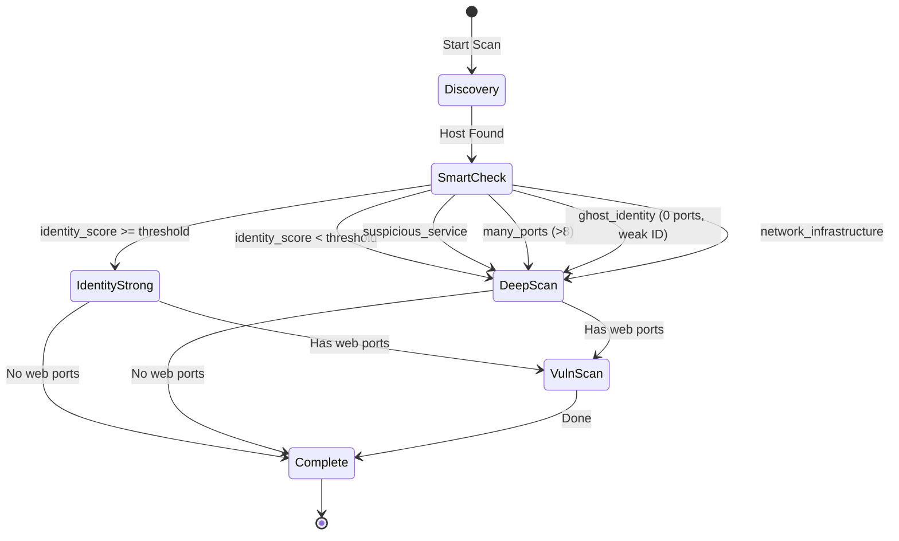

# Phase Transition Diagram

This document describes the escalation logic for RedAudit's scanning phases.

## Overview

RedAudit uses a multi-phase approach to optimize scan time while maintaining coverage:



## Phase Descriptions

| Phase | Purpose | Tools Used |
|-------|---------|------------|
| **Discovery** | Find live hosts | RustScan, ARP, mDNS, DHCP |
| **SmartCheck** | Compute identity score | MAC OUI, banners, device hints |
| **DeepScan** | Aggressive fingerprinting | nmap -A, scripts |
| **VulnScan** | Web vulnerability testing | nikto, testssl, whatweb |

## Escalation Triggers

| Trigger | Condition | Effect |
|---------|-----------|--------|
| `identity_weak` | score < threshold | Force DeepScan |
| `suspicious_service` | backdoor/risky ports | Force DeepScan |
| `many_ports` | ports > 8 | Force DeepScan |
| `ghost_identity` | 0 ports + weak ID | Force DeepScan |
| `network_infrastructure` | router/switch detected | Force DeepScan |
| `identity_strong` | score >= threshold | Skip DeepScan |

## Counters (Summary Report)

These counters appear in `summary.json` under `smart_scan.reasons`:

```json
{
  "reasons": {
    "ghost_identity": 8,
    "identity_strong": 10,
    "identity_weak": 1,
    "many_ports": 1,
    "suspicious_service": 4,
    "network_infrastructure": 6
  }
}
```
