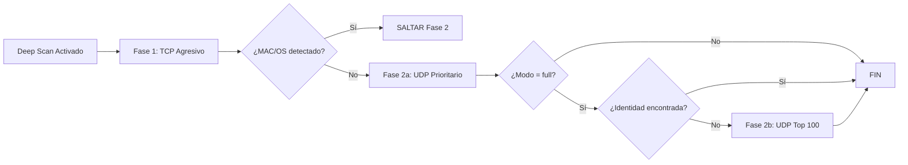
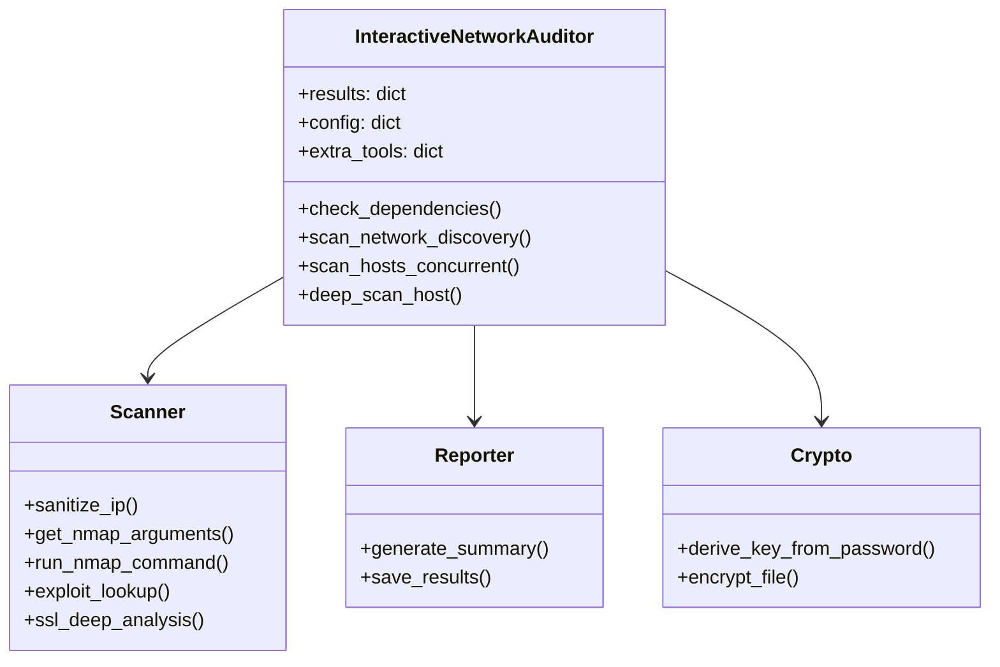

# Guía Didáctica de RedAudit: Manual Profesional para Profesores e Instructores

[](../en/DIDACTIC_GUIDE.md)

Esta guía está diseñada para ayudar a profesores, instructores y mentores a explicar el funcionamiento completo de **RedAudit v3.4.0**. El documento desglosa la herramienta desde una perspectiva pedagógica, combinando teoría, diagramas visuales, ejercicios prácticos y referencias al código.

> **Resumen Ejecutivo para Instructores**: RedAudit es una herramienta de orquestación de auditoría de red ideal para enseñar flujos de seguridad estructurados. Puntos clave de enseñanza: (1) Orquestación automatizada vs escaneo manual, (2) Heurística adaptativa (activadores de Deep Scan), (3) Reportes profesionales (JSON listo para SIEM). Para una clase de 60 minutos, enfocarse en Secciones 1-3. Para laboratorios prácticos, usar ejercicios de la Sección 8. Para estudiantes de investigación, la Sección 5 provee referencia de internals en Python.

---

## Tabla de Contenidos

1. [Introducción y Filosofía](#1-introducción-y-filosofía)
2. [Mecánica Operativa: El Flujo Completo](#2-mecánica-operativa-el-flujo-completo)
3. [Lógica de Deep Scan y Heurística](#3-lógica-de-deep-scan-y-heurística)
4. [Componentes y Herramientas](#4-componentes-y-herramientas)
5. [Guía para Desarrolladores: Internals en Python](#5-guía-para-desarrolladores-internals-en-python)
6. [Seguridad y Gestión de Archivos](#6-seguridad-y-gestión-de-archivos)
7. [Ejemplos de Salida Real](#7-ejemplos-de-salida-real)
8. [Casos de Uso Educativos](#8-casos-de-uso-educativos)
9. [Ejercicios Prácticos para Estudiantes](#9-ejercicios-prácticos-para-estudiantes)
10. [Glosario Técnico](#10-glosario-técnico)
11. [Referencias al Código Fuente](#11-referencias-al-código-fuente)

---

## 1. Introducción y Filosofía

### ¿Qué es RedAudit?

RedAudit no es simplemente "otro script de escaneo". Es una **capa de orquestación inteligente**.

En la ciberseguridad ofensiva y defensiva, los profesionales utilizan docenas de herramientas individuales (`nmap`, `nikto`, `testssl`, `tshark`). El problema que resuelve RedAudit es la **fragmentación** y la **inconsistencia**:

- Ejecutar herramientas manualmente es lento y propenso a errores humanos.
- Los resultados quedan dispersos en múltiples archivos con formatos incompatibles.
- Es difícil correlacionar datos (ej: ¿qué vulnerabilidades tiene el servicio en el puerto 443 del host X?).

### Objetivo Pedagógico

Al enseñar RedAudit, el instructor debe enfocarse en tres pilares:

1. **Auditoría Estructurada vs. Escaneo Ad-hoc**: La importancia de tener un proceso repetible y verificable.
2. **El Enfoque de "Embudo"**: Empezar con una visión amplia (descubrimiento de red) y estrechar el foco progresivamente (escaneo de puertos → detección de versiones → búsqueda de exploits).
3. **Evidencia Verificable**: La importancia de los logs estructurados y reportes JSON para la generación de informes profesionales y análisis forense.

### Comparación con Otras Herramientas

| Herramienta | Tipo | Ventaja | Limitación |
|:---|:---|:---|:---|
| **Nmap** | Escáner manual | Máxima flexibilidad | Requiere correlación manual |
| **OpenVAS/Nessus** | Suite comercial | GUI completa, DB de vulnerabilidades | Pesado, requiere infraestructura |
| **RedAudit** | Orquestador CLI | Automatización + Estructuración | Requiere conocimientos de CLI |

---

## 2. Mecánica Operativa: El Flujo Completo

El flujo de ejecución de RedAudit sigue una secuencia lógica estricta:

```mermaid
graph TD
    A[Inicio: sudo redaudit] --> B[Validación de Entorno]
    B --> C{Dependencias OK?}
    C -->|No| D[Error: Instalar dependencias]
    C -->|Sí| E[Menú Principal]
    E -->|Iniciar escaneo| F[Asistente: Objetivo/Topología/Modo]
    E -->|Actualizar| U[Buscar actualizaciones]
    E -->|Diff| Z[Comparar reportes]
    E -->|Salir| Q[Fin]
    U --> E
    F --> G[Descubrimiento: nmap -sn]
    G --> H[Lista de hosts activos]
    H --> I[Escaneo paralelo de puertos]
    I --> J{¿Activar Deep Scan?}
    J -->|No| K[Enriquecimiento: Web/SSL/DNS]
    J -->|Sí| L[Deep Scan: 3 fases]
    L --> K
    K --> M[Generación de Artefactos (JSON/TXT/HTML/JSONL/Playbooks)]
    M --> N{¿Cifrado?}
    N -->|Sí| O[Cifrar con AES-128]
    N -->|No| P[Guardar en ~/Documents/RedAuditReports]
    O --> P
    P --> Q
```

### Fase 1: Validación y Entorno

**Función en código**: [`check_dependencies()`](../../redaudit/core/auditor.py#L318-L369)

Antes de tocar la red, el programa:

- Verifica permisos de `sudo` (necesarios para sockets raw).
- Comprueba dependencias críticas (`nmap`, `python3-nmap`).
- Detecta herramientas opcionales (`nikto`, `testssl.sh`, `searchsploit`).

### Fase 1.5: Configuración Interactiva (Nuevo en v3.2)

**Función en código**: [`show_main_menu()`](../../redaudit/core/auditor.py) y [`interactive_setup()`](../../redaudit/core/auditor.py)

Al inicio, RedAudit presenta un **Menú Principal** que permite elegir entre escanear, buscar actualizaciones, comparar reportes (Diff), o salir.

```text
┌─────────────────────────────────────────────────┐
│         RedAudit v3.4.0 - Menú Principal       │
├─────────────────────────────────────────────────┤
│  [1] Iniciar Auditoría (Wizard)                │
│  [2] Buscar Actualizaciones                     │
│  [3] Diff Reportes (JSON)                       │
│  [0] Salir                                       │
└─────────────────────────────────────────────────┘
Tu opción:
```

Si se elige escanear, el asistente solicita:

1. **Objetivo**: IP o CIDR.
2. **Topología**: Elección simplificada entre Escaneo Completo, Estándar (sin topología), o Solo Topología.
3. **Modo**: Rápido, Normal, o Completo (`full`).

### Fase 2: Descubrimiento (Discovery)

**Función en código**: [`scan_network_discovery()`](../../redaudit/core/auditor.py#L614-L629)

Utiliza un ping sweep rápido (`nmap -sn -T4 --max-retries 1`) para identificar qué hosts están `UP` en el rango objetivo. Esto evita perder tiempo escaneando IPs vacías.

**Tiempo estimado**: ~1-5 segundos por cada /24 (256 IPs).

### Fase 2b: Descubrimiento de Red Avanzado (v3.2)

**Función en código**: [`net_discovery.py`](../../redaudit/core/net_discovery.py)

**v3.2.3**: **Auto-habilitado en modo Full (`full`)** (sin flag). También disponible vía `--net-discovery` en otros modos.

RedAudit va más allá de ICMP y utiliza protocolos de capa 2:

- **ARP / Netdiscover**: Detecta hosts silenciosos en el enlace local.
- **mDNS / Bonjour**: Descubre servicios y dispositivos (e.g., impresoras, Apple TV).
- **NetBIOS / Nbtscan**: Resuelve nombres de host Windows y grupos de trabajo.
- **Red Team (Opt-in)**: Sondeo activo (SNMP, SMB, Kerberos) y escucha pasiva (STP, CDP, LLMNR). Requiere flag `--redteam`.

Esta fase enriquece el reporte con datos invisibles para un escáner IP estándar.

### Fase 3: Enumeración de Puertos (Concurrent)

**Función en código**: [`scan_hosts_concurrent()`](../../redaudit/core/auditor.py#L788-L840)

Aquí es donde RedAudit brilla. Utiliza un `ThreadPoolExecutor` para lanzar múltiples instancias de Nmap en paralelo.

- **Configurable**: El usuario decide threads (1-16).
- **Modos de Escaneo**:
  - `FAST`: Solo los 100 puertos más comunes (`-F`).
  - `NORMAL`: Los 1000 puertos principales (`-T4 -F -sV`).
  - `FULL`: Todo el rango 1-65535 (`-p- -sV -sC -A`).

**Impacto en tiempo**:

- 1 host en modo NORMAL: ~30-60 segundos.
- 10 hosts con 6 threads: ~60-120 segundos (paralelismo).

### Fase 4: Enriquecimiento

**Funciones en código**:

- [`http_enrichment()`](../../redaudit/core/scanner.py#L402-L441)
- [`ssl_deep_analysis()`](../../redaudit/core/scanner.py#L553-L652)
- [`exploit_lookup()`](../../redaudit/core/scanner.py#L480-L550)

Una vez detectados los puertos abiertos, RedAudit llama a herramientas especializadas según el servicio:

- Si es HTTP/HTTPS → Lanza `whatweb`, `curl -I`, `nikto` (con filtrado de falsos positivos).
- Si es SSL/TLS → Lanza `testssl.sh --quiet --fast`, `openssl s_client`.
- Si detecta versiones → Busca en `searchsploit` (ExploitDB) automáticamente.

### Fase 4b: Dashboard HTML y Visualización (v3.3)

**Código**: [`html_reporter.py`](../../redaudit/core/html_reporter.py)

RedAudit v3.3 introdujo un **Dashboard HTML** interactivo (`--html-report`) (soportado en v3.4). A diferencia de los archivos de texto estáticos, este dashboard permite:

- **Ordenar/Filtrar**: Ordenar hosts por Puertos Abiertos, SO, o Puntuación de Riesgo.
- **Gráficos Visuales**: Gráficos de donut para distribución de SO y resumen de Severidad/Riesgo.
- **Búsqueda**: Búsqueda instantánea en todos los hallazgos.
- **Seguridad Offline**: Totalmente autocontenido (sin JS/CSS externo), seguro para laboratorios aislados.

Esto enseña a los estudiantes el valor de la **presentación de datos**: los datos crudos son útiles para máquinas, pero los datos visualizados son cruciales para la toma de decisiones ejecutiva.

---

### Fase 4c: Playbooks de Remediación (v3.4)

**Código**: [`playbook_generator.py`](../../redaudit/core/playbook_generator.py)

RedAudit v3.4 añade **Playbooks de Remediación**: guías Markdown concisas y accionables generadas automáticamente tras cada escaneo en `<output_dir>/playbooks/`.

- **Un playbook por host + categoría** (deduplicado): hardening TLS, cabeceras HTTP, remediación CVE, hardening web, hardening puertos.
- **Valor didáctico**: conecta la detección ("qué está mal") con la operación ("qué hacer después") sin convertir RedAudit en un framework de explotación.
- **Cifrado**: los playbooks son artefactos en claro y se omiten cuando el cifrado de reportes está activado.

## 3. Lógica de Deep Scan y Heurística

La característica más avanzada de RedAudit es su capacidad de **decisión autónoma**. No escanea "a lo loco"; decide cuándo profundizar basándose en heurísticas.

### ¿Cuándo se activa el Deep Scan? (Código de Decisión)

**Función en código**: [`scan_host_ports()`](../../redaudit/core/auditor.py#L738-L748)

```python
# Extracto real del código (auditor.py, líneas 738-748)
trigger_deep = False
if total_ports > 8:
    trigger_deep = True
if suspicious:  # Servicios como 'vpn', 'proxy', 'tunnel'
    trigger_deep = True
if total_ports <= 3:
    trigger_deep = True
if total_ports > 0 and not any_version:
    trigger_deep = True
```

**Criterios de Activación**:

1. **Pocos puertos** (`<= 3`): Podría ser un firewall bloqueando.
2. **Servicios Sospechosos**: Nombres como `vpn`, `proxy`, `tunnel`, `socks`.
3. **Falta de Versiones**: Puertos abiertos pero Nmap no pudo identificar el software.
4. **Demasiados puertos** (`> 8`): Vale la pena enumerar el SO y servicios exhaustivamente.

### Las 3 Fases del Deep Scan

**Función en código**: [`deep_scan_host()`](../../redaudit/core/auditor.py#L504-L612)



Si se activa, el Deep Scan ejecuta una estrategia adaptativa:

#### Fase 1: TCP Agresivo

**Comando**: `nmap -A -p- -sV --version-intensity 9 -Pn --open <IP>`

- Objetivo: Forzar la identificación del SO y servicios por todos los medios.
- **Captura de Tráfico**: Inicia `tcpdump` en segundo plano **antes** del deep scan para capturar la interacción (PCAP de ~20-50KB con límite de 50 paquetes).
- Duración: 120-180 segundos.

#### Fase 2a: UDP Prioritario

**Comando**: `nmap -sU -Pn -p 53,67,68,123,137,138,161,162,... <IP>`

- Escanea solo 17 puertos UDP críticos: `DNS`, `DHCP`, `NTP`, `SNMP`, `NetBIOS`.
- Es rápido (~60-120s) y suele revelar la identidad del host.
- **Inteligencia**: Si la Fase 1 ya identificó el SO o la dirección MAC, esta fase **se salta automáticamente** ([código](../../redaudit/core/auditor.py#L552-L554)).

#### Fase 2b: UDP extendido de identidad (Solo en modo `full`)

**Comando**: `nmap -O -sU -Pn --top-ports N --max-retries 1 --host-timeout 300s <IP>`

- Solo se ejecuta si:
  1. Usuario especificó `--udp-mode full`.
  2. Las fases anteriores fallaron en identificar el host.
- La cobertura se controla con `--udp-ports` (rango: 50-500, defecto: 100).
- Utiliza optimización v2.9: `--top-ports N` en lugar de `-p-` (50-80% más rápido).
- Es el "último recurso" porque el escaneo UDP es lento y propenso a falsos positivos.

---

## 4. Componentes y Herramientas

RedAudit actúa como un "pegamento" inteligente entre herramientas externas.

| Componente | Herramienta Externa | Función en RedAudit | Código Fuente |
|:---|:---|:---|:---|
| **Escáner Core** | `nmap` | Motor principal de escaneo de paquetes | [scanner.py](../../redaudit/core/scanner.py) |
| **Descubrimiento de Red** | `netdiscover`, `nbtscan` | Hallazgos de descubrimiento L2/L3 mejorado (v3.2) | [net_discovery.py](../../redaudit/core/net_discovery.py) |
| **Recon Red Team** | `snmpwalk`, `enum4linux`, `masscan`, `rpcclient`, `ldapsearch`, `bettercap` | Enumeración profunda opcional (SNMP walking, recursos SMB, consultas LDAP, escaneo rápido de puertos) para análisis Blue Team integral (v3.2+) | [net_discovery.py](../../redaudit/core/net_discovery.py) |

### Técnica Destacada: Descubrimiento Pasivo de Pivote (Redes de Invitados)

*Nuevo en v3.2.3*

Los pentesters profesionales a menudo encuentran redes ocultas no escaneando rangos, sino observando **fugas** en servicios disponibles.

**Cómo lo hace RedAudit**:

1. **Análisis de Cabeceras**: Revisa cabeceras `Location` en redirecciones HTTP (ej: `Location: http://192.168.189.1/login`).
2. **Análisis de Contenido**: Escanea `Content-Security-Policy` y mensajes de error.
3. **Correlación**: Si `192.168.189.1` es privada pero NO está en tu rango objetivo, reporta una **Fuga** (Leak).

**Valor Educativo**: Esto enseña a los estudiantes que el "Descubrimiento de Red" no es solo enviar paquetes—es también escuchar lo que los servicios *dicen* sobre su entorno.

### Técnica Destacada: Sondeo Activo de Identidad (Red Team)

*Nuevo en v3.2.3*

Para evaluaciones autorizadas, encontrar nombres de usuario es clave para el movimiento lateral.

**Cómo lo hace RedAudit**:

1. **Enumeración Kerberos**: Usa `kerbrute` (si se provee lista confiable) para validar usuarios contra el Controlador de Dominio sin bloquear cuentas (Pre-Auth check).
2. **Proxy SOCKS**: Usa `proxychains4` para enrutar herramientas a través de hosts comprometidos si el pivoting está habilitado.

**Riesgo**: Alto. A diferencia de la detección de fugas, esto toca activamente el Controlador de Dominio y genera logs (Evento 4771).

### Técnica Destacada: Análisis Diferencial Visual (v3.3)

**Código**: [`diff.py`](../../redaudit/core/diff.py)

Comparar dos escaneos manualmente es tedioso. El modo `--diff` de RedAudit ahora genera un **Reporte Diff HTML Visual**.

- **Sistema de Semáforo**: Verde (Corregido/Eliminado), Rojo (Nuevo/Añadido), Amarillo (Modificado).
- **Caso de Uso**: Demostrar a un cliente que las actualizaciones del "Patch Tuesday" realmente cerraron el puerto 445 en sus servidores.
| **Recon Web** | `whatweb`, `curl`, `nikto` | Análisis de aplicaciones web | [http_enrichment()](../../redaudit/core/scanner.py#L402-L441) |
| **SSL/TLS** | `testssl.sh`, `openssl` | Auditoría de cifrado y certificados | [ssl_deep_analysis()](../../redaudit/core/scanner.py#L553-L652) |
| **Tráfico** | `tcpdump`, `tshark` | Captura de evidencia forense (PCAP) | [start_background_capture()](../../redaudit/core/scanner.py#L655-L731) |
| **Exploits** | `searchsploit` | Correlación de vulnerabilidades conocidas | [exploit_lookup()](../../redaudit/core/scanner.py#L480-L550) |
| **DNS/Whois** | `dig`, `whois` | Inteligencia de red externa | [enrich_host_with_dns()](../../redaudit/core/scanner.py#L349-L372) |
| **Orquestador** | `ThreadPoolExecutor` | Gestión de hilos para escaneo paralelo | [auditor.py](../../redaudit/core/auditor.py#L788-L840) |
| **HyperScan** | Python `asyncio` | Descubrimiento paralelo ultrarrápido: batch TCP, broadcast UDP IoT, ARP agresivo (v3.2.3) | [hyperscan.py](../../redaudit/core/hyperscan.py) |
| **Cifrado** | `python3-cryptography` | AES-128 para reportes sensibles | [crypto.py](../../redaudit/core/crypto.py) |

### Sistema de Reportes

Los resultados no se imprimen simplemente en pantalla. Se estructuran en formato JSON con schema ECS v8.11:

**Estructura del JSON** ([REPORT_SCHEMA.md](REPORT_SCHEMA.md)):

- `timestamp`: ISO 8601.
- `version`: Versión de RedAudit.
- `network_info[]`: Interfaces detectadas.
- `hosts[]`: Array de hosts con puertos, servicios, vulnerabilidades.
- `unified_assets[]`: Consolidación multi-interfaz (v2.9).
- `summary`: Estadísticas agregadas (total hosts, servicios críticos, puntuación de riesgo).

### Optimización para Uso Profesional

**Diseño para Equipos**: RedAudit genera reportes estructurados pensados para **consumo por equipos multidisciplinares**, no solo para un auditor individual.

**Casos de uso típicos en entornos profesionales**:

1. **Equipos de Red Team/Blue Team** (5-10 profesionales):
   - El **Red Team** ejecuta el escaneo y entrega el JSON.
   - El **Blue Team** importa el JSON a su SIEM (Splunk, ELK) para correlacionar con otros eventos.
   - El **SOC** revisa alertas generadas automáticamente por los scores de riesgo.

2. **Consultorías de Seguridad** (20-50 profesionales):
   - **Auditor Junior**: Ejecuta RedAudit en campo.
   - **Analista Senior**: Revisa el JSON, filtra falsos positivos.
   - **Redactor Técnico**: Extrae datos del JSON para generar el informe ejecutivo.
   - **Cliente**: Recibe el TXT legible como resumen ejecutivo.

3. **Equipos DevSecOps** (3-15 profesionales):
   - **Pipeline CI/CD**: Puede ejecutar RedAudit en entornos de staging.
   - **Dashboard centralizado**: Consume el JSON vía API para mostrar tendencias.
   - **Equipo de Desarrollo**: Recibe notificaciones de puertos/servicios no autorizados.

**Ejemplo práctico - Flujo de trabajo en consultora**:

```text
[Día 1 - Campo]
Auditor Junior → Ejecuta: sudo redaudit --target 10.50.0.0/24 --mode full --encrypt
               → Genera: redaudit_20251210_103045.json.enc

[Día 2 - Oficina]
Analista Senior → Descifra JSON
                → Filtra 200 hosts → Identifica 15 hosts críticos
                → Marca en JSON los CVE prioritarios

[Día 3 - Reporting]
Redactor Técnico → Extrae de JSON:
                   - Top 10 vulnerabilidades
                   - Hosts sin parchear
                   - Servicios EOL (End of Life)
                 → Genera informe ejecutivo en PowerPoint

[Día 4 - Entrega]
Cliente → Recibe:
          - Informe ejecutivo (PowerPoint)
          - Reporte técnico completo (TXT)
          - Datos raw para su SIEM (JSON)
          - PCAPs para análisis forense (si lo solicita)
```

**Ventaja del formato estructurado**:

- **Sin RedAudit**: 10 profesionales trabajando con outputs dispersos de `nmap`, `nikto`, `testssl` → 40 horas/persona de consolidación manual.
- **Con RedAudit**: 1 JSON unificado → 5 horas/persona de análisis directo.

### Optimización para SIEM (Security Information and Event Management)

**Diseño ECS-Compliant**: RedAudit v2.9 genera reportes siguiendo el schema **Elastic Common Schema (ECS) v8.11**, lo que garantiza compatibilidad inmediata con los principales SIEMs del mercado.

**Campos clave optimizados para SIEM** ([código](../../redaudit/core/siem.py)):

- `event.type`: `redaudit.scan.complete`
- `event.severity`: Calculado automáticamente (0-100)
- `risk.score`: Puntuación de riesgo por host
- `tags[]`: Auto-etiquetado (`high-risk`, `web-vulnerable`, `outdated-ssl`)
- `vulnerability.severity`: Mapeado a escala CVSS

#### Ejemplo 1: Integración con Elasticsearch (ELK Stack)

```bash
# Script de ingesta automática
for json_file in ~/Documents/RedAuditReports/*/redaudit_*.json; do
    curl -X POST "http://elasticsearch:9200/redaudit-scans/_doc" \
         -H 'Content-Type: application/json' \
         -d @${json_file}
done
```

**Consulta en Kibana**:

```json
{
  "query": {
    "bool": {
      "must": [
        { "match": { "event.type": "redaudit.scan.complete" }},
        { "range": { "risk.score": { "gte": 70 }}}
      ]
    }
  }
}
```

#### Ejemplo 2: Integración con Splunk

```bash
# Enviar JSON a Splunk HEC (HTTP Event Collector)
for json_file in ~/Documents/RedAuditReports/*/redaudit_*.json; do
    curl -X POST "https://splunk-server:8088/services/collector/event" \
         -H "Authorization: Splunk YOUR-HEC-TOKEN" \
         -d "{\"event\": $(cat ${json_file})}"
done
```

**Búsqueda en Splunk**:

```spl
index="security" sourcetype="redaudit"
| where risk.score > 70
| stats count by host.ip, event.severity
| sort -count
```

#### Ejemplo 3: Integración con Wazuh

```bash
# Copiar JSON al directorio monitoreado por Wazuh
cp ~/Documents/RedAuditReports/*/redaudit_*.json /var/ossec/logs/redaudit/
```

**Regla personalizada de Wazuh** (`/var/ossec/etc/rules/redaudit_rules.xml`):

```xml
<group name="redaudit,">
  <rule id="100100" level="10">
    <decoded_as>json</decoded_as>
    <field name="event.type">redaudit.scan.complete</field>
    <field name="risk.score">^[7-9][0-9]|100$</field>
    <description>RedAudit: High-risk host detected</description>
  </rule>
</group>
```

**Resultado**: 100 escaneos históricos indexados en segundos, lisibles vía Kibana/Splunk/Wazuh por todo el equipo de seguridad.

Este JSON permite integración directa con SIEMs (ELK, Splunk, Wazuh).

---

## 5. Guía para Desarrolladores: Internals en Python

Para estudiantes de programación o desarrollo de herramientas de seguridad.

### Arquitectura de Clases



El código reside principalmente en el paquete `redaudit/core/`:

- **[`Auditor`](../../redaudit/core/auditor.py)** (`auditor.py`):
  - Clase principal: `InteractiveNetworkAuditor`.
  - Mantiene el estado global (`self.results`, `self.config`).
  - Maneja el bucle de interacción con el usuario y las señales (Ctrl+C).

- **[`Scanner`](../../redaudit/core/scanner.py)** (`scanner.py`):
  - Contiene funciones puras y lógica de ejecución.
  - Encapsula las llamadas a `subprocess` para ejecutar herramientas del sistema.
  - Parsea la salida de texto crudo de las herramientas y la convierte en diccionarios Python.

### Patrones de Concurrencia

RedAudit utiliza `concurrent.futures.ThreadPoolExecutor` para paralelismo de I/O:

```python
# Código real de auditor.py (líneas 814-828)
with ThreadPoolExecutor(max_workers=self.config["threads"]) as executor:
    futures = {}

    for ip in unique_hosts:
        if self.rate_limit_delay > 0:
            time.sleep(self.rate_limit_delay)

        future = executor.submit(self.scan_host_ports, ip)
        futures[future] = ip

    for future in as_completed(futures):
        try:
            result = future.result()
            if result:
                results.append(result)
        except Exception as exc:
            self.logger.error("Thread error for %s: %s", futures[future], exc)
```

**Nota Didáctica**: Usamos **Hilos (Threads)** y no Procesos porque:

- La limitación principal es **I/O Bound** (esperar respuestas de red), no CPU.
- Nmap hace el trabajo pesado; Python solo espera.
- Los hilos son más ligeros que procesos (menor overhead de memoria).

### Asyncio y Pre-scan

**Código**: [`prescan.py`](../../redaudit/core/prescan.py)

Para el descubrimiento ultra-rápido de puertos abiertos, se utiliza `asyncio`:

```python
# Código real de prescan.py (líneas 14-37)
async def check_port(ip: str, port: int, timeout: float = 0.5) -> bool:
    try:
        _, writer = await asyncio.wait_for(
            asyncio.open_connection(ip, port),
            timeout=timeout
        )
        writer.close()
        await writer.wait_closed()
        return True
    except (asyncio.TimeoutError, ConnectionRefusedError, OSError):
        return False
```

**Diferencia con Threads**:

- `asyncio` permite abrir **miles de conexiones casi simultáneamente** en un solo hilo.
- Se usa para verificar rápidamente si un puerto responde (TCP Connect) antes de lanzar el escaneo pesado de Nmap.
- Ejemplo: Escanear 65535 puertos en ~10-30 segundos (vs. 10-20 minutos con Nmap).

### El Heartbeat Monitor

**Código**: [`_heartbeat_loop()`](../../redaudit/core/auditor.py#L246-L260)

Como los escaneos de Nmap pueden tardar minutos sin dar salida, RedAudit implementa un "monitor de latido":

```python
# Código real de auditor.py (líneas 246-260)
def _heartbeat_loop(self):
    while not self.heartbeat_stop:
        with self.activity_lock:
            delta = (datetime.now() - self.last_activity).total_seconds()

        phase = self.current_phase
        if phase not in ("init", "saving", "interrupted"):
            if HEARTBEAT_WARN_THRESHOLD <= delta < HEARTBEAT_FAIL_THRESHOLD:
                self.print_status(self.t("heartbeat_warn", phase, int(delta)), "WARNING", False)
            elif delta >= HEARTBEAT_FAIL_THRESHOLD:
                self.print_status(self.t("heartbeat_fail", phase, int(delta)), "FAIL", False)

        time.sleep(HEARTBEAT_INTERVAL)
```

- Un hilo `daemon` en segundo plano.
- Verifica cuándo fue la última vez que se imprimió algo (`self.last_activity`).
- Si pasan >60 segundos, imprime un mensaje de "Still working..." para que el usuario no crea que el programa se colgó.

### Manejo de Subprocesos y Zombies

**Código**: [`signal_handler()`](../../redaudit/core/auditor.py#L262-L301)

Un desafío clave en herramientas de orquestación es limpiar si el usuario presiona Ctrl+C:

- RedAudit captura `SIGINT` (Ctrl+C).
- Mantiene una lista de subprocesos activos (`self._active_subprocesses`).
- Al salir, itera sobre esa lista y envía `SIGTERM/SIGKILL` para asegurar que no queden procesos de `nmap` o `tcpdump` huérfanos consumiendo recursos.

### Personalización de Constantes (Advanced)

**Archivo clave**: [`constants.py`](../../redaudit/utils/constants.py)

RedAudit centraliza todos los valores configurables en un único archivo. Esto permite **adaptar el comportamiento** según el entorno de uso.

**Constantes clave personalizables**:

| Constante | Valor Default | Cuándo Modificar | Nuevo Valor Sugerido |
|:---|:---:|:---|:---:|
| `TRAFFIC_CAPTURE_PACKETS` | 50 | Necesitas análisis forense profundo | 200-500 |
| `DEEP_SCAN_TIMEOUT` | 400s | Redes muy lentas o saturadas | 600-900s |
| `PBKDF2_ITERATIONS` | 480,000 | Hardware muy antiguo (lentitud extrema) | 100,000 |
| `MAX_PORTS_DISPLAY` | 50 | Hosts con muchos servicios | 100-200 |
| `HEARTBEAT_WARN_THRESHOLD` | 60s | Scans muy rápidos (falsos warnings) | 120s |
| `UDP_TOP_PORTS` | 100 | Necesitas cobertura UDP exhaustiva | 1000 |

#### Ejemplo 1: Aumentar límite de PCAP para análisis forense

```python
# Caso: Estás investigando un incidente de seguridad y necesitas
# capturar TODO el tráfico de handshake SSL/TLS completo

# Editar: redaudit/utils/constants.py
TRAFFIC_CAPTURE_PACKETS = 200  # Era 50, ahora captura 4x más
TRAFFIC_CAPTURE_MAX_DURATION = 60  # Era 120s, reducir a 60s para compensar
```

**Resultado**: PCAPs de ~100-150KB (vs ~20-50KB), pero con información completa de negociación SSL.

#### Ejemplo 2: Optimizar para redes corporativas lentas

```python
# Caso: Red con firewalls restrictivos que demoran respuestas

# Editar: redaudit/utils/constants.py
DEEP_SCAN_TIMEOUT = 600  # Era 400s, dar 50% más tiempo
HEARTBEAT_WARN_THRESHOLD = 120  # Era 60s, evitar warnings prematuros
```

#### Ejemplo 3: Laboratorio educativo con hardware antiguo

```python
# Caso: PCs de aula con CPUs de <2GHz, el cifrado es lento

# Editar: redaudit/utils/constants.py
PBKDF2_ITERATIONS = 100000  # Era 480k, reducir a ~20% para velocidad
MIN_PASSWORD_LENGTH = 8  # Era 12, permitir contraseñas más cortas
```

> [!WARNING]
> **Seguridad vs Rendimiento**: Reducir `PBKDF2_ITERATIONS` hace el cifrado más rápido pero **menos seguro**. Solo hazlo en entornos controlados (laboratorio académico), **nunca en auditorías reales**.

**Cómo aplicar cambios**:

```bash
# 1. Editar el archivo
nano redaudit/utils/constants.py

# 2. Reiniciar RedAudit (los cambios se cargan en import)
sudo redaudit --target 192.168.1.0/24 --mode normal

# 3. Verificar que se aplicaron (checkear logs)
tail -f ~/.redaudit/logs/redaudit_$(date +%Y%m%d).log
```

**Revertir cambios**:

```bash
# Restaurar valores por defecto con git
git checkout redaudit/utils/constants.py
```

**Nota didáctica para instructores**: Modificar `constants.py` es un **excelente ejercicio** para que los estudiantes entiendan:

- Cómo los valores configurables afectan el comportamiento del programa
- Trade-offs entre velocidad, seguridad y cobertura
- Debugging a través de logs cuando algo no funciona como esperaban

---

## 6. Seguridad y Gestión de Archivos

### Permisos de Archivos Generados

**Configuración de Seguridad**: [`SECURE_FILE_MODE`](../../redaudit/utils/constants.py#L62)

RedAudit establece permisos restrictivos en **todos** los archivos generados para proteger información sensible:

```python
# Constante en constants.py (línea 62)
SECURE_FILE_MODE = 0o600
```

**¿Qué significa `0o600`?**

En notación octal de Unix:

- **6** (propietario): Lectura (4) + Escritura (2) = **rw-**
- **0** (grupo): Sin permisos = **---**
- **0** (otros): Sin permisos = **---**

**Resultado**: Solo el usuario que ejecutó `sudo redaudit` puede leer/escribir estos archivos.

**Archivos afectados** ([código](../../redaudit/core/reporter.py#L229)):

1. `redaudit_YYYYMMDD_HHMMSS.json` (o `.json.enc`)
2. `redaudit_YYYYMMDD_HHMMSS.txt` (o `.txt.enc`)
3. `redaudit_YYYYMMDD_HHMMSS.salt` (para reportes cifrados)
4. Archivos PCAP: `traffic_192_168_1_100_145832.pcap`

**Ejemplo en terminal**:

```bash
$ ls -la ~/Documents/RedAuditReports/RedAudit_2025-12-12_18-45-32/
-rw------- 1 root root  52480 Dec 12 18:47 redaudit_20251212_184532.json
-rw------- 1 root root   8192 Dec 12 18:47 redaudit_20251212_184532.txt
-rw------- 1 root root     16 Dec 12 18:47 redaudit_20251212_184532.salt
-rw------- 1 root root 102400 Dec 12 18:47 traffic_192_168_1_100_184533.pcap
```

> [!IMPORTANT]
> Si necesitas compartir reportes con otros usuarios, debes cambiar los permisos **manualmente**:
>
> ```bash
> sudo chmod 640 redaudit_*.json  # Permite lectura al grupo
> sudo chown root:auditteam redaudit_*.json  # Cambia grupo
> ```

### Estructura de Directorios

**Ubicación por defecto** ([constante](../../redaudit/utils/constants.py#L55)):

```text
~/Documents/RedAuditReports/
└── RedAudit_2025-12-12_18-45-32/  ← Carpeta timestamped (v2.8+)
    ├── redaudit_20251212_184532.json
    ├── redaudit_20251212_184532.txt
    ├── redaudit_20251212_184532.salt
    ├── traffic_192_168_1_50_184533.pcap
    └── traffic_192_168_1_100_184533.pcap
```

**Ventaja del diseño v2.8+**: Todos los archivos de una sesión (reportes + PCAPs) quedan **agrupados** en una sola carpeta timestamped.

**Personalización**:

```bash
sudo redaudit --target 192.168.1.0/24 --output /mnt/audits/proyecto_X
```

### Uso en Equipos Profesionales

Para equipos que necesitan centralizar reportes, se recomienda montar un volumen compartido (NFS, SMB) en la ruta de salida:

```bash
# Ejemplo de montaje NFS en Linux
sudo mount -t nfs server:/exports/redaudit_reports /mnt/redaudit_shared

# Luego, ejecutar RedAudit con la ruta compartida
sudo redaudit --target 192.168.1.0/24 --output /mnt/redaudit_shared/proyecto_X
```

Esto asegura que todos los miembros del equipo puedan acceder a los reportes generados, manteniendo la estructura organizada por proyecto y fecha.

### Requisitos de Espacio en Disco

| Componente | Tamaño Aproximado | Notas |
|:---|:---|:---|
| **Reporte JSON** | 10-100 KB por host | Depende del número de puertos y servicios |
| **Reporte TXT** | 5-20 KB por host | Versión legible para humanos |
| **Archivo PCAP** | 20-50 KB por host con deep scan | Limitado a 50 paquetes (v2.8.1) |
| **Logs de aplicación** | 1-10 MB/día | Rotación automática (max 5 archivos) |

**Estimación práctica**:

- Escaneo de 10 hosts (modo normal): ~2-5 MB total.
- Escaneo de 100 hosts (modo full + deep scan): ~50-150 MB total.

**Ubicación de logs** ([código](../../redaudit/core/auditor.py#L190-L197)):

```text
~/.redaudit/logs/
├── redaudit_20251212.log  ← Log actual
├── redaudit_20251211.log
└── ...
```

**Rotación automática**: Máximo 5 archivos de 10 MB cada uno (total: 50 MB).

### Consideraciones de Red y Permisos

**Permisos necesarios** ([verificación](../../redaudit/core/auditor.py#L318-L324)):

1. **`sudo` obligatorio**: Para crear sockets raw (necesario para SYN scans de Nmap).
2. **Acceso a herramientas del sistema**:
   - `tcpdump`: Requiere `CAP_NET_RAW` capability.
   - `nmap`: Requiere privilegios para `-sS`, `-sU`, `-O`.

**Firewalls y Filtrado**:

- Asegúrate de que el firewall local permite tráfico saliente desde la interfaz de escaneo.
- En redes corporativas, coordina con el equipo de seguridad para evitar bloqueos automáticos.

**Ejemplo de regla iptables temporal**:

```bash
# Permitir salida ICMP (ping sweep)
sudo iptables -A OUTPUT -p icmp -j ACCEPT

# Permitir conexiones TCP salientes
sudo iptables -A OUTPUT -p tcp --tcp-flags SYN,ACK SYN,ACK -j ACCEPT
```

### Seguridad de Contraseñas

**Punto crítico**: Las contraseñas de cifrado **nunca** se escriben en logs.

**Código de manejo seguro** ([crypto.py](../../redaudit/core/crypto.py)):

```python
# Las contraseñas se manejan en memoria y se derivan a claves
def derive_key_from_password(password: str) -> tuple[bytes, bytes]:
    salt = os.urandom(SALT_SIZE)
    kdf = PBKDF2HMAC(
        algorithm=hashes.SHA256(),
        length=32,
        salt=salt,
        iterations=PBKDF2_ITERATIONS  # 480,000 iteraciones
    )
    key = kdf.derive(password.encode())
    # La contraseña nunca se guarda, solo la clave derivada en memoria
    return key, salt
```

**Nota sobre el salt**:

- El archivo `.salt` **no es confidencial**. Es un parámetro criptográfico público necesario para la derivación de claves.
- Se almacena según NIST SP 800-132 (estándar de criptografía).

### Limpieza y Mantenimiento

**Limpieza manual de reportes antiguos**:

```bash
# Eliminar reportes de hace más de 30 días
find ~/Documents/RedAuditReports -type d -mtime +30 -exec rm -rf {} \;
```

**Limpieza de logs**:

```bash
# Los logs rotan automáticamente, pero puedes forzar limpieza:
rm -f ~/.redaudit/logs/redaudit_*.log.1  # Eliminar backups
```

**Script de limpieza recomendado**:

```bash
#!/bin/bash
# cleanup_redaudit.sh
retention_days=90

# Limpiar reportes viejos
find ~/Documents/RedAuditReports -type d -mtime +${retention_days} -exec rm -rf {} \; 2>/dev/null

# Limpiar logs viejos (mantener solo los últimos 5)
cd ~/.redaudit/logs
ls -t redaudit_*.log | tail -n +6 | xargs rm -f 2>/dev/null

echo "Limpieza completada: reportes >$retention_days días eliminados"
```

---

## 7. Ejemplos de Salida Real

### Ejemplo 1: Salida JSON de un Host

```json
{
  "ip": "192.168.1.100",
  "hostname": "webserver.local",
  "status": "up",
  "ports": [
    {
      "port": 22,
      "protocol": "tcp",
      "service": "ssh",
      "product": "OpenSSH",
      "version": "8.2p1",
      "is_web_service": false
    },
    {
      "port": 443,
      "protocol": "tcp",
      "service": "https",
      "product": "nginx",
      "version": "1.18.0",
      "is_web_service": true,
      "tls_info": "TLS 1.3 (secure)",
      "known_exploits": []
    }
  ],
  "web_ports_count": 1,
  "total_ports_found": 2,
  "dns": {
    "reverse": ["webserver.local."]
  },
  "deep_scan": {
    "strategy": "adaptive_v2.8",
    "mac_address": "00:0c:29:3f:4a:1b",
    "vendor": "VMware, Inc.",
    "pcap_capture": {
      "pcap_file": "/path/to/traffic_192_168_1_100_145832.pcap",
      "iface": "eth0"
    }
  }
}
```

### Ejemplo 2: Log de Consola Durante Deep Scan

```text
[14:58:32] [WARNING] Host 192.168.1.50 → Triggering Deep Scan (Adaptive 3-Phase v2.8)
[14:58:32] [WARNING] [deep] 192.168.1.50 → nmap -A -sV -Pn -p- --open --version-intensity 9 192.168.1.50 (~120-180s)
[15:00:45] [WARNING] [deep] 192.168.1.50 → nmap -sU -Pn -p 53,67,68,123,137,138,161,162 --max-retries 1 192.168.1.50 (~60-120s, priority UDP)
[15:02:12] [OKGREEN] [deep] 192.168.1.50 → Identity acquired! MAC: 08:00:27:ab:cd:ef (Cadmus Computer Systems)
[15:02:12] [OKGREEN] Deep scan completed for 192.168.1.50 (total duration: 220.4s)
```

---

## 7. Casos de Uso Educativos

### Caso 1: Laboratorio de Redes (Nivel Universitario)

**Objetivo**: Que los estudiantes entiendan cómo funcionan los protocolos de red TCP/IP.

**Actividad**:

1. Configurar una red virtual (VirtualBox/VMware) con 3-5 máquinas.
2. Instalar diferentes servicios (Apache, SSH, FTP, MySQL).
3. Ejecutar `sudo redaudit --target 192.168.56.0/24 --mode normal`.
4. Analizar el reporte JSON: ¿Qué puertos están abiertos? ¿Por qué?

**Preguntas para el instructor**:

- ¿Por qué el puerto 80 aparece como `http` y no como un número?
- ¿Qué diferencia hay entre un puerto `open` y `filtered`?

### Caso 2: Ciberseguridad Ofensiva (Pentesting)

**Objetivo**: Enseñar la metodología de enumeración de servicios.

**Actividad**:

1. Usar una máquina vulnerable (ej: Metasploitable2).
2. Ejecutar `sudo redaudit --target <IP_METASPLOITABLE> --mode full`.
3. Revisar la sección `known_exploits` del JSON.
4. Correlacionar con ExploitDB manualmente para verificar.

**Pregunta práctica**: ¿Cómo usarías la salida de `searchsploit` para explotar una vulnerabilidad?

### Caso 3: Administración de Sistemas (DevOps)

**Objetivo**: Auditoría de hardening de servidores.

**Actividad**:

1. Escanear un servidor de producción (con autorización).
2. Identificar servicios innecesarios expuestos.
3. Comparar el reporte "antes" y "después" de aplicar reglas de firewall.

---

## 8. Ejercicios Prácticos para Estudiantes

### Ejercicio 1: Análisis de Heurística (Nivel Intermedio)

**Enunciado**: Modifica el código de `auditor.py` para que el Deep Scan se active solo si hay exactamente 1 puerto abierto.

**Pista**: Busca la función `scan_host_ports()` y modifica la lógica en las líneas 738-748.

**Solución**:

```python
# Cambiar:
if total_ports <= 3:
    trigger_deep = True

# Por:
if total_ports == 1:
    trigger_deep = True
```

### Ejercicio 2: Añadir una Nueva Herramienta (Nivel Avanzado)

**Enunciado**: Integra la herramienta `enum4linux` para enumeración de SMB cuando se detecte el puerto 445 abierto.

**Pasos**:

1. Añadir `enum4linux` a la lista de herramientas en `check_dependencies()`.
2. Crear una función `smb_enumeration()` en `scanner.py`.
3. Llamar a esa función desde `scan_host_ports()` cuando `port == 445`.

### Ejercicio 3: Optimización de Rendimiento (Nivel Avanzado)

**Enunciado**: Mide el tiempo de ejecución de un escaneo con 4, 8 y 16 hilos. ¿Cuál es el punto de rendimiento óptimo?

**Pseudocódigo**:

```bash
time sudo redaudit --target 192.168.1.0/24 --mode fast --threads 4
time sudo redaudit --target 192.168.1.0/24 --mode fast --threads 8
time sudo redaudit --target 192.168.1.0/24 --mode fast --threads 16
```

**Pregunta**: ¿Por qué más hilos no siempre significa más rápido?

---

## 9. Glosario Técnico

| Término | Definición | Relevancia en RedAudit |
|:---|:---|:---|
| **AES-128** | Advanced Encryption Standard con clave de 128 bits | Cifrado de reportes sensibles |
| **Asyncio** | Biblioteca de Python para programación asíncrona | Pre-scan ultra-rápido de puertos |
| **Daemon Thread** | Hilo que se ejecuta en segundo plano y se cierra al finalizar el programa | Heartbeat monitor |
| **Deep Scan** | Escaneo exhaustivo con múltiples fases (TCP + UDP) | Obtención de identidad de host |
| **ECS (Elastic Common Schema)** | Schema estándar para logs y eventos | Formato del JSON de reportes v2.9 |
| **Fernet** | Implementación de cifrado simétrico en Python | Usa AES-128-CBC + HMAC-SHA256 |
| **Heartbeat** | Señal periódica para indicar que el proceso está vivo | Monitor de actividad en scans largos |
| **I/O Bound** | Proceso limitado por entrada/salida, no por CPU | Por qué usamos threads en lugar de procesos |
| **Nmap** | Network Mapper, escáner de puertos de código abierto | Motor principal de RedAudit |
| **PBKDF2** | Password-Based Key Derivation Function 2 | Derivación de claves de cifrado (480k iteraciones) |
| **PCAP** | Packet Capture, formato de archivo para tráfico de red | Evidencia capturada con tcpdump |
| **SIGINT** | Señal de interrupción (Ctrl+C) | Manejo de cancelación limpia |
| **SIEM** | Security Information and Event Management | Sistemas que consumen el JSON de RedAudit |
| **ThreadPoolExecutor** | Clase de Python para gestión de pools de hilos | Paralelización de escaneos |
| **UDP** | User Datagram Protocol, protocolo sin conexión | Más difícil de escanear que TCP |

---

## 10. Referencias al Código Fuente

Para facilitar el estudio del código, aquí están los puntos de entrada clave:

### Archivo Principal

- [redaudit.py](../../redaudit.py): Punto de entrada del programa (`main()`).

### Módulo Core

- [auditor.py](../../redaudit/core/auditor.py): Clase principal `InteractiveNetworkAuditor`.
- [scanner.py](../../redaudit/core/scanner.py): Funciones de escaneo y enriquecimiento.
- [prescan.py](../../redaudit/core/prescan.py): Descubrimiento rápido con asyncio.
- [crypto.py](../../redaudit/core/crypto.py): Cifrado AES-128.
- [reporter.py](../../redaudit/core/reporter.py): Generación de reportes JSON/TXT.
- [siem.py](../../redaudit/core/siem.py): Integración con ECS v8.11.

### Funciones Críticas para Estudiar

| Función | Archivo | Líneas | Descripción |
|:---|:---|:---|:---|
| `deep_scan_host()` | auditor.py | 504-612 | Lógica completa del Deep Scan de 3 fases |
| `scan_host_ports()` | auditor.py | 631-786 | Escaneo principal + heurística de trigger |
| `exploit_lookup()` | scanner.py | 480-550 | Búsqueda automática en SearchSploit |
| `ssl_deep_analysis()` | scanner.py | 553-652 | Análisis SSL/TLS con testssl.sh |
| `start_background_capture()` | scanner.py | 655-731 | Captura concurrente de PCAP |
| `check_port()` | prescan.py | 14-37 | Conexión TCP asíncrona con asyncio |

---

## Conclusión

RedAudit es una herramienta educativa ideal para enseñar:

1. **Redes**: Cómo funcionan los puertos, protocolos y servicios.
2. **Programación**: Concurrencia, asyncio, subprocess, y manejo de señales.
3. **Ciberseguridad**: Metodología de enumeración, correlación de vulnerabilidades, y reporting estructurado.

Esta guía debe servir como referencia completa para instructores que deseen utilizar RedAudit como herramienta pedagógica en cursos de redes, administración de sistemas o ciberseguridad.
